# modules-ESM 后端目标架构

> 本文件是仓库内的 canonical implementation spec。它于 2026-08-22 从临时 HTML 报告固化为 Markdown；第 14 节补充并修正 ticketing 所需的迁移与 ownership 决策。

**Document status:** Target state；审查修订后的完整架构定义；2026-08-22。

这是一份最终结构定义，不是路线图。目标是同时消除巨型文件和重复防御逻辑：每类复杂性只有一个 contract owner，每个 admitted value 只在所属 seam 校验一次，内部 caller 使用 typed facts，不再解析 descriptor dictionaries 或重复证明上游结论。

**一个 ownership，一个 deep module**

一个 module 只暴露一个小 interface；ownership package 可以容纳一个 module 的 implementation partitions，也可以作为多个明确 modules 的 namespace。

**Validate once, trust afterward**

public wire、Catalog、Workflow Commit、Port output、persisted bytes、Ledger transaction 各有唯一 authority。

**Typed inside, dictionaries at codecs only**

raw mappings 只存在于 public/persistence codec；Compiler、Execution、Scoring 与 Ledger 全程使用 typed values。

**Architecture review resolved**

本版已消除 Workflow Compiler 构造循环，固定 Ledger/domain 与 public/wire ownership，闭合 core/extension dependency graph，区分 Project Object Store、Result Store 与 Ledger publication，补全 composition root/CLI、遗漏文件与 verification entrypoints，并定义仅用于真实 provider seam 的 package-private Adapter。

## 1. 全局依赖架构

依赖只能沿箭头方向。`bootstrap` 是唯一 composition root：它知道具体扩展列表、所有 core interface 的 concrete implementations、HTTP app 与进程入口；任何 route、core module 或 extension 都不自行发现依赖。

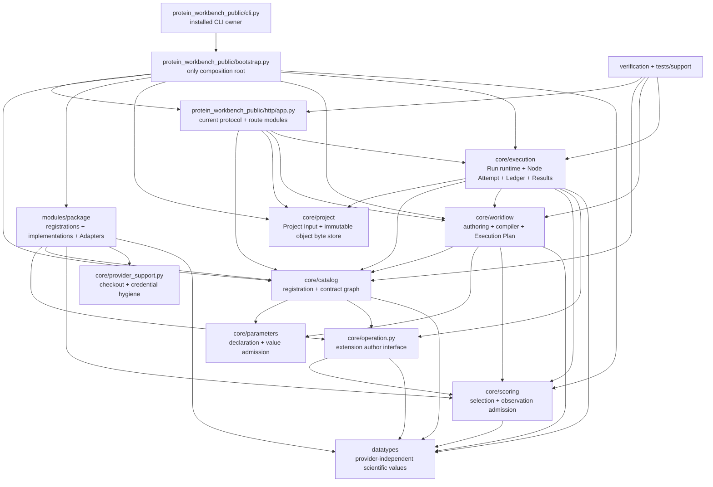

### Runtime construction order

`bootstrap.create_application()` 依次创建 explicit extension registrations → `FrozenCatalog` → Project Manager/Object Store → Workflow Authoring/Compiler → Result Store/Ledger factory/Output Admission/Node Attempt factory/Run Runtime → FastAPI app。这里的顺序是对象构造依赖，不是迁移步骤。

### Installed process entry

`protein_workbench_public.cli:main` 调用 bootstrap 并启动 Uvicorn；`pyproject.toml` 的 `protein-workbench-server` 指向该函数。顶层 `run_server.py` 与 `core.server` 均删除，不保留 forwarding shim。

### Closed dependency choice

Workflow Compiler 使用 Catalog 完成 exact lookup，再把 resolved Selection/Observation facts 交给 Scoring。Scoring 不导入 Catalog；Catalog 依赖 Operation interface 与 provider-independent datatypes；OperationContext 依赖 Scoring typed values。Selection extension 是 Scoring 的真实 caller，因此 `M → S` 是允许边。

**禁止**

`core` 导入 `protein_workbench_public`。public schema 不再参与 Ledger、Workflow Compiler 或 runtime validation。

**禁止**

`core` 导入具体 `modules/<package>`。Catalog discovery 位于 composition root。

**禁止**

扩展导入另一个扩展的 `package.py`、Adapter 或 implementation。跨包依赖用 Catalog exact reference 表达。

**允许**

多个扩展共享 provider-independent datatype；共享 Port contract 由明确的 capability package 单独拥有。

## 2. 目标目录

目录表达 ownership；package 的 `__init__.py` 只暴露其 interface，不承担全仓 re-export。

```text
core/
  operation.py
  provider_support.py
  catalog/
    declarations.py
    port_contract.py
    definition_resource.py
    builder.py
    model.py
    builtins.py
  parameters/
    model.py
    contract.py
  workflow/
    document.py
    authoring.py
    compiler.py
    plan.py
  scoring/
    selection.py
    observation_plan.py
    observation_admission.py
  execution/
    runtime.py
    node_attempt.py
    environment.py
    resources.py
    run_context.py
    output_admission/
      admission.py
      candidate_identity.py
      port_values.py
      artifacts.py
    ledger/
      transitions.py
      facts.py
      codec.py
      reducer.py
      ledger.py
      store.py
      projections.py
    results/
      store.py
      cache.py
  project/
    manager.py
    objects.py
    storage.py

datatypes/
  sequence.py
  structure.py
  residue.py
  prompt.py
  candidate.py
  observation.py
  prediction.py
  exact_reference.py
  i_json.py

protein_workbench_public/
  protocol.py
  bootstrap.py
  cli.py
  http/
    app.py
    errors.py
    catalog_routes.py
    project_routes.py
    workflow_routes.py
    run_routes.py

verification/
  acceptance_campaign.py
  acceptance_cli.py
  backend.py
  build.py

tests/support/
  contract_test_kit.py
```

## 3. 物理拆分规则

### Ownership package 与 module 不强制一对一

`execution/ledger/` 是一个 deep module 的 implementation package，只有 `ledger/__init__.py` 暴露 Ledger interface；codec、reducer、store 与 projection 不是 caller-visible seams。`core/workflow/` 与 `core/execution/` 则是 ownership namespaces，包含多个各自有一个 interface 的 modules，其 `__init__.py` 保持 marker-only，caller 直接 import exact owner。

### 不按 public method 或 Node Type 一文件

物理拆分依据 invariant 与知识聚集：fact grammar、causality、scientific identity、provider translation，而不是机械控制行数。

### 运行时文件不混合两个 contract owners

一个文件超过约 1,000 行即触发 ownership 检查；若仍只有一个深 implementation，可继续作为 package 内部文件，但不得泄漏私有 helper 给 caller。

### 不保留旧路径

所有 producer、consumer、test、example 与文档同时改到新 owner；删除旧 import、alias、shim、dual path 与 deprecation 转发。

Core modules

## 4. 每个 deep module 的详细定义

### Catalog module

唯一 Catalog authority；替代 `core/module_package.py` 与 `core/port_types.py` 中混合的 ownership。

**Role:** in-process + package resource adapter。

#### Interface

输入完整 registrations 与 observation time，输出一个 immutable `FrozenCatalog`；提供 exact contract / Port lookup 与 typed `CatalogProjection`。Catalog 不生成 public wire mappings。

#### Implementation

declarations、YAML Definition admission、contract graph resolution、runtime behaviors、Availability snapshot 与 indexes。

#### Validation authority

ID/version、duplicate identity、exact reference closure、Binding ownership、behavior completeness 与 Availability result。Parameter declaration semantics 委托给 Parameter Contract module，Catalog 只接收其 admitted `ParameterContract`。

#### Deletes

删除 `core/__init__.py` re-export surface；删除 discovery 内部 import；删除 broad wrapping；Catalog 生成后 caller 不再检查 descriptor shape。

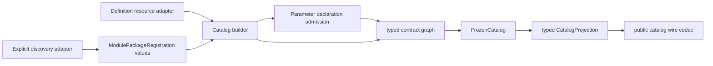

**Wire ownership**

Catalog owns canonical scientific contract descriptors and their digests. `protein_workbench_public/http/catalog_routes.py` alone converts `CatalogProjection` into the current HTTP response and validates the public schema.

### Parameter Contract module

把当前 698 行 `parameter_contract.py` 深化为一个参数语义 owner，而不是把函数分散进 Catalog、Workflow 与 Scoring。

**Role:** two-operation interface。

#### Declaration operation

`admit_declarations(raw declarations) -> ParameterContract`，只由 Catalog Builder 调用，拥有 name/type/value-contract schema 与 environment-field classification。

#### Value operation

`admit_values(ParameterContract, submitted values) -> AdmittedParameterValues`，只由 Workflow Compiler 调用，拥有 defaults、required、range/enum/shape 与 canonical value。

#### Trust

Execution Plan 存储 admitted values；Scoring、Node Attempt、Operation 与 Adapter 不再调用 parameter validators 或重算 effective values。

#### Locality

Catalog 持有 `ParameterContract`，Compiler 调用 value operation，Parameter Contract module 独占 admission leverage；它不认识 HTTP schema、provider objects 或 Operation implementation。

### Workflow ownership package

Document、Authoring、Compiler 与 Commit Store 是各自有一个小 interface 的 modules；`core/workflow` 只是它们的 ownership namespace。它们共享 typed values，不共享 raw public mappings，也不存在 Commit ↔ Plan 的构造循环。

#### Workflow Document interface

typed nodes、edges、selectors、objectives 与 requested contract references；canonical projection/digest。public wire conversion 位于 public protocol。

#### Lock interface

`lock(WorkflowDocument, FrozenCatalog) -> LockedWorkflow`。Lock 解析 exact contract references，但不创建 Commit。

#### Compiler interface

`compile(CompilationRequest, FrozenCatalog) -> ExecutionPlan`；Request 持有 typed `LockedWorkflow` 与由 Authoring 分配的 commit revision。Compiler 对每个 Node 调用 Parameter Contract value operation 一次，再构造 DAG、Selection、Result Identity 与 Output Admission Plan。

#### Authoring interface

read/save Draft、commit、read active Commit、load verified plan。Authoring 在 Plan 已产生后构造 Commit，使其持有 Workflow/Lock/Catalog/Plan digests，并原子发布 Commit record。

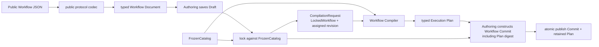

#### Fresh commit path

`save Draft → lock → compile → construct Commit → publish`。Compiler 从不接收 Commit，Commit identity 也不是编译输入；这与当前 `workflow_authoring_v2.py::commit` 和 ADR-0037 一致。

#### Persisted hydrate-and-verify path

Commit Store 解码当前 record 为 typed Commit → Compiler 以其中的 `LockedWorkflow`、recorded revision 与当前 exact Catalog 重新产生 Plan → Authoring 比较 Plan digest 与 Commit identity → 返回 `VerifiedWorkflowCommit(commit, plan)`。不重载 Draft、不 relock、不 repair。

**删除**

`validate_workflow_parameter_values`、`validate_workflow_generation`、legacy `workflow-v2.json` rejection、static/selection/compile 对同一参数的多次 normalization。

**保留**

exact Lock、DAG、Port multiplicity、selection consumption、result-affecting contracts、Commit immutable write 与 persisted Commit admission。

### Output Admission module

所有 Operation output 只跨这一处 seam；整合当前 `value_admission.py`、Node Attempt output logic、Produced Observation admission 与 artifact plan。

**Role:** highest validation leverage。

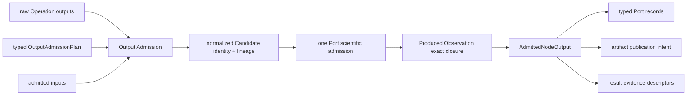

#### Interface

一次调用接收 Node plan、admitted inputs、raw outputs、result identity；返回一个 closed `AdmittedNodeOutput`。

#### Owns

required/multiplicity、Candidate normalization、lineage、canonical bytes/digest、axis/method projections、Score closure、artifact intent。

#### Trust after seam

Node Attempt、Result Store、Ledger 与 public artifact query 不再检查 payload runtime type、Port shape、Candidate IDs 或 score associations。

#### Deletes

fresh encode→decode、自定义 codec 二次 validator、artifact type/body/path 复验、test-only Score admission interface。

### Node Execution Attempt module

一个 schedulable Node Instance 的完整 lifecycle，落实 ADR-0041。

**Role:** internal seam of Run Runtime。

#### Interface

输入一个 `AttemptSpec`（typed Node plan、admitted inputs、Run identity、cancellation token），返回一个 `AttemptOutcome`。

#### Implementation

result identity、cache lookup、readiness、resource ownership、Operation construction/invocation、Output Admission、Result staging、cleanup、Ledger-owned Node Outcome Publication 与 post-commit replay indexing。

#### Dependencies

Evidence Ledger、Result Store、Output Admission、Environment Configuration；不接收整个 mutable Run record。

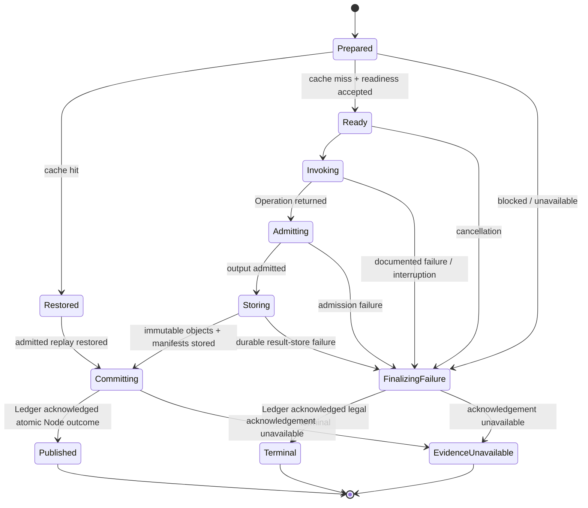

**唯一允许的 broad catch**

只在 Attempt lifecycle 需要记录任何异常、完成 cleanup 并提交 terminal evidence 时存在。它不把 programmer error 改写成 expected scientific outcome；其他内部 modules 不做 broad wrapping。

**Publication order**

Cleanup outcome 在 terminal transition 前确定。Result Store 只产生未发布的 `StoredNodeResult`；Ledger acknowledgement 是 Typed Outputs、Artifacts、Node terminal 与 disposition 唯一可见性 publication；Cache/replay index 只在 acknowledgement 后写入。`AttemptOutcome` 只描述已 committed disposition。

### Run Evidence Ledger module

typed domain fact grammar、causality、atomic publication、domain projection、cursor、replay 与 restart 的唯一 authority；REST/WebSocket wire projection 不属于 Ledger。

**Role:** ADR-0042 aligned。

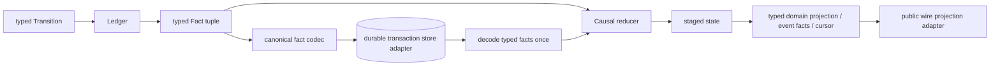

#### Interface

`record(Transition)`、cancellation decision、typed domain projection、typed events/replay、cursor、restart reconciliation。没有锁、transaction helper 或 public-schema dictionaries 暴露。

#### Typed grammar

内存 reducer 处理 typed Fact union，不处理未验证 mappings；fact codec 是 raw JSON 的唯一 owner。

#### Durability

写前验证 atomic transition 与 causal legality；读时验证 canonical bytes、sequence、identity 与 typed grammar。filesystem 与 in-memory 是两个真实 adapters。

#### Deletes

8 个 caller 私有锁调用、restart 私有加载、raw dict schema 在 owner-written facts 上的重复遍历、core 对 public event schema 与 redaction 的依赖。

**Ledger retains**

typed domain facts、closed causal grammar、domain projection、durable codec、transaction atomicity、provenance completeness、persisted transaction admission 与 evidence-unavailable semantics。

**Public protocol owns**

domain projection/events → REST/WebSocket wire projection、public redaction、public schema validation、cursor parameter translation 与 transport errors。Public validation 发生在 wire projection seam，不回流到 durable write seam。

### Result Store module

Node Result Manifest、Port Value Manifest、restore 与 project-scoped replay index 的唯一 owner；依赖 Project Object Store 保存 immutable bytes，但不拥有可见性 publication。

Compiler-owned `ResultIdentityPlanFacts` 与 Result Identity canonical projection 位于 `workflow/plan.py`，落实 ADR-0036，并由 Execution 消费。Result Store 只使用该 identity 组织 manifests、restore 与 replay index；Workflow 不导入 Execution，因此不形成反向依赖。

**Role:** local-substitutable。

#### Interface

`store(AdmittedNodeOutput) -> StoredNodeResult`、restore、read typed value/artifact、lookup replay 与 `index_committed_result`。

#### Implementation

canonical result/value manifests、object-reference closure、project-scoped replay index 与 producer provenance。Project Object Store 独占 content-addressed bytes、digest/size 与 atomic byte writes。

#### Trust

`store` 接受 `AdmittedNodeOutput`，不重新执行 Port/scientific validation；restore 才 decode persisted bytes。Stored objects 在 Ledger commit 前没有 published meaning。

#### Deletes

Node Attempt、cache、typed-value route 中重复的 manifest traversal 与局部 helper forwarding。

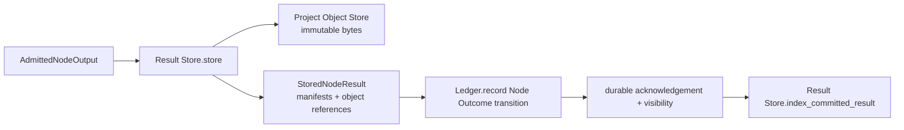

### Run Runtime module

serial Execution Plan traversal 与 public Run use cases；不拥有 Node lifecycle、Ledger grammar 或 result codecs。

**Role:** external core seam。

#### Interface

start 接收 Authoring 返回的 `VerifiedWorkflowCommit`，另有 start derived、cancel、shutdown、typed domain projection、events/replay、typed value、artifact。

#### Owns

one active Run per Project、required-input blockers、serial node order、Run closure、worker lifetime、derived-run node selection。

#### Does not own

readiness details、Operation output checks、manifest grammar、Ledger locks、public error payloads。

### Scoring modules

Selection 与 Produced Observation Admission 没有共同 caller，不应继续共处 `scoring_v2.py`。

#### Selection module

Objective/Selector typed values、compiler-supplied exact Metric/Method/Utility facts、observation matching、utility transform、ranking 与 typed provenance。Workflow Compiler owns Catalog lookup；callers 是 Workflow Compiler 与 selection Operation。

#### Observation Admission module

接收 Compiler 生成的 typed `ProducedObservationPlan`，验证 exact subject、Metric、Method、Context、axis/alignment evidence、pairing 与 multiplicity。Caller：Output Admission。

**删除**

`_admit_scoring_validation_ports`、`validate_produced_score_collection` 与 `core/__init__.py` exports。Observation Admission 不再接受 Binding descriptor mappings，也不在 runtime 解析 Catalog。

## 5. Validation authority matrix

表中 “trusted output” 一旦产生，下游不得重复执行左侧 validation。

| Input | Contract owner | Validation retained | Trusted output |
| --- | --- | --- | --- |
| HTTP / WebSocket bytes | `protein_workbench_public` | current wire schema、closed fields、public limits、error translation | typed request values |
| Raw parameter declarations | Parameter Contract | name/type/value-contract schema、environment-field classification、defaults declaration | `ParameterContract` |
| Registration/resource graph with admitted parameter contracts | Catalog | identity、exact reference closure、Binding ownership、behavior installation、Availability | `FrozenCatalog` |
| Submitted Workflow parameter values | Parameter Contract | required/default、range/enum/shape、environment exclusion、canonical value | `AdmittedParameterValues` |
| Workflow Draft + admitted parameter values | Workflow Authoring + Compiler | lock → compile → Commit construction；DAG、selection、result identity facts、Plan/Commit digests | `VerifiedWorkflowCommit` containing Commit + Execution Plan |
| Project Input bytes | Project | path/name/size、content identity、atomic publication | Project Input descriptor |
| Provider-native result | package Adapter | documented outcome classification、exact translation、provenance capture | canonical raw Operation output |
| Operation output | Output Admission | Port science、Candidate identity/lineage、Score closure、artifact intent | `AdmittedNodeOutput` |
| Admitted immutable object bytes | Project Object Store | content address、digest、size、existing-object identity、atomic byte write | `StoredObject` with no published meaning |
| Result/value manifests + stored object references | Result Store | canonical manifest codec、object-reference closure、producer provenance、restore | `StoredNodeResult` / restored admitted output |
| Typed Ledger transition / persisted transaction | Evidence Ledger | causality、atomicity、typed domain grammar、sequence、canonical durable bytes | committed typed facts + domain projection |
| Ledger domain projection/events | `protein_workbench_public` | REST/WebSocket wire schema、redaction、public cursor and error translation | current public wire bytes |
| Typed CatalogProjection | `protein_workbench_public` | current Catalog response schema、presentation fields、wire encoding | current public Catalog wire bytes |
| Provider asset configuration | package Binding Readiness Adapter | exact Git revision、SHA、runtime identity；shared helper owns checkout/credential hygiene only | admitted Provider Asset Closure |

## 6. Extension package architecture

```text
modules/<package>/
  package.py          # one immutable MODULE_PACKAGE authority
  domain.py           # package-owned canonical values only
  port_types.py       # package-owned nominal codecs
  implementation.py   # scientific orchestration
  adapter.py          # only for a true external provider seam: private interface + real Adapter
  assets.py           # Binding-owned asset closure, when real
  definitions/        # YAML Node / Metric resources
```

• `package.py` 只声明 contracts、factories、Availability/Readiness 与 exact identities，不包含 provider runtime 或 scientific algorithms。

• `implementation.py` 信任 OperationCall 中的 admitted inputs 与 Plan-normalized params；它不重验 Port runtime types。

• Adapter interface 是该 package 的私有 `Protocol`，只表达该 provider translation 所需的方法和 typed request/outcome。core 不定义通用 provider interface，其他 extension 不导入它。

• `package.py` 的 production factory 读取 admitted Environment Configuration，构造 real Adapter，再把它传给 package implementation constructor。Environment Configuration 只含声明过的 serializable values、paths 与 credential handle，不含 `provider_client`、`client_factory` 或任意对象。

• package lifecycle tests 直接向 implementation constructor 传入 fake Adapter；Catalog/Run integration tests 注册一个 test-owned package factory。两者都不扩展 production Environment Configuration schema，也不 monkeypatch core。

• 纯 in-process packages（例如 collection operations、selection、structure transforms）不创建 `adapter.py`、fake Adapter 或 provider port。只有 production external Adapter 与 test fake 都真实存在时，package-private seam 才成立。

• 跨扩展依赖用 Catalog `ContractIdentity` 表达；不得 import 另一个 package 的 concrete MethodDefinition 来计算 digest。

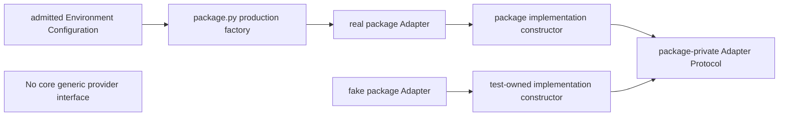

```text
# modules/esm3/adapter.py (same pattern, package-specific types, per provider package)
class _ESM3Adapter(Protocol):
    def invoke(self, request: ESM3Request, *, resources: OperationResources) -> ESM3Outcome: ...

# modules/esm3/implementation.py
class ESM3GenerationOperation:
    def __init__(self, adapter: _ESM3Adapter) -> None: ...

# modules/esm3/package.py — registered production factory
def _create_operation(context: OperationContext) -> ScientificOperation:
    config = context.environment  # already admitted typed values
    return ESM3GenerationOperation(BiohubESM3Adapter.from_config(config))

# package lifecycle test — no production schema hook
operation = ESM3GenerationOperation(FakeESM3Adapter(outcomes=[...]))
```

### Shared provider support is not an Adapter seam

`core/provider_support.py` hides exact installed-checkout admission and private credential-file handling. Package-specific model IDs、source revisions、artifact SHA closures and documented outcome translation remain in each extension's `contracts.py`/`assets.py`/`adapter.py`. It exposes no provider client, request method or universal factory.

## Structure Transform 的完整拆分

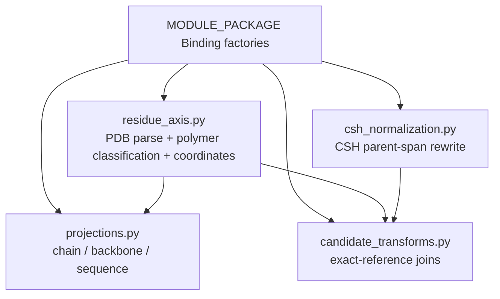

`StructureTransformImplementation.execute` 与 12 个空 subclasses 被删除。Binding factory 直接构造对应 implementation。Resolved Structure Residue Axis 仍是一个 deep module，不把 PDB parsing 拆成浅 helper modules。

## 7. Provider-independent datatype architecture

### `sequence.py` / `structure.py`

ProteinSequence、ProteinStructure 及各自 intrinsic validation。

### `residue.py`

ResidueLayout、ResidueMap、ResidueTrack、modified-residue normalization。

### `candidate.py`

Candidate、CandidateCollection、lineage 与 CandidateDataReference。

### `observation.py`

Exact references、Observation Context、ScoreObservation、ScoreCollection。

### `prediction.py`

PredictionResidueAxis、ConfidenceFact 与 provider-independent confidence values；不 import Catalog 或 prompt Port objects。

### 移出 datatypes

`ProteinMPNNConstraints` 与 `constraint_validation.py` 移到 `modules/proteinmpnn/domain.py`；它们是 package-specific，不是 provider-independent。

## 8. Public protocol architecture

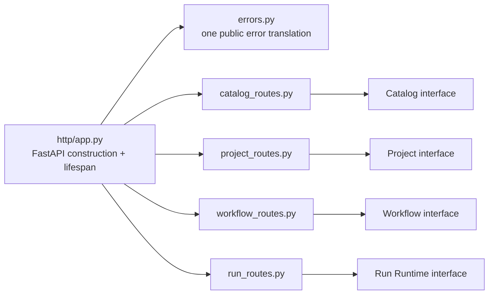

`core/server.py` 被删除。1,196 行 server 不再通过 nested functions 隐藏四类 route ownership，也不继续兼任 composition root 与 CLI owner。

public protocol 独占 request/response schema、Ledger domain-to-wire projection、redaction、REST/WebSocket translation、status codes 与 incident payload；core errors 不包含 transport semantics。

只有 `errors.py` 在最外层捕获未知 exception 并转换 incident。route modules 只捕获其明确 domain errors。

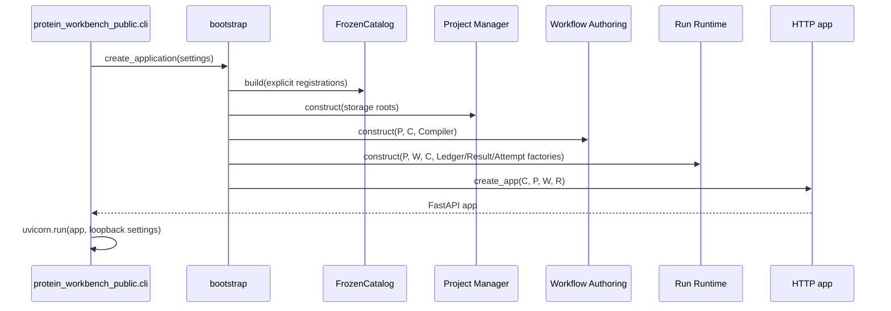

### `bootstrap.py`

唯一知道 concrete implementations 与 extension registration list。返回 app；不解析 CLI flags，不声明 routes。

### `http/app.py`

只接收四个已构造 interface；装配 routes/lifespan。不得 import extension packages 或创建 storage/runtime。

### `cli.py`

唯一 installed server command owner。`pyproject.toml` 入口改为 `protein_workbench_public.cli:main`；文档和 installed verification 同时切换。

## 8A. Normative ADR alignment

本目标架构已与 accepted ADR 同步。以下 ownership decision 已写入 ADR-0042，不留给实施者临场选择。

### ADR-0042 amended and aligned

Ledger owns typed domain facts、causality、atomic transaction grammar、typed domain projection and durable codec；`protein_workbench_public` owns REST/WebSocket wire projection、redaction and public schema validation。Durable write validates domain grammar only；wire encoding validates public schema only。

### ADR-0037/0039 retained, not amended

Workflow follows `save/lock → compile → construct Commit → publish`；persisted Commit reloading is a separate hydrate-and-verify path。Node outcome follows `store immutable objects/manifests → Ledger atomic publication → post-commit replay index`；Result Store never becomes a visibility authority。ADR-0036 Result Identity facts remain an explicit design basis。

**Specification gate cleared**

ADR-0042 已同步，Ledger/domain 与 public/wire ownership 只有一份 accepted definition。本报告现在可以作为无歧义 implementation spec；其余 ownership 与 interfaces 不需要实施者做额外架构选择。

## 9. 旧文件到新 owner 的完整映射

下表覆盖当前全部 core production files、全部 datatypes files、两项错误归属的 modules files、所有 extension packages、server/build/verification entrypoints。YAML definitions 留在其 extension 的 `definitions/`，resources bundle 留在 public protocol；没有未指定 owner 的 Python production file。

| Current file | Target owners | Removed implementation |
| --- | --- | --- |
| `core/run_execution_v2.py` 7,665 | execution/runtime、node_attempt、resources、output_admission、ledger、results | mixed ownership、private Ledger access、raw fact double grammar、manifest forwarding、repeated output/artifact checks |
| `core/workflow_v2.py` 2,699 | workflow/document、compiler、plan | test-only interface、duplicate parameter normalization、public schema dependency |
| `core/workflow_authoring_v2.py` 842 | workflow/authoring；private Commit codec/store stays inside that module | 不删除 authoring semantics：retain exact lock→compile→Commit→publish、seed installation and hydrate-and-verify；只删除 caller-visible persistence plumbing |
| `core/module_package.py` 2,500 | catalog/declarations、definition_resource、builder、model | discovery coupling、broad error wrapping、mapping checks after typed construction |
| `core/parameter_contract.py` 698 | parameters/model + parameters/contract | separate generation/static/selection validation paths；one declaration seam and one value seam remain |
| `core/port_types.py` 2,028 | catalog/port_contract、catalog/model、catalog/builtins；execution/output_admission/port_values | fresh encode/decode cycle、double tree walk、repeated custom validator |
| `core/scoring_v2.py` 2,099 | scoring/selection、observation_plan、observation_admission | test-only admission interface、runtime Catalog reparsing |
| `core/value_admission.py` 828 | execution/output_admission/admission、candidate_identity、port_values | public helper surface and scattered per-value entrypoints；one `admit_node_output` interface remains |
| `core/server.py` 1,196 | public/bootstrap、public/http/app、errors、catalog/project/workflow/run routes、public projection codecs | nested closure plumbing、core transport dependency、duplicated error translation、composition mixed with routes |
| `core/project.py` 508 + `project_objects.py` 78 + `storage.py` 133 | project/manager、project/objects、project/storage；Project Object Store is the sole owner of content-addressed immutable bytes | cross-owner storage forwarding；retain contained paths、input/object identity、digest/size、atomic byte write and accidental-loss protection；stored object presence alone has no published meaning；Result Store owns manifests, not bytes |
| `core/run_context.py` 128 + `process_control.py` 46 | execution/run_context + execution/resources；extension-facing `OperationContext` Protocol remains in operation.py | verification-tier branching moves to verification configuration；retain contained paths、owned temp namespace、safe process-group signaling and cancellation cleanup |
| `core/operation.py` 265 + `artifacts.py` 28 | operation.py extension-author interface；artifact media declaration check to catalog/port_contract；publication logic to output_admission/artifacts | standalone shallow artifact module and global re-export；`ArtifactPayload` becomes an operation contract value |
| `core/contract_test_kit.py` 647 | `tests/support/contract_test_kit.py` | production exports and dependency reachability |
| `core/__init__.py` 198 | near-empty package marker；callers import exact module interfaces | global re-export interface and test-kit import |
| `datatypes/protein.py` 1,207 + `structure_axis.py` 147 + `function_annotations.py` 115 | datatypes/sequence、structure、residue、candidate、observation、prediction | mixed scientific concepts；intrinsic validation stays beside each immutable value |
| `datatypes/candidate_reference.py` 61 + `identifiers.py` 31 | datatypes/exact_reference.py and candidate.py | wire-named constructors inside domain values；public codec owns wire conversion |
| `datatypes/constraint_validation.py` 178 | modules/proteinmpnn/domain.py | ProteinMPNN-specific schema in provider-independent datatypes |
| `datatypes/i_json.py` 91 + `datatypes/__init__.py` 85 | i_json.py remains exact immutable JSON owner；`__init__.py` becomes a marker | package-wide re-export surface |
| `modules/provider_contract.py` 295 | package-specific IDs/revisions/SHA → each extension contracts/assets；generic exact-checkout and credential-file logic → `core/provider_support.py` | cross-extension constants owner and any implied generic provider Adapter；no universal client/factory interface |
| `modules/structure_transform/implementation.py` 1,692 | residue_axis、csh_normalization、projections、candidate_transforms within the same extension module | string dispatcher、empty subclasses、late-import choreography；documented CSH scientific normalization remains |
| `modules/acceptance_campaign.py` 1,047 | `verification/acceptance_campaign.py` as one deep module | incorrect classification as an extension package |
| all other `modules/<package>/*.py` + definitions | remain inside their extension; split only by domain / port_types / implementation / assets and, only for true external seams, package-private Adapter ownership | cross-extension concrete imports、Environment Configuration object injection、duplicated provider result checks、hypothetical Adapters for in-process packages |
| `protein_workbench_public/protocol.py` + resource bundle | protocol.py remains current wire-schema owner；HTTP wire projection/redaction codecs live under public/http | core-side public schema checks and public projection ownership |
| all `__init__.py` package files | empty/near-empty package markers；each caller imports the exact module interface | cross-package re-exports、discovery side effects and hidden test dependencies |
| `examples/` + `pdbs/` maintained data | remain data/resources；all example compiler imports and documentation commands target new owners | no data rewrite, compatibility reader or duplicate schema |
| `run_server.py` + `pyproject.toml:21` | `protein_workbench_public/cli.py:main`；console entry and package discovery updated for the target owners | top-level dev launcher and `core.server` entry；no forwarding shim |
| `scripts/verify_backend.py` 706 + `build_backend.py` 113 | `verification/backend.py` + `verification/build.py` invoked with `python -m` | script-path coupling and production-root imports；all AGENTS/docs/CI commands change together |
| `scripts/acceptance_campaign.py` 74 + `scripts/__init__.py` | `verification/acceptance_cli.py` calling the acceptance_campaign interface | subprocess reference to `scripts/verify_backend.py`, duplicate root discovery and old scripts package |
| tests、examples、docs、verification commands | all imports and command references switch directly to target owners in the same change | old-path tests、legacy import assertions、dual commands and compatibility aliases |

## 10. 必须删除的防御逻辑

- admitted Port value 在 fresh output path 的 encode→decode 与 serializer 二次 validation。
- Workflow parameters 在 generation/static semantics/selection consumer/compile 中重复 normalization。
- Folding、SimpleFold 与 prompt stochastic 对 Plan/effective-randomness facts 的复验与重算。
- artifact publication 对已 admitted payload 的 runtime type、body size 与 filename 再验证。
- 仅供 tests 调用的 Workflow/Score production validation interfaces。
- Environment Configuration 中的 `provider_client`/`client_factory` test injection paths。
- historical artifact repair、compatibility migration/legacy parsing、undocumented provider fallback endpoint 与 schema guessing。由 Node Type/Method contract 明确定义的 CSH topology repair、modified-residue normalization 等科学归一化不是删除对象。
- Catalog/Utility Transform 内把 programmer errors 改写为 generic domain errors 的 broad catches。
- caller 对 Ledger locks、transactions、restart loader 与 evidence state 的私有知识。
- `core/__init__.py`、test kit 与 route nested closures 形成的 shallow forwarding。
## 11. 必须保留的 correctness logic

- units、shapes、masking、randomness、residue identities/mappings 与 exact Candidate lineage。
- Metric、Method、Observation Context、axis、pairing、multiplicity 与 provenance closure。
- Catalog exact reference graph、Workflow Contract Lock 与 Execution Plan result identity facts。
- persisted bytes 的 canonical form、digest、size、object reference closure 与 atomic writes。
- Ledger causal reducer、atomic transitions、restart admission、cursor 与 evidence availability。
- documented provider outcome translation、Provider Asset Closure、Git/SHA evidence 与 credentials。
- cancellation process cleanup 与 Node Attempt terminal evidence。
- Project Input admission 与 accidental data loss protections。
## 12. Testing architecture

### Catalog tests

从 registration interface 进入，断言 FrozenCatalog、typed CatalogProjection 与 exact failure；public Catalog wire tests 单独从 HTTP codec 进入，不测试 builder private phases。

### Parameter tests

只通过 `admit_declarations`/`admit_values` 断言 ParameterContract、defaults、canonical values 与 exact failures；Catalog/Compiler tests 不再直接调用 private validators。

### Workflow tests

Authoring tests 断言 Draft/Commit；Compiler tests 断言 Execution Plan。删除 validation helper direct tests。

### Execution tests

Run Runtime 覆盖 serial outcomes；Node Attempt 通过 fake ScientificOperation / Adapter；Output Admission 用真实 Port contracts。

### Ledger tests

同一 interface 跑 in-memory 与 filesystem store adapters，断言 causal decisions、restart、projection 与 replay。

### Result tests

store/restore/read/index 通过 Result Store interface；断言 store 不产生 visibility、replay index 只接受 committed result；不调用 manifest private helpers。

### Package conformance

Contract Test Kit 位于 tests/support，通过真实 package registration 和 Run seam。

### Provider acceptance

真实 provider acceptance 不由 mocks 替代；fake Adapter 只用于 module lifecycle tests。

### Deletion rule

新 interface test 覆盖相同行为后，删除穿透 private implementation 的旧 tests；不叠加两套测试。

## 13. 架构完成条件

- 不存在 `core/run_execution_v2.py`、`workflow_v2.py`、`scoring_v2.py`、`module_package.py`、`server.py` 这些 mixed-owner files。
- `core` 不依赖 public protocol 或具体 extension；datatypes 不依赖 core/catalog 或 extensions。
- 所有 Operation output 只经一个 Output Admission seam；fresh output 不回解码自己刚生成的 bytes。
- Project Object Store 独占 content-addressed immutable bytes；Result Store 独占 manifests/restore/replay index；Ledger acknowledgement 独占 Node outcome visibility，replay index 只在 commit 后写入。
- Execution Plan 持有 typed runtime facts；runtime 不解析 Catalog descriptors 或重验 Plan-normalized parameters。
- Workflow commit path 严格为 lock → compile → construct Commit → publish；persisted Commit 只走 hydrate-and-verify，Compiler interface 不接收 Commit。
- Ledger caller 不接触锁、transaction、schema mappings 或 restart loader；事实 grammar 只有 typed codec 一份。
- Ledger 只产生 typed domain projection；public protocol 独占 REST/WebSocket projection、redaction 与 public schema validation，ADR-0042 已同步。
- production dependency graph 不包含 Contract Test Kit 与 Acceptance Campaign；二者仍通过 verification interface 可执行。
- 具有真实 external provider seam 的扩展 tests 替换 package-private Adapter，不向 production Environment Configuration 注入 fake provider objects；纯 in-process packages 不创建 Adapter seam。
- `bootstrap` 构造 Catalog、Project、Authoring、Runtime 与 HTTP app；installed CLI 只由 `protein_workbench_public.cli` 拥有，旧 server/run_server entry 不存在。
- 依赖只沿完整架构图：Compiler owns Catalog lookup，Scoring consumes resolved exact facts；Catalog/Operation/Scoring/extension 的 datatypes 与 caller edges 均有明确方向且不存在 import cycle。
- Catalog 只返回 typed `CatalogProjection`；public protocol 独占 Catalog HTTP wire encoding。Parameter Contract 独占 declaration/value semantics，Catalog Builder 与 Compiler 只是 callers。
- 不存在 historical artifact repair、compatibility migration/legacy parser、undocumented provider fallback endpoint、silent coercion、catch-and-continue 或 guessed defaults；明确科学 contract 所定义的 normalization/repair 保留。
- focused pytest、routine verification、deterministic acceptance、frontend lint/build 全部通过，且 scientific/provenance contracts 未削弱。
Architecture basis: `CONTEXT.md`, ADR-0034/0035/**0036**/0037/0038/**0039**/0041/0042/0043/0044/0045, 52,794-line production-root scan, call-site analysis, AST ownership inventory, and defensive-validation audit.

本文定义完成态。没有兼容保留，也没有临时双路径。

## 14. Ticketing closure and authoritative amendments

本节闭合 implementation tickets 所需、而前文目标态尚未逐项写明的 owner 与迁移决策。若本节与前文的目标目录、泛化的 extension 描述或“所有 caller 同时迁移”表述冲突，以本节为准；科学语义、current public protocol、accepted ADR 和第 10–13 节的删除/保留条件不变。

### 14.1 当前分支是 integration branch

本重构直接在用户指定的当前分支 `codex/backend-entropy-deletion-refactor` 上实施，不创建另一个 integration branch。该分支承担 wide-refactor integration sequence；`main` 在最终 cutover 前不接收部分迁移。

迁移 tickets 按 blocking edges 基于当前分支最新状态实施。Core owner tickets 以串行为主；只有目标 Catalog、Workflow、Scoring、Environment Configuration 与 Execution interfaces 已稳定后，互不导入 concrete implementation 的 Module Package tickets 才进入并行 frontier。

中间 commits：

- 可以暂时不通过全仓 gate，也可以暂时留下尚未迁移的 broken imports；
- 必须使本 ticket 所属 owner 的 focused contract tests、语法编译和允许的 dependency edges 可验证；
- 不得保留或新增旧路径 forwarding、compatibility alias、dual parser、dual runtime、旧/新实现并存或 test-only production seam；
- 不得以中间状态为由削弱 Node Type、Method、Metric、unit、shape、residue mapping、masking、randomness、lineage、provenance 或 evidence semantics。

最终 integrate-and-verify ticket 被所有迁移 tickets 阻塞。它独占 residual old-owner deletion/import sweep、tests/examples/docs/entrypoint 全量切换与完整 verification gate。只有该 ticket 通过后，当前分支才具备合回 `main` 的条件。

### 14.2 Project ownership package

`core/project` 包含 Project Manager、Project Object Store 与 private storage implementation，三者共享 Project scope，但不共享 Result Manifest 或 Run visibility ownership。

**Project Manager interface**

- 创建、列举与读取 Project metadata；
- 接纳和读取 Project Input，返回 typed Project Input descriptor；
- 为 Workflow Authoring 与 Run Runtime 提供 Project-scoped owner interface，不暴露任意路径拼接 helper。

**Project Object Store interface**

- `store(canonical_bytes) -> StoredObject`；
- 按 exact object identity 读取 immutable bytes；
- 独占 content address、digest、size、existing-object identity 与 atomic byte publication。

**Validation authority**

Project Manager 独占 Project ID、Project Input name/path/size、input content identity 和 accidental-loss protection。Project Object Store 独占 immutable object bytes 的 digest/size/atomic write。两者都不重验 admitted Port science。

**Does not own**

Workflow Draft/Commit、Result/value manifests、Cache/replay index、Ledger visibility、public HTTP schema、artifact media contracts 或 Run lifecycle。

### 14.3 Environment Configuration module

`core/execution/environment.py` 是 Environment Configuration 的唯一 core owner。

**Interface**

`admit_environment_configuration(FrozenCatalog, raw configuration) -> EnvironmentConfiguration`。`bootstrap.create_application()` 在 FrozenCatalog 构造后调用一次，再把 admitted value 注入 package factories、Binding Readiness 和 Run Runtime。

**Validation authority**

- configuration 只能按 exact Execution Binding identity 提交；
- field closure 与 value category 必须来自该 Binding 已接纳的 Environment declaration；
- 只允许 declaration 所允许的 serializable values、filesystem paths 与 credential handles；
- 禁止 `provider_client`、`client_factory`、fake Adapter 或任意 caller-owned object；
- Workflow parameter declaration 中排除 Environment fields 的语义仍由 Parameter Contract module 拥有。

**Trust after seam**

Node Attempt、Readiness、Operation factory 与 package-private Adapter 接收 typed per-Binding configuration，不重复解析 raw mappings 或重验 declaration。Provider Asset Closure 和 documented provider outcome 仍由对应 Module Package 接纳。

### 14.4 Exhaustive provider-independent datatype ownership

`datatypes/prompt.py` 与 `core/execution/environment.py` 是对第 2 节目标目录的规范性补充。下表同时闭合当前 datatype class、相关 validator 与已存在于 extension 中但属于 provider-independent science 的 prediction values。

| Target owner | Owned values and operations |
| --- | --- |
| `datatypes/sequence.py` | `ProteinSequence`、`validate_protein_sequence` |
| `datatypes/structure.py` | `ProteinStructure`、`validate_protein_structure`、`StructureAtomCoordinate`、`StructureResidueCoordinates`、`StructureAxisSegment`、`StructureComponentDisposition`、`ResolvedStructureResidueAxis` |
| `datatypes/residue.py` | `ModifiedResidueAtomMapping`、`ModifiedResidueNormalization`、`ModifiedResidueNormalizationCollection`、`ResidueLayout`、`ResidueMap`、`ResidueTrack`、`residue_identity_chain`、`validate_residue_layout`、`validate_residue_map` |
| `datatypes/prompt.py` | `FunctionAnnotation`、`FunctionAnnotations`、`ProteinPrompt`、`validate_canonical_function_annotations` |
| `datatypes/candidate.py` | `Candidate`、`CandidateCollection`、`CandidateDataReference`、`validate_candidate_parent_ids`、`validate_candidate_lineage_graph` |
| `datatypes/exact_reference.py` | `validate_canonical_identifier`、`ExactContractReference`、`ExactPortValueReference`、`ResidueAxisReference`；public/wire constructors 移到 public codecs |
| `datatypes/observation.py` | `IntrinsicObservationContext`、`CalibrationObservationContext`、`PairwiseCandidateMatch`、`PairwiseCandidateMapping`、`PairwiseParticipant`、`PairwiseObservationContext`、`ScoreObservation`、`ScoreCollection` |
| `datatypes/prediction.py` | `PredictionResidueAxis`、`ConfidenceFact`、`ConfidenceFactCollection`、`prediction_key`、`prediction_axis_reference`；这些值从 `modules/structure_prediction` 移出，Module Package 只保留 Port contracts 与 Confidence Materialization operation |
| `datatypes/i_json.py` | `FrozenList`、`freeze_i_json`、`thaw_i_json`、`i_json_values_equal` |
| `modules/proteinmpnn/domain.py` | `ProteinMPNNConstraints`、`validate_proteinmpnn_constraints`；它们不是 provider-independent datatype |

上述移动不得改变 canonical bytes、content digest、residue identity、masking、pairing、axis provenance 或 public wire meaning。`datatypes/__init__.py` 成为 marker，caller import exact owner。

### 14.5 Exhaustive Module Package Adapter classification

当前 production registration authority 只有下列 12 个 Module Packages。只有表中标记为 external 的 provider route 建立 package-private Adapter Protocol；in-process packages 不创建 hypothetical Adapter。

| Module Package | Classification | Required target ownership |
| --- | --- | --- |
| `collection_ops` | in-process | collection transformations、pairing 与 score merge；无 Adapter |
| `esm3` | external | Biohub 与 local ESM provider translation 位于 package-private Adapters；generation/representation science 位于 implementation |
| `folding` | external | ESMFold2、SimpleFold folding 与 SimpleFold confidence 各保留真实 Adapter；共享 folding output construction 与 SimpleFold Provider Asset Closure 仍是 package-private deep modules |
| `prompt_authoring` | in-process | deterministic/stochastic authoring 与 exact seed semantics；无 Adapter |
| `protein_io` | in-process | Project Input 到 canonical sequence/structure 与 artifact intent；无 Provider Adapter |
| `proteinmpnn` | external | local ProteinMPNN provider translation、source/checkpoint closure 与 documented outcomes 位于 package-private Adapter/assets；constraints 位于 package domain |
| `selection` | in-process | Selection Objective consumption 与 ranking operation；调用 core Scoring typed interface，无 Adapter |
| `solubility` | external | SoluProt 与 Protein-Sol subprocess/provider translation 各为真实 package-private Adapter |
| `structure_annotation` | mixed by Binding | mkdssp Binding 使用真实 package-private Adapter；repository-owned direct projection Bindings 保持 in-process，不能共享 fake Adapter |
| `structure_comparison` | in-process | alignment evidence、RMSD/TM-score 与 comparison operations 仍为 repository-owned science；无 Provider Adapter |
| `structure_prediction` | in-process | Confidence Materialization 与 Port contracts；provider-independent prediction values 移到 `datatypes/prediction.py` |
| `structure_transform` | in-process | residue-axis resolution、CSH normalization、projections 与 Candidate transforms；无 Adapter |

`modules/provider_contract.py` 不继续作为跨扩展 identity owner。通用 exact-checkout admission 与 credential-file hygiene 移到 `core/provider_support.py`；Method/Binding identity、model/source revision、artifact SHA 与 provider outcome translation 分别留在五个 external packages。

### 14.6 Cross-ticket contract and verification policy

每个 cross-ticket typed value 由第一张声明其 owner 的 ticket 固定 interface 与 owner-level tests；所有 consumer tickets 将其列为 blocker，不得临场重新定义其 scientific fields。关键 ownership 顺序为：

- datatype owners → Parameter Contract / Operation interface / Catalog；
- Catalog + Parameter Contract + Scoring → Workflow Compiler；
- Workflow Plan/Compiler → Result Identity plan facts 与 canonical identity projection；Result Store 和 Node Attempt 只消费这些 facts；
- Project + Workflow + Environment + Output Admission + Result Store + Ledger → Node Attempt；
- Node Attempt + Workflow Authoring + Scoring → Run Runtime；
- core interfaces → public routes/bootstrap 与 Module Package migrations；
- 所有 producer/consumer migrations → final integrate-and-verify。

中间 tickets 至少运行 focused pytest、受影响 Python package 的 `compileall`，并检查本 ticket 负责的禁止 import 与旧 owner 调用点。最终 ticket 运行：

```bash
.venv/bin/python scripts/verify_backend.py routine
.venv/bin/python scripts/verify_backend.py deterministic-acceptance
cd frontend && npm run lint && npm run build
```

需要真实 Provider acceptance 的 Module Package ticket 不得以 fake Adapter 或 mock 代替完成证明；fake Adapter 只证明 package lifecycle。
