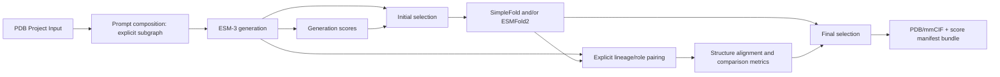

# Protein Workbench 前端重写讨论设计

- **状态**：讨论稿，非最终设计，非规范性 ADR
- **文档版本**：0.2
- **日期**：2026-08-18
- **适用范围**：下一代本机 Protein Workbench UI，以及为其提供能力所需的有限后端修改
- **领域词汇**：当前仍以 [`CONTEXT.md`](../CONTEXT.md) 为准；本文新增词汇均为待讨论候选
- **前置调研**：[`前后端契约分离调研`](research/2026-08-18-frontend-backend-contract-separation.md)

## 1. 文档定位

本文把当前已经达成的产品方向落盘，作为后续讨论和拆分实施任务的共同基线。它刻意保留
未决问题，不应被当作已经冻结的 UI 规格、公共协议或科学合同。

本文作出以下当前约束：

1. 现有 `frontend/` 是废弃实现。正式开始重写时，删除并从空目录重新建立前端；不迁移
   旧组件、状态模型、手写 DTO、路由封装、样式、测试或构建集成。
2. 旧实现使用过 React、TypeScript、Vite 和 React Flow，不代表其源码可以复用。是否继续
   使用这些技术是独立决策；本文暂以这组技术作为候选基线，以便描述模块和交互。
3. 前端与后端独立构建、独立测试、独立发布。前端不得 import Python，后端不得包含或
   读取前端构建产物。
4. 前端功能仍在设计中，因此本轮允许提出有限后端修改；但不得为某一个页面或场景建立
   绕过 Workflow、Run Evidence 或科学合同的专用捷径。
5. 本文被后续讨论修改时，直接更新当前稿；在决定冻结前不建立兼容层或保留并行设计。

如果本文最终被接受，需要再形成 ADR 和精确 protocol diff。现在不修改既有 ADR 的状态，
也不把候选词汇写入 `CONTEXT.md`。

## 2. 已确认的产品目标

Protein Workbench 的产品定位是：**开发者通过 Module Package 扩展科学能力，用户通过可视化
Node 和连接构建 Workflow**。本轮不建设用户安装/编写任意 Python 模块、插件市场、沙箱或
Module 开发者工具。

首批产品必须覆盖三个场景。

### 2.1 场景 1：批量序列评分、筛选、折叠和导出

用户上传包含多条序列的 FASTA，选择 Catalog 中可用的评分 Node、Method、Binding 和参数，
构造筛选与折叠 Workflow，最终获得一批 PDB/mmCIF 结构及对应分数。

- 不设置硬编码的产品条数上限。
- 典型最大规模按 1000 条 Candidate 设计。
- Workflow 可以在折叠前筛选以节省计算，也可以在折叠后根据结构指标再次筛选。
- UI 不把“评分方式”写成固定列表；Metric Definition、Method、单位、方向和参数来自
  active Catalog。

### 2.2 场景 2：ESM-3 Prompt、生成、重折叠与结构一致性筛选

用户上传 PDB，以可视方式构建 ESM-3 风格 ProteinPrompt，使用 ESM-3 生成、评分和筛选，
再通过 SimpleFold 和/或 ESMFold2 重折叠同一批序列。Workbench 显式配对 ESM-3 结构与
重折叠结构，执行结构比较和二次筛选，最后导出结构与分数。

### 2.3 场景 3：ESM-3 结构生成、ProteinMPNN 反折叠与再次折叠

用户上传 PDB 并构建 ProteinPrompt，经 ESM-3 生成和初次筛选后，将结构 Candidate 交给
ProteinMPNN 得到子代序列，再经 SimpleFold/ESMFold2 折叠、评分和筛选，最终导出结构与分数。

### 2.4 Prompt Studio 的已确认要求

Prompt Studio 必须覆盖当前 `ProteinPrompt` 的全部输入语义：

- target `ResidueLayout`；
- sequence track；
- structure coordinate track；
- structure visibility track；
- secondary-structure track；
- absolute per-residue SASA track，单位为 Ų；
- function annotations。

这份列表描述当前 active contract，不是前端永久硬编码的封闭列表。若未来 ESM-3/ProteinPrompt
增加新的 conditioning track，backend 必须以新的 exact contract 和 capability version 发布；
frontend 要么显式支持该版本，要么显示 unsupported capability，不能静默忽略新 track。

用户需要对残基布局和各 track 执行添加、编辑、删除、清除/掩码操作，并通过不同颜色、边框、
符号和纹理区分状态。颜色不能成为唯一编码。

Prompt Studio 在 Canvas 上表现为一个 **组合单元**，但 Workflow Draft 中始终保存显式 Node
Instances 和 edges；组合单元不是新的科学 Node Type，也不进入 Run。

## 3. 设计原则

### 3.1 前端拥有交互，后端拥有科学语义

前端拥有：

- 页面、Canvas、面板、颜色、符号、选择、hover、快捷键和 undo/redo；
- 对已验证 public payload 的展示模型；
- 临时的结果筛选和排序；
- opaque UI state 的 schema 与迁移策略；
- Prompt Studio 的交互状态和组合单元展示。

后端拥有：

- Node Type、Port、Binding、Method、Metric Definition 和 Utility Transform；
- ResidueIdentity、ResidueLayout、ResidueMap、mask、track 和单位语义；
- Candidate identity、lineage、Score Observation 关联和结构配对；
- Workflow admission、Execution Plan、Run、Cache、Artifact 和 Evidence；
- Project、Project Input、Draft、Commit 和 Run 的 durable state；
- Prompt 编辑文档的科学验证及其显式 Workflow 子图 materialization。

前端可以提前反馈错误，但不能成为科学正确性的权威。后端不能理解 React Flow 坐标、面板
宽度、配色或 hover residue。

### 3.2 一个公共协议 source，两个独立实现

`protein_workbench_public/resources/v2/bundle.json` 继续作为唯一手写 public protocol source。
由它确定性生成：

```text
OpenAPI 3.1 projection
TypeScript wire declarations
browser runtime validators
REST/WS operation metadata
```

OpenAPI、TypeScript 类型和 validators 都是生成物，不是第二份可手工修改的协议。前端与后端
只在这条 language-neutral seam 上相遇。跨语言 semantic valid/invalid fixtures 由协议人工
维护，并同时交给 Python/TypeScript validators；工具最多确定性生成 unknown-field、missing-
required 等机械负例，不能从 schema 自动生成科学关联和事件语义的权威样例。

### 3.3 一个 transport owner，多个 capability-scoped Interface

前端只有一个 production protocol-adapter Module 拥有 HTTP/WebSocket transport，但 feature
module 不依赖一个包含所有方法的巨大 Interface。它们只接收自己需要的小 Interface：

```text
Project feature  -> ProjectsBackend ----+
Canvas feature   -> WorkflowBackend ----+
Run feature      -> RunsBackend --------+--> V2ProtocolAdapter Module --> public v2
Results feature  -> ResultsBackend -----+
Prompt feature   -> AuthoringBackend ---+

tests -> capability-specific InMemory Adapter
```

不使用 `WorkbenchPort` 这个名称，因为 `Port` 在 Protein Workbench 中已经专指 Workflow 的
科学 Port。`ProjectsBackend`、`WorkflowBackend`、`RunsBackend`、`ResultsBackend`、
`AuthoringBackend`、`CatalogBackend` 和 `UiStateBackend` 是当前候选 Interface；feature 测试
只实现相关 Interface，不需要构造无关的 Run、Result 或 authoring 方法。

只有 `V2ProtocolAdapter` 可以知道：

- `/api/v2` route 和 operation ID；
- HTTP method、status、header、media type；
- `fetch`、WebSocket、reconnect、cursor 和 conditional request；
- wire DTO、runtime validator 和 structured error mapping。

React feature code中不得出现 `fetch()`、`new WebSocket()`、手写 `/api/v2` 字符串、header 名
或 `response.json() as T`。

### 3.4 Catalog-driven 不等于所有界面都用 JSON 编辑器

普通 Node、Port、参数和 Binding 使用 Catalog 驱动的通用 Canvas/Inspector。ProteinPrompt、
结构和 Candidate Collection 需要专门的交互界面，但专门界面通过版本化 capability 选择，
不能通过 Python package path、Node title 或硬编码 Node Type ID 识别。

### 3.5 不建立场景专用后端编排

场景 1、2、3 是前端模板和验收 journey，不是后端 operation。明确不增加：

```text
POST /run-scenario-1
POST /esm3-design-pipeline
POST /inverse-fold-and-score
```

三个场景都必须展开为普通 Workflow Node Instances、exact Ports、explicit Bindings、Selection
Objectives 和 Run Evidence。模板只能帮助用户创建 Draft，不能成为隐藏 Workflow。

## 4. 允许的后端修改范围

“有限修改”按下面的 owner 约束执行。

| 后端区域 | 本轮允许 | 本轮不允许 |
|---|---|---|
| public protocol | 补齐产品资源、分页、conditional write、capability 和生成物 | 新增与 UI 页面一一对应的 BFF；保留旧 route |
| Project persistence | metadata、Input list、opaque UI state、Draft/Commit/Run history | 保存 React 对象为后端领域模型；多用户锁和权限 |
| results projection | 对 immutable Run outputs 做分页、关联和 lazy retrieval | 重新计算 Metric；按数组位置拼 Candidate/Score |
| authoring | Prompt preview、科学验证、显式子图 materialization | 执行隐藏的完整设计 pipeline；把 preview 当 Run 结果 |
| Module Packages | Multi-FASTA import、PDB/mmCIF/CSV/ZIP export 等场景必需 I/O | 重写现有 ESM-3、folding、ProteinMPNN、scoring science |
| core runtime | 原则上不改；只复用现有 compiler/runtime 接口 | partial-Run 第二执行器、第二 Ledger、UI 专用 Cache |
| datatypes | 原则上不改 | 为表格或 3D viewer 增加 presentation 字段 |
| Provider Adapters | 不改 | 因 UI 需要改变 provider payload、fallback 或 provenance |

任何实际实现若需要超出此表，必须先回到设计讨论，并单独说明科学合同影响。

## 5. 独立 artifact 与部署

### 5.1 三个 artifact

```text
protein-workbench backend wheel
protein-workbench-protocol TypeScript package
protein-workbench frontend static distribution
```

- backend wheel 包含 Python public bundle，但不包含前端 `dist/`。
- protocol package 只包含生成的 types、validators、operation metadata，以及人工维护的
  protocol-owned semantic fixtures；不包含 React、Python 或业务状态。
- frontend 依赖 protocol package，但不依赖 backend repository layout。

在单仓库开发并不等于构建耦合。CI 必须能够在没有 `PYTHONPATH` 的纯 Node 环境构建前端，
也必须能够在没有 Node 的已安装 Python 环境验证 backend wheel。

### 5.2 runtime configuration

同一个前端静态产物在启动时读取部署提供的 `config.json`：

```json
{
  "http_base_url": "http://127.0.0.1:8000",
  "websocket_base_url": "ws://127.0.0.1:8000"
}
```

base URL 不编译进 JavaScript bundle。生产本机部署优先使用反向代理让浏览器看到同源 URL，
但静态前端和 Python backend 仍是两个独立 artifact 和进程。直接跨源作为支持模式时，才按
public protocol 明确配置 CORS exposed headers、WebSocket Origin 和 subprotocol。

### 5.3 bootstrap

前端启动顺序固定为：

1. 读取 runtime config；
2. 获取 protocol discovery，验证 namespace 和 version；解析 bundle 后执行 RFC 8785
   canonicalization，重算 Workbench `sha256:<hex>` domain digest，并与 protocol 声明的
   application domain-digest field/header 比较；
3. 建立生成的 operation table 和 runtime validators；
4. 获取 active Catalog，并验证其 `protocol_digest`；
5. 获取 Workbench Capability Manifest，并验证其引用的 protocol/Catalog digest；
6. 检查前端 required capability set；
7. 兼容后才进入 Project Home，否则显示明确的 incompatible backend 页面。

浏览器不得把 Fetch 解码后的 response bytes 与针对 gzip/br HTTP message content 的
`Content-Digest` 比较并声称 transport integrity 已验证。`Content-Digest` 只由能够访问原始
编码 bytes 的客户端验证，或在该响应端到端明确使用 identity encoding 时验证。Workbench
domain digest、transport `Content-Digest` 和 strong ETag 是三个不同类型的值。

## 6. Workbench Capability Manifest

本文建议新增独立的 **Workbench Capability Manifest**，而不是把 presentation 规则混入
scientific Catalog。它由 public protocol 定义 schema，由 backend 在 startup 后发布，并引用
当前 Catalog 的 exact contracts。

Manifest 至少包含四类 capability：

| Capability | 作用 | 不包含 |
|---|---|---|
| importer | accepted media type/extension、Project Input parameter role、produced Port contract、exact Node/Binding refs | 文件解析代码、React uploader |
| authoring | source/output roles、edit document schema、preview/materialize operations | 内部 Python callable、Canvas 坐标 |
| presentation | 某个 Port/Result role 可由哪个版本化 editor/viewer 展示 | 颜色、CSS、React component name |
| export | accepted Candidate/data roles、format contracts、exact export Node refs | download button state |

示意：

```json
{
  "schema_version": "1.0.0",
  "protocol_digest": "sha256:...",
  "catalog_contract_digest": "sha256:...",
  "authoring": [
    {
      "capability_id": "protein_prompt.authoring",
      "capability_version": "1.0.0",
      "editor_kind": "protein-prompt",
      "source_roles": ["source_structure", "source_sequence"],
      "output_role": "protein_prompt",
      "document_schema_ref": "#/$defs/PromptEditDocument",
      "preview_operation_id": "preview_protein_prompt_authoring",
      "materialize_operation_id": "materialize_protein_prompt_authoring"
    }
  ]
}
```

这份 Manifest 解决三个当前耦合点：上传不再把扩展名映射到 `protein_io.*`；Prompt Studio
不再知道内部 `prompt_authoring.*` Node IDs；结构/结果 viewer 不再依赖偶然的 output name。

普通新 Node Type 不需要 specialized capability。开发者增加符合现有 contracts 的 Module
Package 后，它应自动出现在 Catalog、Node palette 和通用参数表单中，不修改前端源码。

## 7. 全新前端的 Module 结构

正式实施时从空 `frontend/` 开始，建议形成以下结构。名称是候选，不是冻结的文件布局。

```text
frontend/
  src/
    app/                  bootstrap, routing, workspace shell
    backend/              scoped Interfaces + the sole V2ProtocolAdapter Module
    catalog/              wire Catalog -> immutable frontend view model
    model/                frontend-only application models
    features/
      projects/
      workflow-canvas/
      prompt-studio/
      run-monitor/
      results-workbench/
      structure-workspace/
      exports/
    ui/                   design tokens and generic controls

packages/
  protein-workbench-protocol/
    generated/            types, validators, operation tables
    fixtures/             protocol-owned cross-language fixtures
```

### 7.1 深 Module 及 Interface

| Frontend Module | 小 Interface 应提供 | 隐藏的复杂度 |
|---|---|---|
| `V2ProtocolAdapter` | 满足各 scoped backend Interfaces | HTTP/WS、headers、validators、errors、resume |
| Catalog Projection | `loadCatalogView()`、exact ref lookup | wire schema、索引、展示标签、capability join |
| Workflow Authoring | load/edit/save/commit Draft | dirty state、ETag、undo boundary、patch application |
| Canvas | render/edit explicit graph | React Flow state、viewport、selection、group projection |
| Prompt Studio | edit/preview/materialize one Prompt composition | residue selection、track tools、3D sync、normalized document |
| Run Monitor | observe/cancel/derive one Run | replay-to-live、event reduction、reconnect、graph projection |
| Results Workbench | query/filter/compare/export published results | paging、virtualization、score association、lazy structures |

Feature tests通过这些 Interface，而不是穿透内部 store 或协议 adapter。删除任一深 Module 后，
其复杂度会重新扩散到多个页面；因此这些 seam 具有实际 leverage。

`V2ProtocolAdapter` 的 production implementation 可以共享一个 connection/configuration owner，
但 feature 依赖必须保持窄化。测试分别提供 `InMemoryProjectsBackend`、
`InMemoryWorkflowBackend` 等 Adapter，不建立一个必须实现全部方法的万能 fake。

## 8. 信息架构与主工作区

### 8.1 Project Home

Project Home 提供：

- Project 列表、创建、重命名、复制和删除；
- 最近修改时间、active Commit 和最近 Run 摘要；
- 明确的空项目、协议不兼容和后端不可用状态。

Project 复制的推荐语义是“复制 authoring state”：复制 immutable Project Inputs、最新 Draft
和 opaque UI state；不复制 Workflow Commits、Runs、Cache 或 Artifacts。该语义仍需讨论确认。

### 8.2 Workflow Workspace

建议采用一个主工作区，而不是把 Canvas、参数和运行状态拆成互不相干的页面：

```text
top bar       Project / Draft status / Commit / Run
left panel    searchable Catalog and workflow templates
center        Node Canvas
right panel   Node, Binding, parameter and selection inspector
bottom dock   validation diagnostics and current Run progress
```

Canvas 必须支持：

- 从 active Catalog 搜索和添加 Node Type；
- 显式选择 Execution Binding，并显示 Availability；
- 根据完整 exact `ContractReference` 提供 edge compatibility feedback；
- 添加、删除、复制 Node Instance，连接/断开 edge；
- 保存不完整的 Workflow Draft；
- commit 时定位 topology、Port、参数和 Selection errors；
- 将组合单元显示为一个 group，但 Draft 中保持显式 Nodes/edges；
- 将 Run event 投影回各 Node，而不修改 Draft。

这里显示的只能是 `FrozenCatalog` startup snapshot 中的 Binding `Availability`。
`Readiness Attestation` 不是可查询的环境状态：它只在 exact Run 的 Cache miss/bypass 即将进入
Provider seam 时产生。UI 只能从该 Run 的 Evidence、Node outcome 或 Binding Failure 查看
Readiness，不提供脱离 Run 的“readiness check”按钮或 summary endpoint。

### 8.3 Prompt Studio

Prompt Studio 是全屏或大尺寸专用工作区，而不是 Node inspector 中的 JSON textarea。它至少
包含三个同步区域：

1. **Residue Matrix**：每列对应一个 exact ResidueIdentity，每行对应一个 track；
2. **3D Structure View**：选择、hover、可见性和颜色与 Residue Matrix 双向同步；
3. **Inspector/Toolbox**：对当前 residue/range 编辑值、mask、annotation 和坐标。

推荐的视觉编码：

| 语义 | 颜色之外的必须编码 |
|---|---|
| sequence specified | 氨基酸字母和实线方框 |
| sequence unspecified/masked | `?` 或 `·`，加斜线纹理 |
| structure coordinates present | 立方体/原子符号和实线底边 |
| structure invisible | crossed-eye 符号；不能等同于坐标缺失 |
| secondary structure | `H/E/C/...` 字符和不同边框形状 |
| SASA | 数值或刻度条，并始终显示 Ų |
| function annotation | 可命名的区间 ribbon/tag |
| inserted residue | `+` corner marker |
| deleted residue | gap/tombstone marker，仅存在于编辑 diff |
| locally changed value | change indicator，区别 source 和 current preview |

交互选择以 ResidueIdentity 为真值，不以 DOM index 或当前可见数组位置为真值。chain boundary、
gap、insert/delete 和 multi-chain structure 必须可见。

### 8.4 Run Monitor

Run Monitor 提供：

- Project Run history 和 exact Run detail；
- 当前 Workflow Commit、Node outcomes、Cache outcome 和 structured errors；
- replay 后无缝切换 live event stream；
- abnormal disconnect 后从最后 durable cursor 恢复；
- cancel、已支持的 derived Run 操作和 Artifact 链接；
- group summary，但允许展开查看 Prompt 组合内部 Node outcomes。

关闭页面或 React unmount 只终止本地 subscription，绝不等同于 cancel Run。

### 8.5 Results Workbench

Results Workbench 以 Candidate 为主行，并动态显示关联的 Score Observations：

- Candidate ID、数据类型、parent lineage 和 producer；
- exact Metric、Method、Observation Context、value、unit 和 direction；
- sequence/structure lazy preview；
- 按 exact metric/method/context 排序和筛选；
- lineage graph；
- 显式 paired structure comparison；
- PDB/mmCIF/CSV/ZIP Artifact 下载。

3D renderer 可以解析结构字节来绘图，但不能把 renderer 的 residue index、PDB 行号或 chain
猜测当作 Workbench ResidueIdentity。需要联动 score、Prompt、selection 或 comparison 时，
presentation capability 必须同时提供 render residue 与 canonical ResidueIdentity 的明确映射。

Structure Compare 是已发布 Structure Alignment Evidence、Score Observations 和 explicit pairing
的只读 projection。它不提供脱离 Workflow/Run 的 `submit comparison` scientific execution。
用户要求新的 pair、alignment 或 comparison 时，authoring action 必须 materialize 普通 Workflow
Nodes，经过 Draft commit 和正常 Run 后再在 Results Workbench 展示。

临时 filter 是 presentation state，不改变 Workflow，也不产生新的科学 Selection。用户选择
**Save as Workflow Selection** 后，前端才把 declarative objective/predicate 交给 authoring
capability，materialize 为显式 Selection Node 和参数。不能把当前表格隐藏行冒充为可复现的
筛选结果。

## 9. Prompt authoring contract

### 9.1 候选领域词汇

以下词汇先留在本文，确认后再进入 `CONTEXT.md`：

**Prompt Edit Document**：以 exact residue identities 和 role-labelled sources 描述目标布局、
各 track 最终编辑与 function annotations 的声明式 authoring value；它本身不是 ProteinPrompt、
Workflow 或 Run result。

**Authoring Preview**：backend 对一个 Prompt Edit Document 产生的非发布、不可执行预览，
包含规范化文档、residue/track projection 和定位诊断；它不能作为 Workflow 输入或科学证据。

**Materialization Receipt**：backend-owned operation result，记录 materialized patch 的 exact
base Draft revision/digest、Node/edge membership、exposed roles、capability/Catalog identity、
normalized document digest 和 managed-subgraph digest；它证明 backend 针对哪个 Draft 返回了
什么，但不表示 Draft/UI state 已保存。应用 patch 前 base Draft 不匹配时必须重新 materialize。

**Composition Manifest**：frontend 在 materialized Draft 成功保存后根据 Materialization
Receipt 与 Draft save receipt 创建的 UI-owned 描述；它绑定创建时的 exact Draft revision/digest、
managed Node/edge membership 和 managed-subgraph digest，保存在 opaque UI state 中，不进入
Workflow science。

### 9.2 Prompt Edit Document 的语义

文档必须是声明式最终意图，而不是依赖鼠标事件顺序的 command log。至少表达：

- exact source roles，例如 source structure、source sequence 或现有 Workflow output；
- identity-complete source/target layout；
- anchored insertions 和 exact-identity deletions；
- sequence、structure coordinates、visibility、secondary structure 和 SASA 的 exact-identity
  replacements/clears/preserves；
- function annotation 的 label、chain-qualified interval，以及 final annotation collection
  共享的一个 overlap policy；
- document schema version 和 capability version。

插入 residue 的新身份由 backend authoring capability 规范化并返回；前端不得根据数组位置
猜造 scientific identity。preview 返回的 normalized document 成为后续 materialize 输入。

track 之间保持独立：

- 清除 sequence 不得自动隐藏 structure；
- structure coordinates 缺失与 structure visibility=false 是不同状态；
- residue insertion/deletion 改变整个 layout，因此所有 present tracks 必须一起重新对齐；
- SASA concrete value 始终是 absolute Ų，不做前端单位换算；
- function annotation 是区间集合而不是 nullable scalar track。UI 的“mask annotation range”
  应编译为最终 annotation 集合的删除或拆分，而不是发明一个 annotation null sentinel。
- 当前每条 admitted annotation 携带 `overlap_policy`，但 collection validator 要求全体 policy
  相同。Prompt Edit Document 因此只暴露一个 collection-level policy；切换 policy 时必须对
  完整 final collection 重新验证，`reject` 不能只验证刚编辑的 interval。

### 9.3 支持的编辑动作

| 对象 | 添加 | 编辑 | 删除/清除 | 掩码含义 |
|---|---|---|---|---|
| residue layout | 在相邻 identity anchor 间插入 | 修改新插入 residue 的目标值 | exact identity delete | layout 无独立 mask |
| sequence | 为 residue 指定氨基酸 | replace value | clear value | unspecified sequence conditioning |
| structure coordinates | 从合法 source 添加或输入 named-atom XYZ | replace exact named-atom coordinates | clear coordinate value | coordinates unspecified |
| structure visibility | 指定 visible/hidden | toggle exact residue | clear为 unspecified | hidden 不等于 coordinate missing |
| secondary structure | set one/range | replace class | clear value | unspecified SS conditioning |
| SASA | set one/range | replace finite Ų value | clear value | unspecified SASA conditioning |
| function annotation | add labelled interval | edit label/endpoints；policy 在 collection level 修改 | remove/split interval | 从 conditioning annotation 集合排除 |

首个坐标编辑器不必成为通用分子建模器，但必须允许通过 Inspector 精确编辑 backend contract
已经支持的 named-atom coordinates。3D drag-to-edit geometry 是否进入首版仍是未决问题。

### 9.4 preview 与 materialize

建议 public capability 提供两个不同 operation：

```text
preview_protein_prompt_authoring(document, role_inputs)
  -> normalized_document
  -> preview_digest
  -> ordered residue projection
  -> all track projections
  -> renderable structure projection
  -> residue/range-addressed diagnostics

materialize_protein_prompt_authoring(normalized_document, preview_digest, placement_context)
  -> explicit Workflow node/edge patch
  -> exposed input/output role mapping
  -> backend-owned Materialization Receipt
```

preview 不是 partial Run，不产生 Candidate、Score、Cache publication、Artifact 或 Run Evidence。
其 backend implementation 必须复用 canonical prompt authoring invariants，不能复制一套较宽松
的 UI science。materialize 生成当前 active Catalog 的 exact Node/Binding refs 和参数；完整
Draft 仍在 commit seam 被 authoritative validation。

Prompt Studio 不解析 PDB 来建立 ResidueIdentity，也不自行计算二级结构、SASA 或 residue map。
需要这些事实时，通过 role input 引用已有 Project Input/Workflow output，由 backend preview
返回 projection。

### 9.5 组合单元的生命周期

1. 用户从 structure/sequence source 打开 Prompt Studio；
2. frontend 保存 Prompt Edit Document 的本地 undo/redo state；
3. backend preview 返回 normalized document 和 projection；
4. 用户确认后 materialize explicit patch，backend 返回 Materialization Receipt；
5. Workflow Authoring Module 将 patch 应用到当前 Draft，并先保存 Draft；
6. Draft save receipt 返回 exact revision/digest 后，frontend 创建 Composition Manifest，将
   Materialization Receipt、saved Draft identity 和 managed-subgraph digest 绑定；
7. frontend 再把 Composition Manifest 和颜色/layout 写入 opaque UI state；
8. commit/Run 只看到显式 Nodes/edges；
9. 用户可选择“展开为普通 Nodes”，该动作删除 Composition Manifest，但不删除 Workflow Nodes。

当 Composition Manifest 丢失或版本不受支持时，Workflow 仍可作为显式 graph 打开；UI 不应
猜测一组 Node 是否原本属于 Prompt Studio。受管理组合内部 Node 在 group mode 下不可从普通
Inspector 单独修改，避免 edit document 与 explicit subgraph 分叉。

加载或每次 Draft 变更后，frontend 必须根据 exact member Node/edges 重算 managed-subgraph
digest。若 membership、subgraph digest 或 capability version 与 Composition Manifest 不匹配，
立即丢弃该 Manifest，并把 Nodes 展开为普通显式 graph；不得尝试从相似标题或 Node 类型修复。
`materialized_draft_revision` 记录组合创建时的 revision，但之后只修改组合外 Nodes 时，可在
managed-subgraph digest 仍相同的前提下保留 Manifest。Draft save 成功而 UI state save 失败时，
结果也是可执行的显式 graph，而不是半保存的科学组合。

## 10. 三个场景的 Workflow 形状

下面是推荐模板，不是硬编码 pipeline。

### 10.1 场景 1

```mermaid
flowchart LR
    INPUT["Multi-record FASTA Project Input"] --> IMPORT["Multi-FASTA Import"]
    IMPORT --> CAND["Sequence Candidate Collection"]
    CAND --> SCORE1["Configured sequence scores"]
    CAND --> SELECT1["Explicit pre-fold selection"]
    SCORE1 --> SELECT1
    SELECT1 --> FOLD["SimpleFold and/or ESMFold2"]
    FOLD --> SCORE2["Structure/confidence scores"]
    FOLD --> SELECT2["Explicit final selection"]
    SCORE2 --> SELECT2
    SELECT2 --> EXPORT["PDB/mmCIF + score manifest bundle"]
```



评分和筛选 Node 可增删或重新连线。前后两次 selection 都不是必选模板步骤。

### 10.2 场景 2



ESM-3 structure和重折叠结构必须通过 exact Candidate lineage 与 role-labelled mapping 配对，
不得按 collection index zip。

### 10.3 场景 3

```mermaid
flowchart LR
    PDB["PDB Project Input"] --> PROMPT["Prompt composition: explicit subgraph"]
    PROMPT --> ESM3["ESM-3 generation"]
    ESM3 --> SCORE1["Generation scores"]
    ESM3 --> SELECT1["Structure selection"]
    SCORE1 --> SELECT1
    SELECT1 --> MPNN["ProteinMPNN inverse folding"]
    MPNN --> REFOLD["SimpleFold and/or ESMFold2"]
    REFOLD --> SCORE2["Confidence and structure scores"]
    REFOLD --> SELECT2["Final selection"]
    SCORE2 --> SELECT2
    SELECT2 --> EXPORT["PDB/mmCIF + score manifest bundle"]
```



ProteinMPNN sequence Candidate 是结构 Candidate 的 child；front 不通过 table row 或文件名
重建 parent relationship。

## 11. 后端 public resource 补齐

以下列出首个 frontend baseline 需要的 operation capability。route 只是候选；冻结前以
protocol diff 为准。

### 11.1 Project 与 UI state

| Operation ID 候选 | 行为 |
|---|---|
| `list_projects` | cursor page Project summaries |
| `get_project` | exact Project metadata + ETag |
| `update_project` | rename，要求 `If-Match` |
| `delete_project` | 删除 exact Project scope，返回明确 terminal receipt |
| `duplicate_project` | 按确定的 authoring-state copy 语义创建新 Project |
| `get_project_ui_state` | 读取 frontend-owned opaque payload + ETag |
| `put_project_ui_state` | conditional replace opaque payload |
| `delete_project_ui_state` | 删除指定 UI state resource |

UI state envelope 只包含：

```json
{
  "ui_state_id": "workbench-main",
  "ui_schema_id": "protein-workbench-ui/workbench@1",
  "media_type": "application/json",
  "content_digest": "sha256:...",
  "size": 1234,
  "payload": {}
}
```

backend 验证 envelope、I-JSON、size 和 durable write，不解释 `payload`。Canvas layout、viewport、
panel sizes、Composition Manifest、Prompt Studio UI document、Results column layout 都在 payload。

### 11.2 Project Inputs

保留当前 immutable publication/get，新增 `list_project_inputs` cursor page。Importer 必须来自
Capability Manifest；frontend 不按 `.fasta`/`.pdb` 硬编码 Node Type。

当前 `protein_io.import_sequence` 只接受一个 FASTA record。场景 1 需要一个新 active Node
contract，将 multi-record FASTA 发布为 ordered sequence Candidate Collection，并为每个 record
保留稳定 root Candidate identity 和 FASTA header provenance。它不得把多条 sequence 拼成一条。

### 11.3 Workflow history 与 conditional write

保留当前 Draft/commit/active Commit operations，并新增：

| Operation ID 候选 | 行为 |
|---|---|
| `list_workflow_drafts` | immutable Draft revisions cursor page |
| `get_workflow_draft_revision` | 读取 exact historical Draft |
| `list_workflow_commits` | immutable Commits cursor page |
| `get_workflow_commit` | 读取 exact Commit metadata/locked Workflow |

读取 current Draft 返回 strong ETag；保存 current Draft 要求 `If-Match`。用户从历史 Draft
“复制”时，frontend 读取 exact revision，再通过正常 save 产生新的 current revision，不需要
restore 旁路。

这项建议会收窄 ADR-0037 对 concurrency machinery 的拒绝：仍不引入多用户锁、retry state
machine 或 caller-owned scientific revision，但在 public mutable resource seam 使用
ETag/If-Match 防止两个浏览器 tab 意外覆盖。若接受，需要单独修订 ADR-0037。

### 11.4 Run history

新增 `list_project_runs` cursor page。保留 exact Run projection、start、cancel、derive 和 event
stream。Run list cursor 与 Run Ledger event cursor 是不同 nominal contracts，不能共用 string
类型后靠调用者记忆语义。

### 11.5 Candidate/Score result projection

当前 Typed Value retrieval 会一次返回整个 Candidate Collection，不能作为 1000 Candidate UI
的主要接口。建议增加只读 projection：

| Operation ID 候选 | 行为 |
|---|---|
| `list_run_result_collections` | 列出 Run 中可浏览的 Candidate/Score collections |
| `page_candidate_collection` | page Candidate summary，不急加载 structure bytes |
| `query_score_observations` | 按 exact Candidate/Metric/Method/Context refs 查询关联 observation |
| `get_candidate_lineage` | 返回 explicit parent/child projection |
| `get_candidate_value` | lazy 获取一个 Candidate 的 sequence/structure typed value |

这些 operation 只投影 immutable published values：

- association 必须使用 Candidate Data Reference 和 exact observation subject；
- 不按 collection order join；
- 不计算、归一化或修复 score；
- 不产生新的 Candidate；
- structure bytes/3D data按需加载，不随 table page 返回。

列表统一使用 opaque cursor：

```json
{
  "items": [],
  "next_cursor": "opaque-or-absent",
  "page_size": 50,
  "snapshot": "opaque-stable-view-id"
}
```

推荐默认 50，允许 `1..200`；典型 1000 不进入协议硬上限。immutable Candidate/Score collection
的 cursor 绑定 collection identity 和 exclusive position；mutable history list 的首个 page 建立
snapshot。cursor 失效返回 typed `invalid_cursor`，不能静默回到第一页。

### 11.6 Batch export

场景的可复现主路径建议新增或替换为一个 explicit export Node：

```text
selected structure Candidate Collection
+ associated Score Collection(s)
+ formats: pdb | mmcif | both
-> one ZIP Artifact
-> one CSV/JSON manifest Artifact
```

manifest 至少记录 Candidate ID、Candidate Data Reference、source Run/Node/Port、parent IDs、
exact Metric/Method/Context、value/unit，以及归档内 filename。PDB 和 mmCIF 是显式 format
contract。mmCIF writer 只能序列化 admitted canonical structure，不能改变 Candidate identity。

首版 Results Workbench 不把临时 UI filter 直接变成后端 ZIP job。用户先选择 **Save as Workflow
Selection** 并运行 explicit export Node，保证导出集合可解释。后续若确实需要一次性便利导出，
再单独设计非科学 derived package resource。

## 12. 前端状态所有权

| 状态 | Authority | frontend 行为 |
|---|---|---|
| Project/Draft/Commit/Run/Input | backend public resources | query cache，不自行发明 identity |
| Catalog/Capability Manifest | backend startup snapshots | immutable view model，digest 校验 |
| Canvas graph science | Workflow Draft | edit后 conditional save |
| Canvas layout/panels/groups | frontend opaque UI state | frontend 自己版本化和迁移/丢弃 |
| Prompt normalized scientific edits | Prompt Edit Document + backend preview | 保存于 UI state，materialize 后以 explicit subgraph 为执行真值 |
| Prompt materialization facts | backend Materialization Receipt | Draft save 后用于创建/核对 frontend Composition Manifest |
| Prompt selection/hover/tool/undo | frontend memory | 可丢弃，不发给 backend |
| Run progress | Run Projection + validated events | event reducer 的派生状态 |
| Candidate/Score association | backend published values | 按 stable refs query，不自行 zip |
| Results temporary filters | frontend UI state | 不改变 Workflow science |
| saved selection | explicit Workflow Nodes/Objectives | normal Draft/commit/Run |

Workflow Draft 和 UI state 是两个独立 mutable resource。保存其中一个失败时，不假装二者已原子
成功；UI 显示各自 dirty/error 状态。只有 Draft save receipt 已存在时才保存新的 Composition
Manifest。Manifest 丢失或 digest mismatch 只影响专用编辑体验，不影响 explicit Workflow 的
科学可执行性。

## 13. 公共协议 reset 与冻结规则

前端全面实现前允许一次 pre-release v2 reset，同时修改所有当前 producers、consumers、tests、
fixtures 和文档；旧开发 Project、Run、Cache、UI state 直接 fail closed/清理，不增加 shim。

reset 至少完成：

1. payload schema 显式声明 JSON Schema Draft 2020-12 dialect 和稳定 `$id`；
2. 完整公开当前 parameter/value-contract grammar；
3. 生成 TypeScript declarations、runtime validators 和 operation metadata；
4. 加入上述最小 Project/UI/Input/Workflow/Run/Result operations；
5. 加入 Capability Manifest 和 Prompt authoring contracts；
6. 用 protocol-declared application field/header 传递 canonical Workbench domain digest；
   `Content-Digest` 只表达实际 HTTP message content，并和 domain digest、strong ETag 分开；
7. 固定 cursor paging、WS subprotocol 和 resume contract；
8. 建立 Python/TypeScript 共享 valid/invalid fixtures。

需要分开版本化：

| 版本轴 | breaking 后果 |
|---|---|
| public transport protocol | 冻结后进入新 namespace，例如 `/api/v3` |
| Workflow/persistence schema | 当前开发 state fail closed/清理 |
| scientific Catalog contracts | 当前 Catalog 原子换代，exact refs/digests 变化 |
| frontend opaque UI schema | frontend 自行 migrate 或丢弃对应 UI state |
| authoring/presentation capability | unsupported capability 明确显示，不猜测 fallback |

Capability descriptor 的 wire schema 属于 public transport protocol，但每个 capability 的编辑
语义、document schema 和 materialization semantics 使用独立 capability version。它因此是一条
独立兼容性轴，不是 protocol semver 的别名。

在 v2 冻结后，closed response 增加未知字段也可能破坏 strict old validator，不能一概视为 minor。
breaking wire change 应原子切换 v3，不并行维护 v2/v3 runtime。

## 14. 最快实施顺序

前端无需等待所有 backend 功能完成。它可以用同一 protocol package 的人工维护 semantic
fixtures 和 capability-specific InMemory Adapters 并行开发，但不能手写临时 DTO 或临时 route。

### Phase 0：讨论与 contract foundation

1. 逐项确认本文第 17 节问题；
2. 写出精确 v2 protocol diff；
3. 建立 protocol codegen、runtime validators 和 parity fixtures；
4. 确认 Capability Manifest、domain/transport digest、ETag、pagination 和 WS resume；
5. 确认 ADR-0016/0037 的修订范围。

### Phase 1：空目录前端与场景 1

1. 删除整个旧 `frontend/`，从空目录创建新 frontend；
2. 完成 bootstrap、scoped backend Interfaces、production/in-memory adapters；
3. 完成 Project Home、Workflow Workspace、Catalog palette 和 generic parameter forms；
4. backend 完成 Project/UI/Input/Draft/Commit/Run history resources；
5. backend 完成 Multi-FASTA import；
6. 完成 Run Monitor、Candidate/Score paging 和 lazy value viewer；
7. 完成 explicit batch export Node；
8. 以 1000-record FASTA 验收完整 journey。

Phase 1 先证明前后端独立、协议生成、项目生命周期、分页、Run resume、结果关联和批量导出，
也是最快可交付的真实用户路径。

### Phase 2：Prompt Studio 与场景 2

1. backend 完成 Prompt authoring capability、preview 和 materialize；
2. frontend 完成 Residue Matrix、track tools、3D synchronization 和 Composition Manifest；
3. 完成显式 lineage/role pairing 与 Structure Compare；
4. 验收 ESM-3 -> refold -> compare -> selection -> export。

### Phase 3：场景 3

在同一 Canvas、Prompt、Run 和 Results seams 上接入 ProteinMPNN inverse folding journey；不增加
新的 transport 或 scenario endpoint。

### Phase 4：体验完善

- workflow templates 和 onboarding；
- keyboard/accessibility；
- large-run profiling；
- evidence/lineage 深入浏览；
- 非科学便利导出是否必要；
- Cache 管理界面。

Module 开发指南、scaffold/CLI 和第三方扩展示例继续暂缓。

## 15. 验收与架构守卫

### 15.1 前后端分离

- frontend 在无 Python/PYTHONPATH 环境安装、测试和 build；
- backend wheel 在无 frontend/dist 环境运行所有 backend verification；
- frontend static dist 中不存在 `localhost`、absolute repository path 或手写 `/api/v2` route；
- backend 不 import/serve frontend source 或 build output；
- 同一个 frontend dist 可通过 runtime config 连接不同 compatible backend。

### 15.2 protocol parity

- bundle/meta-schema 和 JSON Schema 2020-12 validation；
- codegen 两次 byte-identical；
- Python 与 TypeScript validators 对同一人工维护的 semantic fixtures 给出相同结论；
- browser 对解码后的 bundle 重算 canonical Workbench domain digest；若发送 transport
  `Content-Digest`，由 raw HTTP/identity-encoding test 验证，不让 browser 作虚假声明；
- backend router 恰好实现 bundle 声明的 public operations；
- `V2ProtocolAdapter` 只通过 generated operation metadata 构造请求；
- installed backend + built frontend 完成 browser smoke journey。

### 15.3 frontend architecture

CI/lint 应阻止：

- adapter 目录之外的 `fetch`、`WebSocket`、HTTP header 或 `/api/v2`；
- feature code中的 wire DTO casts；
- hardcoded `protein_io.*`、`prompt_authoring.*`、Metric 或 Binding identity；
- 以 collection index 关联 Candidate 和 Score；
- 以颜色作为唯一 scientific state encoding。

### 15.4 产品 journey

- 1000-record FASTA 不一次加载 1000 个 structure viewer 或完整 structure bytes；
- Candidate table 使用 cursor page 和 virtual rendering；
- WS 断开后从最后 durable cursor 恢复，最终 projection 与未断开一致；
- Prompt 的 residue matrix 与 3D selection 通过 exact ResidueIdentity 双向同步；
- sequence/coordinates/visibility/SS/SASA/function annotations 的操作均能 preview、materialize、
  save、commit 和 run；
- 场景 2 的结构比较和场景 3 的 ProteinMPNN child lineage 不按数组位置建立；
- batch export 中每个文件和 score 都可回溯到 exact Candidate 和 Run evidence。

后端 production code 修改后仍运行仓库规定的 Python 3.12 focused tests、routine verification、
deterministic acceptance、Oxlint 和 `tsc`。只有实际修改 Provider/Adapter/科学合同时才要求针对
变化重新形成对应 real-provider scientific acceptance；纯 UI 和 public projection 变化不能用
mock 声称 Provider 已验收，也不应无理由重复昂贵 Provider campaign。

## 16. 与既有文档的关系

如果本文方向最终被接受：

- ADR-0016 中 React/TypeScript/Vite/React Flow 可作为重新评估后的技术选择保留；其旧 source
  layout、`App.tsx` orchestration、手写 `currentProtocol.ts`、无专用 Prompt Editor、以及由
  FastAPI 直接包含 frontend dist 的结论需要被明确 supersede。
- ADR-0017 已经是 historical v1，不从中恢复 route 或 payload。
- ADR-0022 的 pre-release reset 和不保留兼容路径继续适用。
- ADR-0033 的 ResidueIdentity/Candidate lineage、ADR-0037 的 Draft/Commit、ADR-0038 的
  Candidate-associated values/structure pairing继续约束 UI。
- ADR-0037 需要讨论 public ETag/If-Match 是否构成可接受的 accidental-overwrite protection。
- `docs/protein_workbench_architecture.md` 的 UI 和 deployment 段落需要在设计冻结后更新。

在此之前，本文只是候选设计，不修改这些规范性文档。

## 17. 下一轮优先讨论的问题

建议按以下顺序继续，前四项会直接改变 protocol diff：

1. **Project duplicate**：是否接受“Inputs + latest Draft + UI state，不复制 Commit/Run/Cache”默认语义？
2. **Draft concurrency**：是否接受单用户多 tab 场景下 Draft/UI state 使用 ETag/If-Match，并修订
   ADR-0037？
3. **Prompt source roles**：Prompt Studio 首版只从 Project Input/已存在 Workflow output 开始，
   还是也允许上传后立即进入临时 preview、稍后再 materialize importer Node？
4. **坐标编辑深度**：首版支持 Inspector 中 named-atom XYZ 精确编辑是否足够，是否必须同时
   支持 3D drag-to-edit？
5. **function annotation mask**：是否接受“从最终 interval set 删除/拆分覆盖范围”，而不是
   引入新的 nullable annotation track？
6. **保存筛选**：Results filter 应 materialize 为阈值 filter、weighted Selection Objective，
   还是由用户每次明确选择其中一种？本文建议明确选择，不能自动猜。
7. **导出**：是否接受首版只导出 explicit Workflow Selection 的可复现 bundle，不支持临时
   table filter 的即时 ZIP？
8. **结构 viewer 技术**：Mol* 或其他 viewer 的选择、large-structure 性能和 coordinate editing
   能力需要单独 prototype，不应由旧前端依赖决定。
9. **模板入口**：Project 创建时展示三个可编辑 Workflow template，还是只在 Catalog 中提供
   “Insert template”动作？
10. **UI state 恢复**：不兼容的 `ui_schema_id` 是直接丢弃 layout 并打开显式 graph，还是由
    新前端维护有限的 UI-only migrator？这不影响 Workflow scientific state。

这些问题确认后，下一份文档应是精确的 **Phase 0 public protocol diff**，而不是更细的页面
像素稿。
