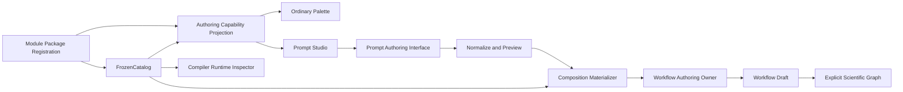

# ProteinPrompt Authoring 层级与参数所有权规格

- **状态**：已确认
- **日期**：2026-08-31
- **性质**：当前实现必须满足的工程规格
- **上位功能规格**：`docs/2026-08-29-webui-functional-spec.md`
- **领域词汇**：`CONTEXT.md`

## 1. 目的

本规格一次性修正 ProteinPrompt authoring 的两个架构问题：

1. executable scientific contract、显式 Workflow scientific Node 和普通用户可操作的
   authoring capability 被压成同一层；
2. `ResidueLayout`、`ResidueMap`、canonical residue identities、aligned track carriers、
   Node/Binding/Port identities 和 edge topology 等 implementation-owned facts 被错误地当作
   普通用户参数暴露。

完成后，普通用户在 Workflow 画布中只操作一个“编写 ProteinPrompt”authoring entry，并在
Prompt Studio 中表达来源、残基选择、编辑动作和科学值。Backend implementation 维护内部残基
身份轴、来源对应、全轨道重对齐、preview 和显式 Workflow materialization。

底层 scientific Nodes 和 exact scientific facts 不因用户层级变深而消失。它们继续存在于
完整 Catalog、Workflow Draft、Workflow Commit、Execution Plan 和必要的 Run Evidence 中，
用于编译、执行、解释和复现。

## 2. 任务约束

### 2.1 只修改层级与参数所有权

本任务只允许修改完成以下目标所必需的代码、合同、测试、示例和文档：

- 发布正确的 Authoring Capability Projection；
- 建立深 Prompt Authoring module；
- 把 Prompt Studio 用户意图 materialize 为显式 Workflow；
- 纠正 Prompt authoring Node contracts 中由错误层级造成的冗余或逐轨道装配；
- 支持当前 WebUI 功能规格已经确认的完整 ProteinPrompt authoring 行为。

不得借此修改 Results、Selection、Export、Run runtime、Cache、Evidence、Provider Adapter、
权限、部署或其他 Module Package 的独立问题。跨 Module Package 的 Node 只能在它们是
ProteinPrompt source resolution 或 materialization 的必要 current producer/consumer 时修改。

本任务之后唯一获批的 Provider Adapter 例外是 ESM-3 atom37 translation：ProteinPrompt 保留
完整 named-atom coordinates；ESM-3 Adapter 在 provider translation seam 只投影官方 atom37
可表示的原子，并以同一投影计算 functional-input digest。非 atom37 原子不进入 provider input，
但不会被拒绝或从 ProteinPrompt 删除。该例外不授权其他 Adapter 重构、校验、fallback 或兼容逻辑。

不得建立面向假想 capability 的通用框架。Authoring Projection 的抽象深度只覆盖本规格要求的
ordinary Node、specialized composition 和 managed member 三种已确认角色。

### 2.2 编码原则：信任已接纳的值

实现只写完成业务语义所需的代码，不增加防御性编程。

- Public protocol adapter 对 closed wire value 做一次 schema admission。
- Prompt Authoring interface 的 implementation 对其拥有的 authoring 和科学 invariant 做一次
  admission。
- Workflow authoring owner 在写入 Draft 时对 managed composition ownership 做一次 admission。
- 通过 contract-owning seam 后，trusted in-process callers 直接传递 typed values。
- 不重复检查已经接纳的字段、类型、范围、identity、Port compatibility 或 canonical form。
- 不增加 broad catch、catch-and-continue、silent coercion、schema repair、guess、fallback、
  undocumented retry 或 guessed default。
- 不增加认证、授权、多租户、adversarial input handling、sandboxing 或 hosted-service hardening。
- 除 preview digest 这一已确认的用户确认事实外，不增加 authoring record self-digest、
  subgraph integrity digest 或其他防御性 hashing。
- 本地 invariant violation fail fast；用户可修正的 authoring 问题作为 typed diagnostics 返回。
- 只保留科学正确性、explicit contract、durable write 和防止意外数据丢失所必需的检查。

### 2.3 原子替换

项目没有历史兼容义务。实现必须同时修改 current producers、consumers、tests、examples、public
protocol 和文档，并删除 superseded contracts 和路径。

不得增加：

- legacy route 或 legacy schema；
- `hidden` / `user_visible` 兼容字段；
- 新旧 authoring interface 并行路径；
- raw Workflow patch public interface；
- managed Node direct-edit fallback；
- migration、alias、shim 或 dual decoder。

## 3. 规格内术语

以下术语由本规格使用；进入实现时应同步写入 `CONTEXT.md`。

**Authoring Capability Projection**：startup-frozen、非科学的 authoring 投影。它引用同一个
`FrozenCatalog` 的 exact contracts，声明哪些操作进入普通 Palette、哪些操作由 specialized
authoring entry 表达，以及哪些 Node Types 是其 managed members。它不是第二个 scientific
Catalog。

**Specialized Composition**：在普通用户画布中表现为一个 authoring entry、在
`WorkflowDocument` 中 materialize 为一个或多个显式 Node Instances 和 edges 的 authoring
结构。

**Managed Member**：属于一个 Specialized Composition 的显式 Node Instance 或 internal edge。
它在完整 Catalog 和 Workflow 中保持可检查，但不能通过普通 Palette 或通用参数表单创建、修改
或部分删除。

**Prompt Authoring Document**：声明 ProteinPrompt 来源、目标 residue membership、各 track 的
最终编辑意图、function annotations、随机 authoring 条件和结构变换的非可执行 authoring value。
它不是 ProteinPrompt、Workflow、Run result 或 scientific evidence。

**Prompt Authoring Preview**：Backend 根据 Prompt Authoring Document 产生的非发布、不可执行
projection。它包含 normalized document、完整 Prompt projection、变化、实际随机选择和
diagnostics，不产生 Run、Candidate、Cache、Artifact 或 Evidence。

**Managed Composition Record**：与一个 Workflow Draft revision 一起持久化的非科学 authoring
state。它使 implementation 能重新打开、替换和删除 Specialized Composition，而不从底层图反向
猜测用户意图。

## 4. 目标架构



架构必须保持以下 seam：

1. `FrozenCatalog` 继续是 exact scientific contract resolution 的唯一 owner；
2. Authoring Capability Projection 只拥有用户 authoring 层级，不拥有 scientific semantics；
3. Prompt Authoring module 只通过一个小 interface 暴露完整 authoring 行为；
4. Workflow authoring owner 继续是 Workflow Draft 和 Workflow Commit 的唯一写入者；
5. public protocol adapter 只做 wire admission 和 typed projection，不复制 authoring science。

## 5. Authoring Capability Projection

### 5.1 Module Package contribution

`ModulePackageRegistration` 必须增加独立的 `authoring_capabilities` contribution。
`build_frozen_catalog()` 不把该 contribution 作为 `CatalogDefinition`，也不把它写入 scientific
descriptor、Result Identity 或 Workflow Commit scientific definition snapshot。

Startup 使用全部 Module Package registrations 和已构建的 `FrozenCatalog` 构建一个 immutable
Authoring Capability Projection。Builder 只校验本投影拥有的关系：

- capability identity 唯一；
- exact Node Type 和 Port Type references 能从 current FrozenCatalog 解析；
- 一个 Node Type 不能同时被两个 specialized capabilities 声明为 managed；
- exposed input/output roles 引用存在的 exact Port Type contracts；
- managed Node Type 属于 capability 声明允许 materialize 的集合。

这些检查只在 startup projection build seam 执行一次。其他 callers 信任构建完成的 typed
projection。

### 5.2 三种 authoring role

Authoring Capability Projection 只声明三种角色：

| 角色 | 用户行为 | Catalog / Workflow 行为 |
|---|---|---|
| `ordinary_node` | 可从普通 Palette 添加并使用通用参数表单 | 直接引用一个 Node Type contract |
| `specialized_composition` | 以一个 authoring entry 打开专用 editor | materialize 为一个 managed scientific subgraph |
| `managed_member` | 不能单独添加或直接编辑；Inspector 可只读查看 | 保留完整 Node Type、Node Instance、Ports 和参数 |

所有未被 specialized capability 声明为 managed 的 Node Types 按现有 Node Definition 语义成为
`ordinary_node`。一个 capability 必须同时声明替代 managed members 的 specialized entry；不允许
只有“隐藏”而没有 authoring replacement。

### 5.3 ProteinPrompt capability

Prompt authoring package 必须贡献一个 `protein_prompt.authoring` capability。Public projection
至少包含：

- title、summary、category 和 editor kind；
- role-labelled source kinds；
- exposed ProteinPrompt output role；
- exact accepted/output Port Type references；
- managed Node Type references；
- Inspector 所需的 capability-to-member relationship。

Public projection 不复制 Node Definition 的 Ports、参数 schemas 或 scientific meaning；caller 通过
exact refs join 同一个 public Catalog projection。

## 6. Prompt Authoring interface

Prompt Authoring module 的外部 interface 固定为三项行为。具体 transport route names 由 public
protocol 定义，但不得增加平行行为。

### 6.1 `open`

`open` 创建或恢复完整 Prompt Authoring Document 和 authoring snapshot。

它必须支持：

- 新建空白 ProteinPrompt；
- 从 FASTA/ProteinSequence source 开始；
- 从 PDB/Resolved Structure Residue Axis source 开始；
- 从已有 ProteinPrompt source 开始；
- 重新打开已有 Specialized Composition。

Snapshot 返回用户可定位的 chain/residue labels、opaque authoring residue handles、所有 track
projections、function annotations 和来源信息。它不返回 `ResidueLayout` 或 `ResidueMap` public
objects。

### 6.2 `preview`

`preview` 接受一份声明式 Prompt Authoring Document，并一次返回：

- normalized authoring document；
- preview digest；
- ordered residue projection；
- sequence、coordinates、secondary structure 和 absolute SASA projections；
- function annotation projection；
- source/current/changed/cleared/inserted/pending-delete 状态；
- 随机 authoring 实际选中的 residues 或 insertion positions；
- layout 变化造成的全部 track 和 annotation 后果；
- source merge、conflict 和 correspondence projection；
- 所有可定位 diagnostics；
- 完整 ProteinPrompt summary。

Residue 和 track projection 按其 source/current value 归类为上述六态。Function annotation 没有
独立 annotation identity，因此只按完整 `(label, start residue identity, end residue identity)`
tuple 建立 exact correspondence：相同 tuple 是 `source`，新 tuple 是 `inserted`，被移除的 source
tuple 是 `pending-delete`。不得按重复 label 猜测 annotation 的 `changed`、`current` 或 `cleared`。

Preview 不保存 Draft，不执行 materialized Nodes，不建立 Execution Plan，不产生 Run、Candidate、
Cache、Artifact 或 Evidence。

### 6.3 `apply`

`apply` 接受 normalized authoring document 和已确认 preview digest。它必须：

1. 在当前 Project 的最新 Workflow Draft 上工作；
2. 创建、替换、复制或删除一个完整 Specialized Composition；
3. materialize 完整目标 scientific subgraph；
4. 保留全部不属于该 composition 的 Nodes、edges、Selection Objectives 和 Observation Selectors；
5. 根据 exposed roles 自动重新连接 existing external edges；
6. 通过 Workflow authoring owner 原子发布下一 Draft revision；
7. 返回完整新 Workflow Draft 和 Specialized Composition projection。

Caller 不提交 expected Draft revision。Preview digest 只证明 caller 确认的是同一 normalized
document、source facts 和 composition facts，不承担并发锁或历史版本职责。

删除和复制不增加另一套 interface：

- 删除是一种 closed apply intent，移除完整 managed composition；
- `create` 和复制每次分配新的 opaque composition identity；删除后使用相同 document 重新创建也不
  复用旧 identity。identity 不由 normalized document、source facts、fixture identity 或 graph scan
  推导；
- `replace` 保留原 composition identity；同一 composition 内的 managed identities 在 replace 时稳定；
- 编辑始终使用 `open -> preview -> apply`。

## 7. Prompt Authoring Document

### 7.1 文档形式

Prompt Authoring Document 必须表达声明式最终意图，不得保存鼠标事件、快捷键事件或 command
log。Hover、selection highlight、panel layout、viewer hide/show 和 undo/redo history 属于
frontend-owned opaque UI state。

Document 必须表达：

- source role 和 exact source reference；
- blank source 的 chain order、chain identifiers 和 lengths；
- target residue membership 和 ordered chain membership；
- insert、delete、preserve、specify 和 Mask 意图；
- sequence、coordinates、secondary structure 和 absolute-SASA values；
- function annotation 的 final label/interval collection；
- operation-scoped overlap policy；
- random count、eligible scope 和 seed；
- source merge 的 per-track adopt/preserve/conflict decisions；
- 用户确认的 source-to-target residue correspondence；
- residue selection 上的 exact rigid translation/rotation。

### 7.2 Public residue addressing

Public authoring interface 使用 opaque authoring residue handle 定位 residues。Snapshot 和 preview
同时提供用户可读的 chain/residue locator。

Public authoring request 不接受：

- canonical `ResidueIdentity` string；
- `ResidueLayout`；
- `ResidueMap`；
- source/target index arrays；
- aligned track carrier；
- Node Type、Binding 或 Port identity；
- Node Instance ID、internal edge 或 graph ordering；
- named-atom replacement arrays。

Implementation 将 opaque handles 解析为 exact canonical identities，在 materialized Workflow 中
保存这些 exact facts。Rigid transform 由 implementation 展开为 exact named-atom coordinate
replacements。

### 7.3 Random authoring

用户拥有 seed、count、eligible scope 和是否确认本次 preview 的决策。Implementation 拥有：

- eligibility normalization；
- deterministic sampling；
- 实际选择 projection；
- effective randomness parameters；
- random insertion identities。

Preview 和 materialized scientific operation 必须使用同一 canonical sampling implementation，
使相同 source facts、seed、count 和 scope 得到相同选择。不得实现第二套 preview sampling。

### 7.4 Correspondence

当来源与目标的长度、缺失区间、编号或 identity 不同，implementation 可以生成临时 correspondence
draft，但不得把临时 draft 当作最终 scientific correspondence。用户必须明确确认最终关系。

Materialized Workflow 保存 exact source/target residue correspondence 和 gap dispositions。它不得把
数组位置、viewer index 或 provider position 当作 Workbench residue identity。

## 8. 完整 ProteinPrompt authoring 行为

同一个 Prompt Authoring interface 必须覆盖当前功能规格中全部已经确认的 ProteinPrompt
authoring 行为：

- 空白、FASTA、PDB 和已有 ProteinPrompt 四种同等级来源；
- 单链、多链和完整 residue membership；
- residue preserve、specify、Mask、insert 和 delete；
- sequence、coordinates、secondary structure 和 absolute SASA；
- function annotation 添加、修改、删除和拆分；
- random Mask 和 random insertion 的 preview、重抽和确认；
- layout 变化后的全部 present tracks 和 annotations 整体重对齐；
- 多来源导入、逐 track conflict decisions、gap authoring 和用户确认 correspondence；
- residue-level rigid translation/rotation；
- 完整 diagnostics、summary 和 frontend undo 所需 projection；
- composition 创建、编辑、复制、删除和重新打开。

FASTA/PDB source resolution 只实现 Prompt authoring 使用这些来源所必需的 current path；不得借此
重构通用 importer architecture。多来源 correspondence 只服务 ProteinPrompt authoring；不得借此
建立通用 alignment framework。

## 9. Managed Composition Record

### 9.1 Draft ownership

`WorkflowDraft` 必须在 `workflow` 之外持有 immutable `authoring_compositions`。Draft durable
record 使用并列字段保存：

```text
WorkflowDraft
  project_id
  draft_revision
  workflow                  # scientific WorkflowDocument
  authoring_compositions    # non-scientific authoring state
```

`WorkflowDocument.canonical_projection()` 保持纯 scientific graph。Workflow Commit 只保存 admitted
Workflow 和 minimum scientific definition snapshots；它不保存 Prompt Authoring Document 或
Managed Composition Record。

### 9.2 Record 内容

每条 Managed Composition Record 必须保存：

- composition identity；
- capability identity；
- normalized Prompt Authoring Document；
- managed Node Instance identities；
- internal edge identities；
- exposed input/output role endpoints；
- 已确认 preview 的业务 identity。

Managed Composition Record 不保存 self-digest、source facts digest、normalized document digest 或
materialized subgraph digest。Typed record、stable managed identities 和 Workflow authoring owner 的
一次 admission 已足够表达 ownership，不增加第二套完整性机制。

### 9.3 Ownership rules

- Prompt Authoring module 独占 managed composition 的创建、修改、复制和删除。
- Generic Workflow save 可以修改 ordinary Nodes 和 composition external edges。
- Generic Workflow save 不得部分修改、遗漏或伪造 managed Nodes 和 internal edges。
- Workflow authoring owner 在 Draft admission seam 一次检查 managed membership；通过后不重复检查。
- Materializer 以 `composition_id + logical role` 生成同一 composition 内稳定的 Node Instance IDs；
  该稳定性不把 composition identity 变成 content-addressed identity。
- Materializer 每次产生完整目标 managed subgraph；implementation 在一次 Draft write 中原子替换。
- External edges 按 exposed role 自动重新连接，不按偶然 Node/Port locator 猜测。
- Composition 删除移除全部 managed Nodes、internal edges 和 connected external edges。
- 不存在把无法识别的 managed subgraph 降级为 ordinary editable Nodes 的 fallback。

## 10. Materialized scientific graph

### 10.1 原则

Materialization 必须在 authoring time 完成。Run runtime 不增加 implicit layout conversion、implicit
track mapping、implicit source merge 或 hidden authoring execution。

Materialized Workflow 必须保留：

- exact Node Type 和 Binding identities；
- exact Node parameters；
- exact Port connections；
- explicit inserted and deleted residue identities；
- exact source-to-target correspondence；
- exact track values、annotation collection 和 effective randomness；
- nominal Port Type compatibility。

### 10.2 参数所有权

| 用户拥有的意图 | Implementation-owned derived state | Materialized scientific facts |
|---|---|---|
| chain order、identifiers、lengths | `ResidueLayout` 和 canonical residue identities | layout-building Node parameters/output |
| insertion position、count 和 initial values | inserted identities、target layout | explicit whole-Prompt layout edit |
| residue deletion selection | complete delete declarations 和 `ResidueMap` | explicit whole-Prompt layout edit |
| track、selection、action 和 replacement value | identity-addressed normalized overrides | whole-Prompt track-edit parameters |
| seed、count 和 scope | normalized eligibility 和 preview selection | effective randomness parameters |
| annotation label、interval 和 overlap policy | canonical endpoints 和 ordering | complete annotation-edit parameters |
| source adopt/preserve/conflict choices | exact confirmed correspondence | explicit source-merge parameters/evidence |
| residue selection 和 rigid transform | named-atom coordinate replacements | exact structure-track overrides |

## 11. Prompt authoring Node contract 原子替换

本修改必须同时更新 `modules/prompt_authoring` 的 current scientific contracts。目标不是只把浅
Nodes 从 Palette 隐藏，而是删除已经被完整 whole-Prompt operations 取代的浅接口。

### 11.1 保留的 Node Types

- `prompt_authoring.build_residue_layout`
- `prompt_authoring.assemble_protein_prompt`
- `prompt_authoring.prompt_from_structure`
- `prompt_authoring.override_protein_prompt_track`
- `prompt_authoring.random_mask`
- `prompt_authoring.random_insert_masked`
- `prompt_authoring.update_prompt_sequence`

这些 Node Types 全部是 `protein_prompt.authoring` capability 的 managed members，不进入普通
Palette。

### 11.2 新增的 whole-Prompt Node Types

#### `prompt_authoring.edit_protein_prompt_layout`

该 Node 接受一个 identity-complete ProteinPrompt 和 exact insert/delete declarations，并原子输出：

- target ProteinPrompt；
- complete source-to-target `ResidueMap`。

它必须同步处理所有 present tracks 和 function annotations。Insert declarations 在 materialized
Node 中保存 exact inserted identities；delete declarations 保存 exact deleted identities。它取代
Prompt 编辑中的：

```text
edit_residue_layout
-> map_residue_track x N
-> assemble_protein_prompt
```

#### `prompt_authoring.replace_protein_prompt_annotations`

该 Node 接受 identity-complete ProteinPrompt、完整 final annotation collection 和
operation-scoped overlap policy，并输出更新后的 ProteinPrompt。它支持 annotation add、edit、
delete 和 split 的最终 materialization，不通过一串单条 add operations 重放 UI actions。

#### `prompt_authoring.merge_protein_prompt_source`

该 Node 接受 target ProteinPrompt、一个 role-labelled source、用户确认的 exact residue
correspondence 和逐 track adopt/preserve decisions，并输出 merged ProteinPrompt。它必须显式保存
correspondence 和 conflict decisions，不猜测跨 identity 科学关系。

### 11.3 删除的 Node Types

- `prompt_authoring.add_function_annotation`
- `prompt_authoring.edit_residue_layout`
- `prompt_authoring.insert_masked_residues`
- `prompt_authoring.map_residue_track`
- `prompt_authoring.override_residue_track`

删除理由：

- `override_residue_track` 没有 current production consumer，且 aligned track 已拥有 layout；
- `edit_residue_layout`、`map_residue_track` 和 `insert_masked_residues` 的 Prompt authoring 语义由
  `edit_protein_prompt_layout` 完整拥有；
- `add_function_annotation` 只表达单条追加，不能拥有完整 annotation collection 的 edit/delete/split
  semantics；
- current repository 没有独立于 ProteinPrompt authoring 的 `map_residue_track` production consumer，
  因此不保留 speculative nominal-track utility。

所有 current examples、fixtures、tests 和 docs 必须同步更新；不保留旧 stable IDs 的 alias 或
reader。ADR-0033 必须同步改写为 whole-Prompt layout edit contract，同时继续要求 explicit inserted
identities、exact residue mapping 和全轨道同步变化。

## 12. Public protocol

Current public protocol 必须原子增加：

- Authoring Capability Projection retrieval；
- Prompt authoring open；
- Prompt authoring preview；
- Prompt authoring apply。

所有 request/response 使用 closed schemas。Prompt authoring schemas 不使用任意 `JsonObject` 作为
document escape hatch。

Public protocol 不提供：

- raw Workflow patch；
- raw managed membership mutation；
- direct low-level Prompt Node authoring；
- `ResidueLayout` / `ResidueMap` editor payload；
- arbitrary capability dispatch；
- legacy operation 或 alternate schema。

`ProjectWorkflowDraft` response 必须携带 frontend 渲染 Specialized Composition 所需的 typed
composition projections。Generic Workflow save request 不接受 caller-authored managed composition
records。

## 13. Diagnostics 与错误

Authoring diagnostics 只表达用户可以修正的业务问题，例如：

- source 缺少当前操作需要的科学值；
- residue handle、selection 或 interval 不属于当前 snapshot；
- replacement value 不满足目标 track 的 scientific contract；
- random count 超过 admitted eligibility；
- delete/merge 会丢失的值或 annotations；
- correspondence 尚未确认；
- source conflicts 尚未裁决；
- rigid transform 不满足当前 structure authoring contract。

Preview 必须一次返回全部可定位 diagnostics，不用 exception 逐项中断。Public malformed request、
unknown Project/source/composition 和 durable write failure 使用现有 structured error grammar。

Implementation bug、impossible managed membership、materializer 产生不符合自己声明的 Node/Port 或
local invariant violation 直接 fail fast；不得包装成用户 diagnostics、Provider failure 或
retryable outcome。

## 14. 测试与验证

### 14.1 Authoring Projection tests

- capability identities 唯一；
- exact refs 全部解析；
- managed Node Type 只被一个 capability 拥有；
- ordinary Palette 不包含 managed Node Types；
- Prompt specialized entry 存在且引用 `protein.prompt` output contract；
- Authoring Projection 不进入 Result Identity 或 scientific definition snapshots。

### 14.2 Prompt Authoring interface tests

测试只通过 `open`、`preview` 和 `apply` interface 覆盖：

- 四种来源；
- 所有 residue 和 track edits；
- random preview 与 materialized operation 的一致选择；
- function annotation add/edit/delete/split；
- insert/delete 后所有 tracks 和 annotations 整体重对齐；
- source merge、conflicts 和用户确认 correspondence；
- rigid transform materialization；
- composition create/edit/copy/delete/reopen；
- external role edge preservation；
- unrelated Workflow content 保持不变；
- apply 后 Draft 中存在完整显式 scientific graph。

### 14.3 保留与删除的低层 tests

- 保留每个 current scientific Node contract 的 focused scientific behavior tests；
- 为三个新增 whole-Prompt Node Types 建立完整 contract/behavior tests；
- 删除五个 superseded Node Types 的 tests；
- 删除把手工 layout/map/track wiring 当作普通用户 authoring contract 的 tests；
- checked-in complete examples 可以保存用于静态编译和说明的 current materialized graph；fresh public
  journey acceptance 必须通过 `open -> preview -> apply` 获取当前 managed graph。Fixture 只贡献明确的
  ordinary Nodes、ordinary internal edges、selectors/objectives 和 exposed-role connection intent；
  科学期望值必须是独立 oracle，不得从被测 materialized graph 反推。

测试不得为 trusted internal values 增加 defensive malformed-object permutations。Malformed public
wire 只在 public protocol adapter tests 覆盖一次；scientific invariants 只在 owning module tests
覆盖一次。

### 14.4 Required verification

修改完成后必须运行 focused tests，以及：

```bash
.venv/bin/python -m verification.backend routine
.venv/bin/python -m verification.backend deterministic-acceptance
```

涉及实现的最终验收还必须在远端隔离副本中运行完整 repository matrix 和当前 canonical Acceptance
Campaign。不得使用原部署目录。Campaign tier 数量以 `verification.acceptance_campaign` 的当前定义
为准；host、临时目录和凭据只记录在运行证据或 handoff，不写入本规格。

## 15. 完成条件

以下条件必须全部满足，任务才算完成：

1. 普通 Palette 只显示一个“编写 ProteinPrompt”specialized entry，不显示其 managed Node Types。
2. Inspector 可以只读解释 materialized managed Nodes 和 exact scientific parameters。
3. Public Prompt authoring requests 不包含 ResidueLayout、ResidueMap、canonical residue strings、
   Node/Binding/Port identities 或 raw graph patch。
4. 四种来源和全部已确认 Prompt Studio authoring 行为通过同一个 `open -> preview -> apply`
   interface 完成。
5. Backend implementation 独占 identity allocation、correspondence、全轨道重对齐、random preview、
   coordinate expansion 和 graph materialization。
6. Workflow Draft 保存 Managed Composition Records；WorkflowDocument 和 Workflow Commit scientific
   content 保持纯粹。
7. Materialized Workflow 保留完整显式 scientific Nodes、Ports、parameters、maps、randomness 和
   correspondence。
8. Superseded Prompt authoring Node Types、routes、schemas、tests、examples 和 docs 已删除或原子更新，
   不存在 dual path。
9. 除本规格要求的 necessary producers、consumers、tests、examples 和 docs 外，没有修改其他问题。
10. 实现没有增加防御性检查、fallback、兼容层、猜测、修复或重复 admission。
11. Focused tests、routine verification、deterministic acceptance、远端隔离 repository matrix 和
    canonical Acceptance Campaign 全部通过。
