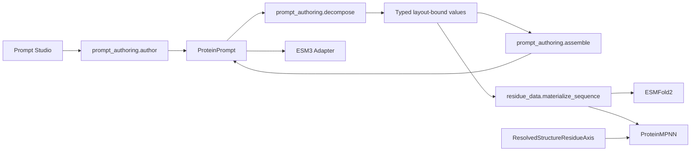

# 干净科学数据流与 Prompt Authoring 删除型重构规格

- **状态**：已确认
- **日期**：2026-09-02
- **性质**：当前重构的工程规格
- **适用阶段**：Phase 1–3
- **暂挂阶段**：Phase 4 closed resolved-structure transport
- **领域词汇**：`CONTEXT.md`
- **历史材料**：`docs/legacy/` 下的设计文档与 ADR 只解释历史，不约束本规格

## 1. 目的

本规格重构跨 Module 的科学数据传输、Prompt Authoring Node interface 和相关数据 ownership，
优先保证以下性质：

1. Module 之间只传递闭合、自描述且科学语义明确的数据；
2. residue identity axis 与逐 residue values 不再通过可错配的平行 Port 传递；
3. 相同数据形状共享一个小 runtime interface，不再维护三套 track carrier；
4. nominal Port Type Definition 继续区分不同科学语义、单位和 missing role；
5. Prompt Studio 使用一个深 Node，而不是 managed subgraph 或新的通用 Node Group framework；
6. 删除 superseded Node Types、Port Types、codecs、sidecar state 和 graph surgery；
7. ProteinPrompt 保留，但不再作为所有科学 Module 的通用交换模型。

本规格不以增加验证、追溯或 evidence 复杂度为目标。Implementation 只保留关闭科学值和阻止
错误 Provider translation 所必需的最小检查。

## 2. 设计原则

### 2.1 深 Module 与 seam

新的 residue data Module 必须通过小 interface 隐藏以下 implementation：

- residue identity parsing 与 chain order 推导；
- immutable value freezing；
- layout/value length closure；
- identity-addressed reindex；
- canonical wire representation；
- Provider sentinel 与 Workbench `None` 的转换。

这个 in-process Module 不需要 Adapter。ESM3、ProteinMPNN、ESMFold2 和 DSSP 的翻译继续留在各自
真实 Provider seam 的 Adapter 中。

该 Module 通过 deletion test：若删除它，layout closure、track alignment、codec 和 reindex 逻辑会
重新散落到所有 producers 与 consumers。因此它具有足够 depth、leverage 和 locality。

### 2.2 不建立假想抽象

本规格禁止新增：

- `ProteinState`、`UniversalPrompt` 或含大量 optional fields 的 mega-bundle；
- `Any + TrackKind`、动态 track registry 或 capability bag；
- Prompt→Provider 的 pairwise converter matrix；
- dynamic socket inference、隐式 Port conversion 或 Blender Field 语义；
- 通用 Node Group persistence、recursive groups 或 runtime group executor；
- legacy Port、legacy Node、alias、shim、dual parser 或旧 workflow migration。

Blender 设计只用于指导稳定 typed Port interface、显式 conversion 和 implementation 隐藏；不复制其
动态 Bundle、隐式转换或可变 datablock。

### 2.3 原子替换

项目没有历史兼容义务。每个 Phase 必须同时迁移所有 current producers、consumers、tests、fixtures、
examples 和文档，并在同一 Phase 删除 superseded implementation。

不得为了分步上线保留新旧 carrier、Port 或 Node 双路径。开发期已有 workflow、cache 和 evidence
artifact 可直接失效并重新生成。

## 3. 目标架构



关键 ownership：

- `ProteinPrompt` 是闭合 aggregate，只拥有一次 `ResidueLayout`；
- 独立穿越 Port 的逐 residue value 使用 self-contained `ResidueTrack`；
- Candidate-associated observed value 使用 `CandidateResidueTrack`；
- ProteinMPNN 的 structure target 只来自 `ResolvedStructureResidueAxis`；
- ESMFold2 只消费从 complete sequence conditioning 显式物化的 sequence Candidate。

## 4. Provider-independent residue data interface

### 4.1 `ResidueLayout`

```python
@dataclass(frozen=True, slots=True)
class ResidueLayout:
    residue_ids: tuple[str, ...]

    @property
    def length(self) -> int: ...

    @property
    def chain_ids(self) -> tuple[str, ...]: ...
```

Interface 规则：

- 只保存 ordered、identity-complete `residue_ids`；
- `length` 从 `len(residue_ids)` 派生；
- chain order 从 residue identities 派生；
- residue identity 唯一；
- 同一 chain 在 layout 中连续；
- 不再保存可与 `residue_ids` 矛盾的 `chain_id` 或 `length` 字段。

`ResidueLayout` 数据类型保留。裸 `residue.layout` Port 的生命周期见第 10.2 节。

### 4.2 `ResidueTrack`

```python
T = TypeVar("T")


@dataclass(frozen=True, slots=True)
class ResidueTrack(Generic[T]):
    layout: ResidueLayout
    values: tuple[T | None, ...]
```

Interface 规则：

- `len(values) == layout.length`；
- `values[index]` 永远描述 `layout.residue_ids[index]`；
- values immutable；
- 不保存 `sentinel`、`kind`、unit、subject 或 mask role；
- 不执行隐式 padding、truncation、layout conversion 或 positional guess；
- carrier 本身不解释 `None` 的科学角色；该语义由 nominal Port Type Definition 拥有；
- present all-null track 不得自动转换为 absent track。

### 4.3 `CandidateResidueTrack`

```python
@dataclass(frozen=True, slots=True)
class CandidateResidueTrack(Generic[T]):
    subject: CandidateDataReference
    track: ResidueTrack[T]
```

Interface 规则：

- `subject` 必填；
- 不使用 `CandidateDataReference | None`；
- 只用于确实以 Candidate 为 subject 的 observed 或 evaluated Scientific Value；
- Prompt conditioning 不得虚构 Candidate subject；
- wrapper 不猜测 Candidate 类型或 axis。

### 4.4 Runtime carrier 与 nominal Port

`ResidueTrack` 和 `CandidateResidueTrack` 是 shared runtime carriers，不是可任意连接的 generic Port。
Workflow Port compatibility 继续要求 exact nominal Port Type ID。

同样的 runtime values 不意味着以下语义可以直接连接：

- intended conditioning 与 observed annotation；
- sequence masking 与 ProteinMPNN designability；
- absolute SASA 与 relative SASA；
- named-atom conditioning coordinates 与 resolved structure target。

## 5. ProteinPrompt interface

### 5.1 角色

ProteinPrompt 保留为 residue-aligned multi-track conditioning aggregate。它是 Prompt Studio 与 ESM3
路径上的闭合值，但不是 ProteinMPNN、ESMFold2 或未来科学 Module 的通用输入语言。

### 5.2 目标形状

```python
@dataclass(frozen=True, slots=True)
class ProteinPrompt:
    layout: ResidueLayout
    sequence: tuple[str | None, ...]
    coordinates: tuple[NamedAtomCoordinates | None, ...]
    secondary_structure: tuple[str | None, ...] | None
    sasa: tuple[float | None, ...] | None
    function_annotations: tuple[FunctionAnnotation, ...]
```

Interface 规则：

- aggregate 只保存一次 `layout`；
- sequence 和 coordinates 始终 present，允许 all-null；
- secondary structure 和 SASA 允许 whole-track absent；
- `None` whole-track 与 present all-null tuple 是不同状态；
- aggregate 内部 tracks 只保存 immutable tuples，不再嵌套 bare `ResidueTrack`；
- aggregate 不保存 Candidate subject；
- aggregate 不保存独立 `target_layout` 副本。

### 5.3 Function annotations

Function annotations 是绑定于 authoritative ResidueLayout 的、按规范顺序排列的标注区间集合。不同注释可以部分重叠、相互包含或覆盖相同区间；重叠本身不构成错误。完全相同的 `(label, start_residue_id, end_residue_id)` 不得重复。Prompt Authoring 不提供 `overlap_policy`，也不自动裁剪、合并或去重注释。

```python
@dataclass(frozen=True, slots=True)
class FunctionAnnotation:
    label: str
    start_residue_id: str
    end_residue_id: str
```

删除 `start`、`end` 和 `chain_id`。Containing ProteinPrompt 的 layout 是唯一位置 owner。Adapter 需要
provider position 时，根据 layout 解析 residue identity。

## 6. Secondary structure 与 missing semantics

### 6.1 SS8 actual states

SS8 实际结构状态统一为：

```text
H / B / E / G / I / T / S / C
```

转换规则：

- Prompt 输入 `-` 转为 canonical `C`；
- DSSP 输入 `P` 转为 canonical `C`；
- DSSP 输入 `_` 转为逐 residue `None`；
- 其他 canonical SS8 state 保持不变。

`None` 是逐 residue 缺失值，不是 actual SS8 state。

### 6.2 Absent 与 present all-null

- optional Port 没有输出值，或 ProteinPrompt optional field 为 `None`：whole-track absent；
- `ResidueTrack(layout, (None, ...))`：track present，但每个 residue 均缺失；
- 两种状态不能由 constructor、codec、Prompt override 或 Adapter 自动合并；
- ESM3 translation 必须继续区分 provider `None` 与 provider present masked track。

## 7. Named-atom coordinates 与 ESM3 atom37 projection

Canonical `ResidueTrack` 保持 provider-independent named atoms。通用 residue data Module 不包含 atom37
限制，也不删除无法被 ESM3 表示的 named atoms。

ESM3 Adapter 采用官方 atom37 projection 行为：

```text
provider-independent named atoms
              │
              ▼
      ESM3 atom37 projection
      ├─ atom37 支持的原子：复制
      ├─ 不支持的原子：忽略
      └─ 缺失槽位：NaN / mask=false
              │
              ▼
          [L, 37, 3]
```

规则：

- 非 atom37 原子不导致 Adapter 失败；
- 非 atom37 原子不会从 ProteinPrompt 或 canonical `ResidueTrack` 删除；
- functional-input digest 只覆盖实际进入 ESM3 的 atom37 projection；
- present coordinates track 若没有任何 atom37-supported coordinate，则 Provider view 没有可用 coordinates；
- 该行为只属于 ESM3 Adapter implementation，不改变其他 Provider Adapter 的科学 interface。

## 8. Nominal Port Type Definitions

目标 Port Types：

| Port Type ID | Runtime value | Scientific meaning |
|---|---|---|
| `protein.prompt` | `ProteinPrompt` | 闭合 multi-track conditioning aggregate |
| `residue.condition.sequence` | `ResidueTrack[str]` | nullable sequence conditioning |
| `residue.condition.coordinates` | `ResidueTrack[NamedAtomCoordinates]` | named-atom coordinates，单位 Å |
| `residue.condition.secondary_structure` | `ResidueTrack[str]` | canonical SS8 conditioning |
| `residue.condition.sasa` | `ResidueTrack[float]` | absolute SASA，单位 Ų，无 normalization |
| `residue.condition.function_annotations` | layout-bound annotation value | identity-addressed function intervals |
| `structure_annotation.secondary_structure.observed` | `CandidateResidueTrack[str]` | Candidate-associated observed SS8 |
| `structure_annotation.sasa.observed` | `CandidateResidueTrack[float]` | Candidate-associated observed absolute SASA |

删除以下 generic 或重复 Port Types：

- `residue.track`；
- `residue.track.sasa`；
- `residue.track.secondary_structure`；
- `prompt_authoring.track.sequence`；
- `prompt_authoring.track.structure`；
- `prompt_authoring.track.secondary_structure`；
- `prompt_authoring.track.sasa`。

Observed annotation 与 intended conditioning 必须使用不同 nominal Port。Observed→conditioning 通过显式
Node 转换；不能仅因 runtime carrier 相同而直接连接。

## 9. Node Type interface

### 9.1 `prompt_authoring.author`

Specialized Composition 与 managed subgraph 被一个普通、深 Node 取代。

```yaml
node_type_id: prompt_authoring.author

inputs:
  - name: sequence_source
    port_type_id: protein.sequence
    required: false
    multiplicity: one

  - name: structure_source
    port_type_id: structure_transform.resolved_residue_axis
    required: false
    multiplicity: one

  - name: prompt_source
    port_type_id: protein.prompt
    required: false
    multiplicity: one

  - name: merge_sources
    port_type_id: protein.prompt
    required: false
    multiplicity: many

outputs:
  - name: protein_prompt
    port_type_id: protein.prompt
    required: true
    multiplicity: one

node_parameters:
  document:
    required: true
```

Interface 规则：

- `sequence_source`、`structure_source`、`prompt_source` 最多连接一个；
- 三者均未连接表示 blank authoring；
- `merge_sources` 是 ordered many-input Port；
- FASTA/PDB 读取由可见的 `protein_io` Node 完成；
- merge sources 只接受 ProteinPrompt，不建立 heterogeneous source union；
- output 不包含平行 `target_layout` 或 `residue_map`；
- Prompt Studio 直接编辑 Node 的 `document` parameter。

`document` 保存：

- blank/sequence source 所需的 chain declaration；
- ordered target residue identities、insertions 与 deletions；
- sequence、coordinates、secondary structure、SASA 的稀疏编辑；
- rigid transforms；
- function annotations（遵循第 5.3 节，不含 `overlap_policy`）；
- random mask、random insertion 和显式 seed；
- merge correspondence 与 per-track adopt/preserve intent。

`document` 不保存：

- `project_input_ref`；
- `composition_id`；
- embedded merge source；
- `confirmed`、conflict、diagnostics 或 preview digest；
- UI-only residue handles；
- materialized Node IDs、role endpoints 或 internal edges。

### 9.2 唯一 Prompt authoring implementation

Preview 与 execution 必须调用同一个 pure implementation：

```python
apply_prompt_recipe(
    *,
    sequence_source,
    structure_source,
    prompt_source,
    merge_sources,
    document,
) -> ProteinPrompt
```

不得保留直接 `_evaluate()` 与 workflow `_materialize()` 两套 scientific implementation。

Open、Preview 和 execution 的 provider-free 来源解析复用同一值合同 owner；FASTA parser 只解析，
来源 ProteinSequence 必须完成 admission 后才能应用下游 edits。上游 Node 参数使用当前 Catalog 的
参数合同，不编译整个 Draft 来执行 Preview，也不建立新的通用 evaluator。

Open/Preview 的 `baseline_diagnostics` 单独说明已保存 document 对当前合法来源无法求值的原因。
此时 Open 保留可编辑 document，Preview 可独立计算候选；候选有效即可 Apply，且 `changes` 为空，
UI 明确显示无可比较的旧结果。不可用 baseline 不得伪装为空 ProteinPrompt；来源错误及候选错误仍
阻止 Apply。Apply 必须针对当前来源重算并验证 preview digest，失败后 editor 保留编辑并允许重新预览。

Preview 显示轴以候选 layout 顺序为准，共同 residue ID 只出现一次。删除 residue 的 tombstone 按旧
顺序放在同链下一个存活 residue 前；无后继放在该链末尾，整链删除放在显示轴末尾。过滤 tombstones
后必须精确得到候选 layout。共同 residue 的相对顺序改变时，用
`kind=residue_order, action=replace` 及 `before_residue_handles` / `after_residue_handles` 记录前后
有序 handles；普通插入、删除不额外报告顺序变更。WebUI 直接使用后端显示轴，不再独立重排。

Open 与 Preview 均通过 `random_selections` 暴露本 Node 同次 recipe 的实际随机 trace，包含
`operation_index`、`kind` 和 `realized_residue_handles`。随机插入保持现有 seed 和执行次序；本 Node
随机生成的 residue 可编辑轨道值，但 Studio 不允许单独删除或将其用作插入锚点，必须明确显示限制。
含此类 residue 的混合删除选择整体不可执行。普通来源 residue 仍可编辑，target intent 不得把本 Node
随机生成的 residue 伪装成 source。不得解析 ID 命名来猜测来源，不增加自动固化、排除项或随机重采样规则。

新建普通 author Node 显式初始化 `document: {}`；Studio 提供 blank/sequence authoring 的有序 chain
声明编辑入口，由用户填写 chain ID 和 length，经 Preview 后写回，不猜测默认科学 layout。


### 9.3 `prompt_authoring.decompose`

```text
ProteinPrompt
  ├─ sequence                  required
  ├─ coordinates               required
  ├─ secondary_structure       optional
  ├─ sasa                      optional
  └─ function_annotations      required
```

每个输出都携带 authoritative `ProteinPrompt.layout`。该 Node 不生成新 residue identity，不重建
`A:1...N`，也不改变 values。

### 9.4 `prompt_authoring.assemble`

Inputs：

- sequence conditioning：required；
- coordinate conditioning：required；
- secondary-structure conditioning：optional；
- SASA conditioning：optional；
- function annotations：required，empty value 合法。

Output：一个 `ProteinPrompt`。

该 Node 没有独立 layout input。所有 present inputs 必须具有完全相同的 `ResidueLayout`。Output
aggregate 只保存一次 layout。

### 9.5 `residue_data.materialize_sequence`

```text
input:
  sequence: residue.condition.sequence

outputs:
  sequence: protein.sequence
  sequence_candidates: candidate.collection
```

Interface 规则：

- 输入必须是 complete、single-chain sequence conditioning；
- 任一 residue 为 `None` 时失败；
- output ProteinSequence 保留输入 residue identities；
- output Candidate 是 root Candidate；
- Node 只投影 sequence，不读取 coordinates、SS8、SASA 或 function annotations。

### 9.6 Structure annotation Nodes

`structure_annotation.dssp_compute` 直接输出：

- `structure_annotation.secondary_structure.observed`；
- `structure_annotation.sasa.observed`。

删除 `DSSPAnnotation` transport、`secondary_structure_extract` 和 `sasa_compute` extraction Nodes。

新增一个显式 observed→conditioning Node。它：

- 输入 observed CandidateResidueTrack；
- 输出 source-less conditioning ResidueTrack；
- 保留 layout 与 values；
- 明确移除 Candidate subject；
- 不重建整个 ProteinPrompt。

Prompt Studio 不负责 ProteinMPNN design mask，也不从 sequence `None` 推断 designability。若未来需要，
应新增独立 `residue.design_mask` scientific value；不得扩展 ProteinPrompt 承担该语义。

## 10. Layout 与 residue mapping

### 10.1 平行 layout outputs

以下 Node 不再输出与 aggregate 或 track 平行的 layout：

- `prompt_authoring.author`；
- Prompt layout edit/random insert implementation；
- Prompt source conversion；
- track extraction/decomposition。

独立穿越 Port 的 ResidueTrack 自带 layout；ProteinPrompt 自己拥有 layout。Implementation 不得按 chain
length 重建 `A:1...N`。

### 10.2 裸 `residue.layout` Port

执行分两步：

1. Phase 1 立即删除 Prompt 与 track 旁边的平行 `residue.layout` outputs；
2. ProteinMPNN constraints 改为消费 resolved structure/design intent 后，重新检查生产 consumers；若已无
   consumer，则删除裸 `residue.layout` Port Type。

`ResidueLayout` 数据类型不删除。

### 10.3 ResidueMap

删除 public `residue.map` Port 和 Prompt edit/random-insert 的 `residue_map` outputs。当前生产 Workflow
没有 consumer 使用这些 outputs。

Identity-preserving insertion/deletion reindex 属于 Prompt authoring implementation 的 private 逻辑。
若未来出现真实 non-identity correspondence，再由拥有该科学语义的 Module 定义新 interface；本规格
不提前保留 generic public ResidueMap。

## 11. 目标 Workflow

### 11.1 Prompt Studio → ESM3

最短路径：

```text
prompt_authoring.author
  → protein.prompt
  → esm3.generate_*
```

需要显式连接或替换五类 conditioning 时：

```text
prompt_authoring.author
  → prompt_authoring.decompose
  → five typed conditioning Ports
  → prompt_authoring.assemble
  → esm3.generate_*
```

### 11.2 Prompt Studio → ESMFold2

```text
prompt_authoring.author
  → prompt_authoring.decompose.sequence
  → residue_data.materialize_sequence.sequence_candidates
  → folding.fold
```

Partial、masked 或 multi-chain sequence 不可进入 ESMFold2。

### 11.3 Prompt Studio → ProteinMPNN

```text
Structure Candidate
  → resolve authoritative structure target
  → ProteinMPNN

prompt_authoring.author
  → prompt_authoring.decompose.sequence
  → residue_data.materialize_sequence.sequence
  → ProteinMPNN optional reference sequence
```

不存在通用 ProteinPrompt→ProteinMPNN converter。ProteinMPNN structure target 必须来自
`ResolvedStructureResidueAxis`；named-atom conditioning 不能恢复 segment topology、residue names、
modified-residue normalization 或 backbone masks。

Prompt Studio 不输出 ProteinMPNN design mask。ProteinMPNN 无 constraints 时按其 own interface 执行；
有 constraints 时由 ProteinMPNN-owned design intent 提供。

## 12. 删除要求

### 12.1 数据与 Port

删除：

- `ResidueTrack.sentinel`；
- `AlignedResidueTrack`；
- `StructureAnnotationTrack`；
- `TrackKind`；
- `modules/prompt_authoring/track_types.py`；
- generic built-in `residue.track*` Port Types；
- four `prompt_authoring.track.*` Port Types；
- public `residue.map` Port；
- duplicate layout/track codecs；
- `FunctionAnnotation.start`、`end`、`chain_id`；
- Prompt Authoring 的 `overlap_policy` parameter、公开 schema/type 字段及重叠拒绝分支；同步更新 tests、fixtures 和 examples，不保留兼容解析；
- three families of track copy/rebuild helpers。

### 12.2 Prompt micro Nodes

由 `prompt_authoring.author` 的 private implementation 吸收并删除：

- `prompt_authoring.assemble_protein_prompt`；
- `prompt_authoring.build_residue_layout`；
- `prompt_authoring.edit_protein_prompt_layout`；
- `prompt_authoring.merge_protein_prompt_source`；
- `prompt_authoring.override_protein_prompt_track`；
- `prompt_authoring.prompt_from_structure`；
- `prompt_authoring.random_insert_masked`；
- `prompt_authoring.random_mask`；
- `prompt_authoring.replace_protein_prompt_annotations`；
- `prompt_authoring.update_prompt_sequence`。

新 `prompt_authoring.assemble` 是五个 public conditioning Ports→ProteinPrompt 的明确 Adapter Node，
不是旧逐轨 managed assembly Node 的兼容版本。

### 12.3 Specialized Composition machinery

删除：

- `ManagedCompositionRecord`；
- `ManagedRoleEndpoint`；
- `WorkflowDraft.authoring_compositions`；
- Specialized Authoring Capability Projection；
- managed ownership admission；
- managed/materialized Node Type lists；
- `_materialize_base_source()`；
- `_materialize_merge_source()`；
- `_materialize()`；
- managed Node ID generation；
- replace 时的 external Edge rewiring；
- WebUI composition folding、fake Node 和 hidden Edge rewriting；
- 依赖 managed UUID、Node order 或 internal membership 的 mechanics tests。

Prompt Studio 保留为专用 editor，但只编辑普通 `prompt_authoring.author` Node 的 document parameter。

## 13. 最小 admission 与检查

只保留两层：

1. value-owning interface 关闭单个 scientific value；
2. Provider Adapter 检查跨输入关系和 Provider representability。

不建立新的 validation framework、error hierarchy、repair、fallback 或 repeated admission。

必须阻止：

- layout/value 长度不一致；
- 不同 track 被隐式 positional join；
- function annotations 出现完全相同的 `(label, start_residue_id, end_residue_id)`；重叠本身不得被拒绝，也不得自动裁剪、合并或去重；
- absent 与 present all-null 被合并；
- 按 chain length 重建 residue identities；
- partial/multi-chain sequence 隐式进入 ESMFold2；
- named-atom conditioning 被伪造成 ProteinMPNN resolved structure；
- Prompt sequence `None` 被推断为 ProteinMPNN designability。

ESM3 atom37 projection 对非 atom37 atoms 的忽略是已确认 Provider translation，不属于 silent schema
repair 或错误数据丢弃。

## 14. 实施阶段

### Phase 1：Residue data ownership

主要文件：

- `datatypes/residue.py`；
- `datatypes/prompt.py`；
- `modules/prompt_authoring/domain.py`；
- `modules/prompt_authoring/prompts.py`；
- `modules/prompt_authoring/prompt_types.py`；
- `modules/structure_annotation/domain.py`；
- `modules/structure_annotation/port_types.py`；
- `modules/esm3/adapter.py`；
- `core/catalog/builtins.py`；
- `core/catalog/_port_value_codec.py`；
- corresponding tests、fixtures、examples 与 `CONTEXT.md`。

Phase 完成条件：

- 生产代码不再出现 `AlignedResidueTrack`、`StructureAnnotationTrack`、`TrackKind` 或 track sentinel；
- generic `residue.track*` Port 不再存在；
- Prompt 与 track 不再依赖平行 layout Port；
- 非序数、signed、insertion-code residue identities 不被重建；
- SS8 与 missing semantics 符合第 6 节；
- ESM3 atom37 projection 符合第 7 节。

### Phase 2：显式跨 Module Nodes

实现：

- `prompt_authoring.decompose`；
- new `prompt_authoring.assemble`；
- `residue_data.materialize_sequence`；
- DSSP direct observed outputs；
- observed→conditioning Node。

同步更新 ESM3、ProteinMPNN、ESMFold2 examples 和 workflow fixtures，并删除旧 extraction、apply-to-
Prompt 和 public residue-map paths。

Phase 完成条件：

- 三个第 11 节 Workflow 可由 exact nominal Ports 直接表达；
- 没有 Prompt→ProteinMPNN 或 Prompt→ESMFold2 pairwise converter；
- ProteinMPNN structure input 仍来自 authoritative resolved structure；
- ESMFold2 路径显式 materialize complete sequence Candidate。

### Phase 3：Prompt Studio 单深 Node

实现 `prompt_authoring.author`，让 preview 和 execution 调用同一个 `apply_prompt_recipe()`。同步迁移
public protocol 与 WebUI，随后删除第 12.2、12.3 节全部 superseded implementation。

Phase 完成条件：

- Workflow 与 protocol 不再出现 `authoring_compositions`；
- Prompt Studio 只编辑一个普通 Node Instance；
- 外部 Edge 连接真实 typed Ports；
- preview 与 execution 没有平行 scientific implementation；
- 十个 micro Node Type 及其 Method、Binding、YAML 与 mechanics tests 已删除。

### Phase 4：暂挂

Closed resolved-structure transport 暂时挂起，等待 Phase 1–3 完成后再设计。

届时才决定：

- Candidate、CandidateDataReference 与 ResolvedStructureResidueAxis 的最终 aggregate ownership；
- structure wire representation 的唯一 owner；
- ProteinMPNN、DSSP、folding confidence 与 structure comparison 的 closed transport interface。

已固定的限制：

- 只服务 resolved structures；
- structure wire 只序列化一次；
- 不扩展为 `Candidate + arbitrary capabilities` mega-bundle；
- Phase 1–3 不预建 placeholder、registry 或 compatibility field。

## 15. 明确推迟或排除

本规格不包含：

- Prompt Studio ProteinMPNN design-mask authoring；
- atomic Candidate-associated Output Admission；
- confidence/normalization materializer 重构；
- broad lineage、provenance 或 evidence redesign；
- Catalog single-source Node declaration；
- generic Node Group framework；
- closed resolved-structure transport implementation；
- ProteinSequence 全局 ownership 重构；
- performance、cache compatibility 或 legacy artifact replay。

## 16. 规格关闭条件

Phase 1–3 全部完成且满足以下条件后，本规格关闭：

1. 所有逐 residue Port value 都自带 authoritative layout；
2. aggregate 不再与平行 layout outputs 分叉；
3. ProteinPrompt 只作为 closed conditioning aggregate；
4. ESM3、ProteinMPNN、ESMFold2 使用各自真实科学 interface；
5. Prompt Studio 只有一个深 authoring Node；
6. managed composition、micro Node chain 和重复 carrier 已删除；
7. 没有 legacy、shim、dual path 或 speculative framework；
8. Phase 4 仍保持显式暂挂，不因前三阶段 implementation 偷渡新 abstraction。
