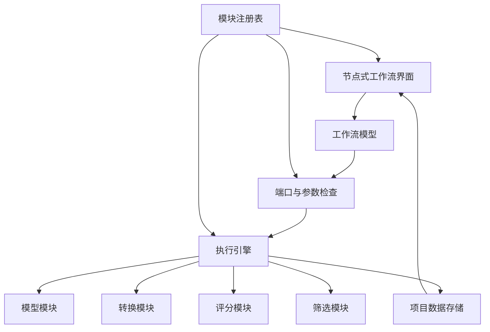
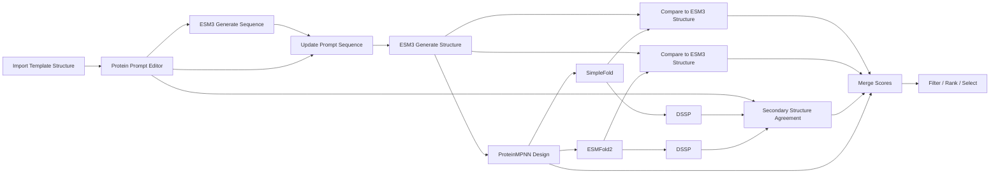

# 模块化蛋白质设计与评价工作台：项目架构文档

- **文档版本**：0.2
- **日期**：2026-07-23
- **使用场景**：个人本地使用
- **文档目标**：定义项目的核心模块、节点接入规范、数据接口和首版实现范围

---

## 1. 项目目标

本项目是一个采用节点连线方式构建工作流的蛋白质设计与评价工具。

用户可以在可视化画布中：

- 导入蛋白质序列或结构；
- 编辑 ESM-3 所需的多轨 prompt；
- 使用不同模型生成蛋白质序列或结构；
- 对生成序列执行独立折叠；
- 对序列、结构以及结构之间的关系进行评分；
- 筛选、排序和保留候选；
- 保存并重新加载完整工作流。

系统不限定为固定流程：

```text
Prompt → Sequence → Folding → Scoring
```

而是允许用户自由连接合法节点，例如：

```text
Structure
→ ProteinMPNN
→ Sequence
→ SimpleFold
→ Structure
```

或者：

```text
ProteinPrompt
→ ESM-3 Generate Sequence
→ ESM-3 Generate Structure
→ ProteinMPNN
→ ESMFold2 / SimpleFold
→ Structure Scoring
→ Selection
```

项目的核心不是某一个具体模型，而是一个稳定的**模块接入规范**：

> 开发者按照统一规范实现一个模型模块、转换模块或评分模块后，系统能够自动发现该模块，并允许用户将它连接到现有工作流中。

---

## 2. 项目范围

### 2.1 当前需要实现

首版围绕以下模型和操作建设：

- ESM-3；
- ProteinMPNN；
- ESMFold2；
- SimpleFold；
- 蛋白质序列和结构导入、导出；
- 多轨 ProteinPrompt 编辑；
- 残基插入、删除、指定替换和掩码替换；
- 结构 prompt 可见残基选择；
- 二级结构和 SASA 的计算或手工指定；
- 功能标记；
- 结构比较；
- DSSP 二级结构计算；
- TM-score、RMSD 等评分；
- 候选筛选、排序和保留；
- 工作流保存与加载。

### 2.2 当前不需要实现

以下内容不属于首版规划：

- 假想的未来模型；
- 假想的未来评分器；
- 插件市场；
- 多用户权限；
- 容器隔离体系；
- 插件安全审查；
- 许可证管理；
- 科学来源归档系统；
- 复杂的远程任务调度；
- 面向企业或公共服务的部署架构。

未来模型和评分方法只需要能够按照当前模块规范接入，而不需要现在预先实现。

---

## 3. 对“向后兼容和扩展兼容”的定义

本项目中的兼容性主要指：

### 3.1 模块接入兼容

当前定义的模块接口应保持稳定。

未来开发者实现一个新模块时，只需要：

1. 声明模块 ID；
2. 声明输入端口；
3. 声明输出端口；
4. 声明可配置参数；
5. 实现执行函数；
6. 将模块注册到系统。

不需要修改：

- 工作流编辑器；
- 核心执行引擎；
- 工作流文件格式；
- 已有模型模块；
- 已有评分模块。

### 3.2 已有模块兼容

核心系统升级后，按照旧版模块接口实现的模块应继续能够加载。

因此必须固定：

- 模块 API 版本；
- 节点定义格式；
- 端口定义格式；
- 参数定义格式；
- 执行结果格式。

### 3.3 工作流兼容

保存的工作流至少记录：

- 模块 ID；
- 模块版本；
- 输入输出端口；
- 参数；
- 节点连接。

重新加载工作流时，系统根据模块 ID 查找对应模块。

如果模块缺失，节点仍显示在画布上，但不能执行；安装模块后即可恢复。

### 3.4 不追求预知未来所有输入输出

系统不建立一个包含所有潜在字段的“万能模型输入”。

未来模型出现新输入或新输出时，模块可以：

- 使用已有公共数据类型；
- 注册新的端口数据类型；
- 提供与已有类型之间的转换节点。

核心只需要能够识别类型 ID、传递数据和检查端口是否兼容。

---

## 4. 总体架构



系统由五个核心部分组成：

1. **节点式用户界面**
2. **工作流模型**
3. **模块注册表**
4. **执行引擎**
5. **项目数据存储**

具体模型和评分算法作为模块接入。

---

## 5. 节点式用户界面

用户界面参考 ComfyUI 的节点连接方式，但不使用 ComfyUI 内核。

### 5.1 节点画布

支持：

- 添加节点；
- 删除节点；
- 拖动节点；
- 连接端口；
- 断开连接；
- 节点分组；
- 节点复制；
- 节点注释；
- 运行全部工作流；
- 从指定节点开始运行；
- 运行选定分支。

### 5.2 节点结构

每个节点包括：

```text
标题
分类
输入端口
输出端口
参数区域
运行状态
结果摘要
```

### 5.3 端口连接

只有兼容类型才能连接。

例如：

```text
ProteinSequence → SimpleFold
ProteinSequence → ESMFold2
ProteinStructure → ProteinMPNN
ProteinStructure + ProteinStructure → Structure Comparison
```

不兼容连接应在编辑阶段被拒绝。

### 5.4 参数表单

参数表单根据模块声明自动生成。

支持的基础参数控件包括：

```text
整数
浮点数
布尔值
字符串
多行文本
枚举
文件路径
目录路径
残基范围
链选择
结构中的残基选择
```

模块可以在必要时提供自定义参数编辑器，但标准模块应优先使用自动表单。

---

## 6. 工作流模型

工作流使用有向无环图表示。

```text
Workflow
├── Nodes
├── Edges
├── Inputs
├── Outputs
└── Metadata
```

### 6.1 Node

```yaml
node_id: node-12
module_id: proteinmpnn.design
module_version: 1.0.0

parameters:
  model_name: v_48_020
  num_sequences: 32
  temperature: 0.1
```

### 6.2 Edge

```yaml
from:
  node_id: node-10
  port: structure

to:
  node_id: node-12
  port: structure
```

### 6.3 工作流执行顺序

执行引擎根据节点依赖关系自动确定顺序：

1. 找到没有未完成依赖的节点；
2. 执行节点；
3. 保存输出；
4. 将输出传递给下游节点；
5. 重复直到工作流完成。

### 6.4 分支

一个输出可以连接到多个下游节点。

例如：

```text
ProteinMPNN Sequence
├── ESMFold2
├── SimpleFold
└── Sequence Scoring
```

### 6.5 合并

下游节点可以接受多个输入。

例如：

```text
ESM-3 Structure
+
SimpleFold Structure
→ TM-score
```

### 6.6 子图和复合节点

用户可以将一组节点保存为复合节点。

例如：

```text
ESM3 Sequence + Structure Generation
```

内部由以下节点组成：

```text
ESM3 Generate Sequence
→ Update Prompt Sequence
→ ESM3 Generate Structure
```

复合节点只是可复用工作流，不改变底层模块规范。

---

## 7. 模块系统

## 7.1 模块分类

首版模块分为：

```text
Input Module
Prompt Module
Model Module
Conversion Module
Scoring Module
Selection Module
Output Module
```

分类只用于 UI 组织，不限制模块功能。

## 7.2 模块定义

每个模块提供一份 `ModuleDefinition`。

```yaml
module_api: 1

module:
  id: proteinmpnn.design
  version: 1.0.0
  title: ProteinMPNN Design
  category: model

inputs:
  structure:
    type: protein.structure
    required: true

  reference_sequence:
    type: protein.sequence
    required: false

  constraints:
    type: proteinmpnn.constraints
    required: false

outputs:
  sequences:
    type: protein.sequence.candidates

  scores:
    type: score.collection

parameters:
  model_name:
    type: enum
    values:
      - v_48_002
      - v_48_010
      - v_48_020
      - v_48_030
    default: v_48_020

  num_sequences:
    type: integer
    default: 1
    minimum: 1

  temperature:
    type: float
    default: 0.1
```

## 7.3 模块执行接口

推荐 Python 接口：

```python
class WorkflowModule:
    definition: ModuleDefinition

    def validate(self, inputs: dict, parameters: dict) -> list[str]:
        """返回输入或参数错误；无错误时返回空列表。"""
        ...

    def run(
        self,
        inputs: dict,
        parameters: dict,
        context: "RunContext",
    ) -> dict:
        """返回与输出端口名称对应的结果。"""
        ...
```

最小模块只需要实现：

```text
definition
run()
```

复杂模块可以额外实现：

```text
validate()
prepare()
cleanup()
```

核心不要求模块采用特定模型框架。

模块内部可以自行调用：

- Python 库；
- 命令行程序；
- 本地模型；
- 外部 API。

这些属于模块实现细节，不影响工作流接口。

## 7.4 模块注册

模块通过统一入口注册：

```python
registry.register_module(ProteinMPNNDesignModule())
registry.register_module(SimpleFoldModule())
registry.register_module(TMScoreModule())
```

也可以使用自动发现机制：

```text
modules/
├── esm3/
├── proteinmpnn/
├── esmfold2/
├── simplefold/
└── scoring/
```

系统启动时扫描模块目录并注册。

## 7.5 模块唯一标识

模块使用稳定 ID：

```text
esm3.generate_sequence
esm3.generate_structure
proteinmpnn.design
proteinmpnn.score
esmfold2.fold
simplefold.fold
structure.tm_score
structure.rmsd
secondary_structure.dssp
```

模块显示名称可以修改，但 ID 不应随意改变。

---

## 8. 数据类型与端口类型

## 8.1 公共数据类型

首版定义以下公共类型：

```text
protein.prompt
protein.sequence
protein.sequence.candidates
protein.structure
protein.structure.candidates
protein.structure.ensemble
residue.layout
residue.map
residue.track
residue.track.secondary_structure
residue.track.sasa
protein.function_annotations
structure.alignment
score.collection
candidate.collection
table
text
file
```

## 8.2 类型 ID

类型通过字符串 ID 标识：

```yaml
type: protein.sequence
version: 1
```

未来模块可以注册：

```text
my_module.custom_input
my_module.custom_output
```

核心不需要理解其内部所有字段。

## 8.3 标准类型和模块私有类型

### 标准类型

当数据会被多个模块共同使用时，应采用标准类型，例如：

```text
protein.sequence
protein.structure
protein.prompt
score.collection
```

### 模块私有类型

仅在某个模型内部或同一模块包内使用的数据，可以声明私有类型，例如：

```text
esm3.encoded_protein
some_model.latent
```

私有类型可以连接到认识该类型的节点。

## 8.4 类型转换

如果两个节点格式不同，但数据在科学语义上可以转换，应提供转换节点。

例如：

```text
ProteinStructure
→ Extract Backbone
→ BackboneStructure
```

或者：

```text
ProteinSequence
→ Write FASTA
→ File
```

模块内部为了调用模型而临时转换 FASTA、PDB、JSONL 或张量，不需要暴露为工作流节点。

只有当转换结果需要被用户复用或会改变科学内容时，才作为可见节点。

## 8.5 端口兼容规则

连接允许条件：

1. 类型 ID 相同；
2. 输出类型声明为输入类型的子类型；
3. 存在用户显式添加的转换节点。

系统不自动执行未显示的科学转换。

---

## 9. ProteinPrompt

`ProteinPrompt` 是当前项目中最重要的公共数据对象。

它用于保存用户提供给 ESM-3 的多轨输入。

## 9.1 Prompt 组成

```text
Target Residue Layout
Sequence Track
Structure Coordinate Track
Structure Visibility Mask
Secondary Structure Track
SASA Track
Function Annotations
Residue Mapping
```

## 9.2 目标残基布局

所有编辑完成后，首先确定目标蛋白质长度和目标残基位置。

```yaml
layout_id: layout-target-001

chains:
  - chain_id: A
    length: 98
```

所有 prompt 轨道必须与该布局对齐。

## 9.3 残基映射

模板结构和目标结构之间使用 `ResidueMap` 保存对应关系。

```yaml
source_layout: layout-template-001
target_layout: layout-target-001

mapping:
  - source: A:1
    target: A:1

  - source: null
    target: A:20
    operation: insertion

deleted:
  - source: A:35
```

## 9.4 编辑操作

支持：

```text
Insert
Delete
Set Residue
Mask Residue
```

语义：

| 操作 | 结果 |
|---|---|
| Insert | 创建新的目标位置 |
| Delete | 删除目标位置 |
| Set Residue | 设置明确氨基酸 |
| Mask Residue | 保留位置但交给模型生成 |

## 9.5 轨道相互独立

同一位置的以下状态必须独立保存：

```text
序列是否已指定
结构是否可见
二级结构是否已指定
SASA 是否已指定
是否存在功能标记
ProteinMPNN 是否可重新设计
```

不能使用一个统一 mask 同时控制所有轨道。

## 9.6 Structure Prompt

结构轨道保存：

```text
模板坐标
目标残基映射
可见残基 mask
```

第一版按残基控制结构可见性：

```yaml
visible:
  - true
  - true
  - false
  - false
```

不可见位置在 ESM-3 适配器中转换为对应的 masked/NaN 坐标表示。

## 9.7 二级结构和 SASA

二级结构和 SASA 都使用逐残基轨道：

```yaml
layout_id: layout-target-001
values: [...]
specified: [...]
```

值可以来自：

- 原结构计算；
- 用户手工输入；
- 计算结果与手工覆盖的合并。

## 9.8 功能标记

功能标记使用区间表示：

```yaml
annotations:
  - label: some_function
    start: 10
    end: 20
```

系统内部统一一种索引规则，并由 ESM-3 模块负责转换为模型要求的索引形式。

---

## 10. 当前模型模块

## 10.1 ESM-3

建议拆分为两个主要节点。

### ESM3 Generate Sequence

```text
Input:
    ProteinPrompt

Output:
    ProteinSequenceCandidates
    ScoreCollection
```

### ESM3 Generate Structure

```text
Input:
    ProteinPrompt
    或 ProteinSequence

Output:
    ProteinStructureCandidates
    ScoreCollection
```

### Update Prompt Sequence

```text
Input:
    ProteinPrompt
    ProteinSequence

Output:
    ProteinPrompt
```

该节点保留结构、二级结构、SASA 和功能轨道，仅替换序列轨道。

### 可选复合节点

```text
ESM3 Generate Sequence and Structure
```

由上述节点组合而成。

---

## 10.2 ProteinMPNN

### ProteinMPNN Design

```text
Input:
    ProteinStructure
    optional ProteinSequence
    optional ProteinMPNNConstraints

Output:
    ProteinSequenceCandidates
    ScoreCollection
```

### ProteinMPNN Score

```text
Input:
    ProteinStructure
    ProteinSequence

Output:
    ScoreCollection
```

### ProteinMPNNConstraints

```text
designable_positions
fixed_positions
designed_chains
fixed_chains
omit_amino_acids
residue_bias
tied_positions
```

约束应由独立节点产生或由用户编辑，而不是隐藏在 ProteinMPNN 模块内部。

---

## 10.3 ESMFold2

```text
Input:
    ProteinSequence
    或 ProteinSequenceCandidates

Output:
    ProteinStructureCandidates
    ScoreCollection
```

模块负责将模型输出转成统一的 `ProteinStructure`。

---

## 10.4 SimpleFold

```text
Input:
    ProteinSequence
    或 ProteinSequenceCandidates

Output:
    ProteinStructureCandidates
    ScoreCollection
```

SimpleFold 模块内部可以使用 FASTA 和命令行调用，但对外只暴露标准序列和结构类型。

---

## 11. 候选数据

模型通常一次产生多个候选。

```yaml
candidate_id: candidate-001
data_ref: sequence-001
parent_ids:
  - esm-candidate-003

metadata:
  sample_index: 1
```

## 11.1 CandidateCollection

```yaml
collection_id: collection-001
item_type: protein.sequence
items:
  - candidate-001
  - candidate-002
```

## 11.2 候选谱系

典型关系：

```text
ESM-3 Candidate
→ ProteinMPNN Candidate
→ ESMFold2 Fold Candidate
→ SimpleFold Fold Candidate
```

每个候选保存父候选 ID，用于：

- 合并不同分支评分；
- 查找候选来源；
- 对同一个序列的不同折叠结果进行比较；
- 回到上游候选。

不需要建立复杂科研 provenance 系统，只需要保存工作流内部必要的父子关系。

---

## 12. 评分模块

评分模块与模型模块使用相同的模块规范。

区别只在于其主要输出是：

```text
score.collection
```

## 12.1 ScoreCollection

```yaml
scores:
  - score_id: tm_score
    subjects:
      - structure-a
      - structure-b
    value: 0.82
    details:
      aligned_residues: 91
      normalization: reference

  - score_id: rmsd
    subjects:
      - structure-a
      - structure-b
    value: 1.4
    unit: angstrom
```

## 12.2 评分节点可以接受任意数量的明确输入

例如：

```text
Structure A + Structure B
→ TM-score
```

```text
Expected Secondary Structure Track
+
Observed Secondary Structure Track
→ Secondary Structure Agreement
```

```text
ProteinSequence
→ Some Future Score Module
```

核心不需要预先了解未来评分算法。

未来评分模块只需要：

1. 声明输入端口类型；
2. 声明输出为 `score.collection`；
3. 实现 `run()`；
4. 注册模块。

## 12.3 当前需要的评分节点

首版实现：

```text
Structure Alignment
TM-score
RMSD
DSSP
Secondary Structure Agreement
Confidence Aggregation
ProteinMPNN Score
```

## 12.4 TM-score 与 RMSD

建议拆分为：

```text
Structure A + Structure B
→ Structure Alignment
→ TM-score / RMSD
```

`StructureAlignment` 保存：

```text
残基对应
链对应
比较残基数量
覆盖率
使用的原子
变换矩阵
```

这样不同评分模块可以复用相同对齐结果。

## 12.5 DSSP 二级结构一致性

```text
ProteinStructure
→ DSSP
→ Observed SecondaryStructureTrack
```

然后：

```text
Expected SecondaryStructureTrack
+
Observed SecondaryStructureTrack
→ Secondary Structure Agreement
```

输出可以包括：

```text
重合比例
比较残基数量
覆盖率
逐残基是否匹配
```

## 12.6 自定义评分扩展

首版不需要提供任意脚本评分编辑器。

扩展方式是：

```text
开发者实现新的 Scoring Module
→ 声明输入和输出
→ 注册到系统
→ 出现在节点菜单
```

用户也可以通过连接多个已有评分节点，构建自己的评分子图。

---

## 13. 筛选和排序

筛选节点读取 `ScoreCollection` 和候选集合。

首版节点：

```text
Filter
Sort
Top-K
Weighted Rank
Pareto Selection
Diversity Selection
```

## 13.1 Filter

```yaml
conditions:
  - score: tm_score
    operator: ">="
    value: 0.75
```

## 13.2 Sort

```yaml
score: proteinmpnn_score
order: ascending
```

## 13.3 多指标排序

```yaml
metrics:
  - score: tm_score
    weight: 0.5
  - score: ss_overlap
    weight: 0.3
  - score: proteinmpnn_score
    weight: -0.2
```

评分计算和排序规则必须分离。改变排序方法不应重新运行评分模型。

---

## 14. 模块内部格式转换

模型模块自行负责输入输出格式转换。

例如：

```text
ProteinSequence
→ SimpleFold 模块内部写入 FASTA
→ 调用 SimpleFold
→ 读取 mmCIF
→ 返回 ProteinStructure
```

这些临时格式不需要成为工作流公共类型。

只有以下情况才需要独立转换节点：

1. 用户需要直接使用转换结果；
2. 多个模块会复用该结果；
3. 转换会改变科学内容；
4. 用户需要明确选择转换策略。

---

## 15. 执行引擎

执行引擎保持简单，面向个人本地运行。

职责：

- 根据依赖顺序运行节点；
- 向模块提供输入和参数；
- 接收模块输出；
- 保存节点状态；
- 处理候选集合；
- 缓存已完成节点；
- 支持取消运行；
- 展示错误日志。

执行引擎不负责：

- 模型内部设备管理；
- 模型内部批大小选择；
- 模型文件格式；
- 具体评分算法。

这些由模块实现。

## 15.1 RunContext

```python
class RunContext:
    project_dir: str
    node_id: str
    run_id: str
    seed: int | None
    temp_dir: str
```

## 15.2 节点状态

```text
idle
queued
running
completed
failed
cancelled
```

## 15.3 错误

模块错误返回：

```yaml
error_type: ModuleExecutionError
message: ...
details: ...
```

节点失败时，下游依赖节点不执行；不相关分支可以继续。

---

## 16. 缓存

个人使用场景下采用简单内容缓存。

缓存键由以下内容组成：

```text
模块 ID
模块版本
输入数据 hash
参数
随机 seed
```

```text
cache_key = hash(
    module_id,
    module_version,
    input_hashes,
    normalized_parameters,
    seed
)
```

节点位置、颜色和注释不进入缓存键。

用户可以：

- 清除单节点缓存；
- 清除整个项目缓存；
- 强制重新运行节点。

---

## 17. 项目文件

建议每个项目使用一个目录：

```text
project/
├── workflow.json
├── ui.json
├── project.json
├── inputs/
├── outputs/
├── cache/
└── logs/
```

### workflow.json

保存：

- 节点；
- 模块 ID 和版本；
- 参数；
- 连接；
- 工作流输入输出。

### ui.json

保存：

- 节点位置；
- 节点尺寸；
- 分组；
- 颜色；
- 注释；
- 画布缩放。

### project.json

保存：

- 项目名称；
- 创建时间；
- 修改时间；
- 当前工作流版本；
- 模块依赖列表。

### inputs 和 outputs

保存用户导入文件和用户选择保留的结果。

### cache

保存可重新生成的中间结果。

### logs

保存节点运行日志。

---

## 18. 模块版本

## 18.1 Module API Version

```yaml
module_api: 1
```

核心通过该字段判断模块是否兼容。

## 18.2 Module Version

```yaml
module:
  id: simplefold.fold
  version: 1.2.0
```

建议使用语义版本：

```text
Major：端口或含义不兼容
Minor：新增兼容参数或功能
Patch：实现修正
```

## 18.3 旧工作流加载

加载工作流时：

1. 根据模块 ID 查找模块；
2. 检查模块 API 版本；
3. 检查保存版本与当前版本；
4. 兼容时直接加载；
5. 参数变化时由模块提供简单迁移；
6. 模块缺失时显示缺失节点。

模块自己的参数迁移可以写为：

```python
def migrate_parameters(old_version: str, parameters: dict) -> dict:
    ...
```

不建立独立的复杂迁移框架。

---

## 19. 推荐代码结构

```text
protein-workbench/
├── core/
│   ├── workflow.py
│   ├── graph.py
│   ├── module_api.py
│   ├── module_registry.py
│   ├── type_registry.py
│   ├── executor.py
│   ├── cache.py
│   ├── project.py
│   └── candidates.py
│
├── ui/
│   ├── node_editor/
│   ├── parameter_editor/
│   ├── prompt_editor/
│   ├── structure_viewer/
│   ├── sequence_viewer/
│   ├── candidate_viewer/
│   └── score_viewer/
│
├── modules/
│   ├── io/
│   ├── prompt/
│   ├── esm3/
│   ├── proteinmpnn/
│   ├── esmfold2/
│   ├── simplefold/
│   ├── structure_scoring/
│   ├── secondary_structure/
│   └── selection/
│
├── types/
│   ├── protein_prompt.py
│   ├── sequence.py
│   ├── structure.py
│   ├── residue_layout.py
│   ├── residue_track.py
│   ├── candidate.py
│   └── score.py
│
├── tests/
│   ├── core/
│   ├── modules/
│   └── extension/
│
└── app.py
```

---

## 20. 首版模块清单

### 输入输出

```text
Import Sequence
Import Structure
Export Sequence
Export Structure
```

### Prompt 编辑

```text
Build Residue Layout
Apply Residue Edits
Select Structure Visibility
Compute Secondary Structure
Compute SASA
Override Residue Track
Add Function Annotation
Assemble ProteinPrompt
Protein Prompt Editor
```

### 模型

```text
ESM3 Generate Sequence
ESM3 Generate Structure
Update Prompt Sequence
ProteinMPNN Design
ProteinMPNN Score
ESMFold2 Fold
SimpleFold Fold
```

### 转换

```text
Extract Sequence from Structure
Extract Backbone
Select Chains
Map Residue Track
```

### 评分

```text
Align Structures
TM-score
RMSD
DSSP
Secondary Structure Agreement
Aggregate Confidence
Merge Scores
```

### 候选和筛选

```text
Filter Candidates
Sort Candidates
Top-K
Weighted Rank
Pareto Select
Diversity Select
```

---

## 21. 当前核心工作流示例



---

## 22. 扩展模块示例

以下示例只说明接入方式，不属于首版功能。

假设未来存在一个新评分模块：

```yaml
module_api: 1

module:
  id: example.new_score
  version: 1.0.0
  title: New Score

inputs:
  sequence:
    type: protein.sequence
    required: true

outputs:
  scores:
    type: score.collection

parameters: {}
```

实现：

```python
class NewScoreModule(WorkflowModule):
    definition = load_definition("new_score.yaml")

    def run(self, inputs, parameters, context):
        sequence = inputs["sequence"]
        value = calculate_score(sequence)

        return {
            "scores": ScoreCollection([
                Score(
                    score_id="example.new_score",
                    value=value,
                    subjects=[sequence.id],
                )
            ])
        }
```

注册后，系统自动：

- 在节点菜单中显示该节点；
- 根据定义创建输入输出端口；
- 允许连接 `ProteinSequence`；
- 将评分结果传递给筛选和排序节点。

这就是项目要求的扩展兼容性。

---

## 23. 首版验收标准

### 工作流

- 用户可以在画布中添加和连接节点；
- 不兼容端口不能连接；
- 工作流可以保存和重新加载；
- 分支和多输入合并可以执行；
- 模块缺失时工作流仍可打开。

### 模块扩展

- 新模块可以在不修改核心代码的情况下注册；
- 参数表单能够根据模块定义自动生成；
- 新评分模块输出可以进入通用筛选节点；
- 新模型模块可以声明自己的输入输出类型；
- 已有模块不因新增模块而改变。

### ProteinPrompt

- 支持残基增、删、指定改和 masked 改；
- 所有轨道与目标残基布局一致；
- 序列指定和结构可见状态相互独立；
- 二级结构和 SASA 可以计算或手工覆盖；
- 功能标记可以编辑。

### 模型流程

- ESM-3 可以生成序列和结构；
- ESM-3 结构可以进入 ProteinMPNN；
- ProteinMPNN 序列可以进入 ESMFold2 和 SimpleFold；
- 同一个候选的不同折叠结果可以正确关联；
- 结果可以进入结构和二级结构评分。

### 评分与选择

- TM-score 和 RMSD 可以比较两份结构；
- DSSP 结果可以与目标二级结构比较；
- 多个评分可以合并；
- 用户可以按评分过滤、排序和选取 Top-K。

### 兼容性

- 按 `module_api: 1` 实现的测试模块可以被系统自动加载；
- 核心升级后测试模块仍可运行；
- 旧工作流能够根据模块 ID 恢复节点；
- 缺失模块安装后，节点能够恢复执行。

---

## 24. 明确不采用的设计

本项目不采用：

```text
ComfyUI 内核
一个包含所有未来字段的万能输入对象
一个可以运行所有模型的万能节点
在核心代码中按模型名称编写 if/else
为了未来兼容预先实现假想模型
复杂的权限和安全隔离系统
容器化插件规范
许可证管理系统
科研来源归档系统
企业级任务调度
```

---

## 25. 架构结论

本项目是一个个人本地使用的、节点式、模块化蛋白质设计工作台。

系统核心负责：

```text
节点连接
端口类型检查
模块发现
工作流执行
候选关联
评分传递
筛选排序
项目保存
```

模型和算法模块负责：

```text
声明输入输出
声明参数
处理模型原生格式
执行计算
返回标准结果
```

未来新增模型、转换方法或评分方法时，开发者按照当前 `ModuleDefinition + WorkflowModule` 规范实现和注册模块，即可将其接入已有工作流。

项目的扩展性来自稳定、简单的模块接口，而不是来自额外的部署、安全、许可证或科研管理规划。
