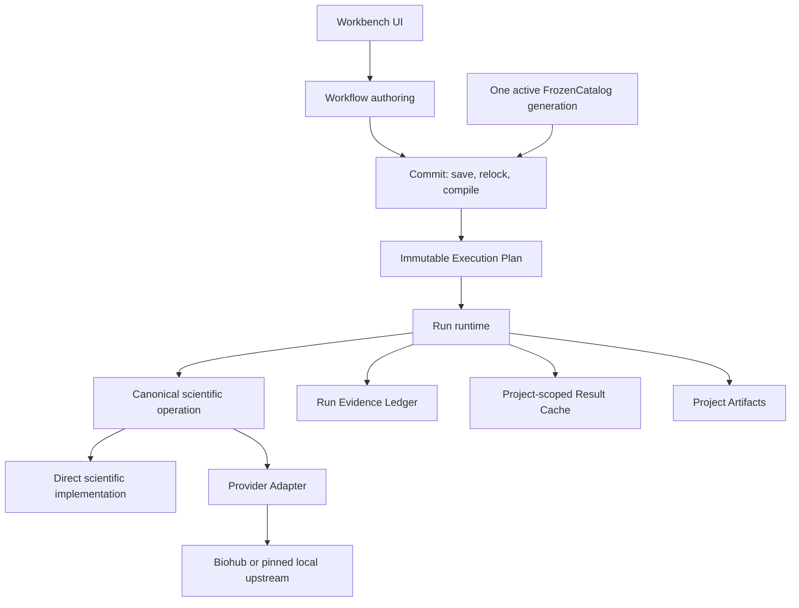
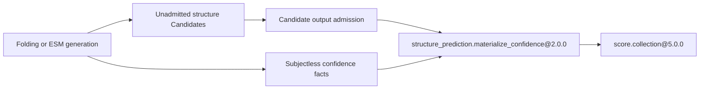
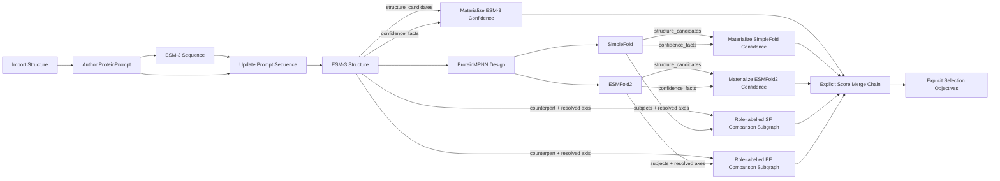

# 模块化蛋白质设计与评价工作台：当前架构

- **文档版本**：1.2
- **日期**：2026-08-20
- **使用场景**：可信、单用户、仅本机使用
- **规范词汇**：以 [`CONTEXT.md`](../CONTEXT.md) 为准
- **核心决策**：ADR-0022、ADR-0028、ADR-0030、ADR-0033、ADR-0034、ADR-0035、ADR-0036、ADR-0037、ADR-0038、ADR-0039、ADR-0040、ADR-0041、ADR-0042、ADR-0043、ADR-0044、ADR-0045

## 1. 目标与优先级

Protein Workbench 是用 Node 连线组合蛋白质设计、折叠、评价、转换与选择操作的科学工作台。它首先保证科学对象及其解释正确，其次才考虑实现便利性。

优先级依次为：

1. Node Type、Method、Metric Definition 的科学含义；
2. 单位、数值尺度、shape、残基映射、mask 和随机性；
3. Candidate identity、lineage、provenance 和 Run Evidence；
4. exact Contract 和持久化结果的可解释性；
5. 本机运行的可维护性与效率；
6. 简单、稳健且可维护的本机实现。

项目尚未投入使用，不承担历史运行兼容义务。科学含义发生变化时，直接修改当前 producers、consumers、tests、examples 和文档，并使旧开发数据 fail closed；不为旧格式增加 shim、alias、legacy parser、dual path 或 migrator。

当前必须支持：

- ESM-3、ProteinMPNN、ESMFold2 和 SimpleFold；
- 序列、结构、ProteinPrompt、残基编辑和映射；
- 结构比较、DSSP、TM-score、RMSD 与置信度等评价；
- Candidate 筛选、排序和选择；
- Workflow 保存、编译、执行、重放和 Artifact 获取；
- Biohub 等明确的联网 Provider 路线和本地上游程序。

当前不建设：

- 多用户权限、认证、授权或多租户；
- 插件市场、插件沙箱或公共托管架构；
- 历史 Contract 的并行运行时；
- 自动迁移、自动降级、备用 Provider 或猜测式兼容；
- 假想模型的通用抽象；
- 隐式科学转换或自动 Binding 选择。

## 2. 总体结构



这组 Module 形成四个关键 seam：

1. **公开协议 seam**：UI 和本地调用者只使用当前 `protein_workbench_public` v2 协议。
2. **Catalog seam**：Module Package Registration 经一次原子构建发布一个 `FrozenCatalog`。
3. **科学操作 seam**：Run runtime 只向 canonical scientific operation 传入 admitted typed values 和已解析上下文。
4. **Provider seam**：Adapter 独占 Workbench 表示与真实外部表示之间的翻译。

深度来自这些 seam 的 locality：调用者不需要理解 Catalog 搜索、Provider payload、历史版本、wire codec 或证据拼装。

## 3. 单一活动 Catalog generation

### 3.1 运行时规则

每个 checkout 只发布一个 startup-frozen `FrozenCatalog` generation。对于每个 logical Contract，Catalog 中只有一个活动 exact version：

- Node Type / Node Definition；
- Port Type Definition；
- Method；
- Execution Binding；
- Metric Definition；
- Utility Transform。

不兼容变化使用新的 exact semantic version。已经出现过的 exact identity 不得静默绑定到不同 descriptor bytes，但旧 identity 不与新 identity 一起进入当前 Catalog。

公共协议 envelope 的 v2 schema version 与具体科学 Contract version 相互独立。修改 Node、Port、Binding 或 Method 不要求机械升级所有无关 Contract，也不要求把公共协议改名为 v3。

### 3.2 历史证据而非历史运行时

历史由以下事实保留：

- Git commit；
- exact contract descriptor bytes、digest 和 Contract Lock；
- Provider、model、checkpoint、source 和环境锁；
- Result Identity；
- Run Evidence Ledger 和不可变 Artifact digest。

这些事实可以解释历史结果，但当前运行时不注册旧 decoder、factory、Adapter 或 scientific implementation。旧 Workflow、Cache 和 Run record 加载时返回明确的 `unsupported_schema_version`、`unsupported_version` 或 `inactive_generation`，不得猜测、迁移或重解释。

仓库拥有的 Workflow examples、fixtures 和测试随 active generation 原子更新。开发期 Project、Cache 和 Run 数据可以在明确的 cutover 操作中清理重建。

### 3.3 `FrozenCatalog` 的深度

`FrozenCatalog` 是 exact public contracts 的唯一解析 Module，而不是可变 Registry 或运行时插件管理器。它负责：

- 聚合并验证全部 Module Package Registration；
- 检查 ID/version 唯一性、引用闭包和 contract digest；
- 解析 Workflow 中固定的 Node Type、Binding、Method 和 Port contracts；
- 发布 canonical descriptor、contract references 和 startup Availability；
- 为 compiler 和 Contract Test Kit 提供同一个测试 surface。

Package discovery、descriptor parsing、runtime codecs、implementation factories 和 readiness declarations 可以作为其 Implementation 内的私有索引，但不扩散给 scientific operation。

## 4. Workflow、Execution Plan 与 Run

### 4.1 Workflow

Workflow 是由 Node Instances 和 compatible Ports 组成的有向无环图。每个 Node Instance 显式固定：

- 一个 exact Node Type；
- 一个 exact Execution Binding；
- Node 参数；
- Binding 参数；
- 输入连接或 Project Input；
- 必要的 Selection Objective。

Binding 不按当前机器、Provider 可用性或性能自动选择。环境变化只能影响 Availability 和 Readiness，不能改变 Workflow 的科学路线。

### 4.2 Workflow Draft 与 Workflow Commit

`Workflow Draft` 是 unlocked authoring revision，可以不完整或暂时无效，不能执行。
`Workflow Commit` 是针对一个 active `FrozenCatalog` 解析完成的 immutable runnable
publication。UI 中一次“保存并准备运行”的操作由一个深的 commit interface 完成：

1. 保存 Workflow draft；
2. 针对当前 `FrozenCatalog` 产生 exact Contract Lock；
3. 检查 DAG、Port exact nominal compatibility 和参数；
4. 解析 immutable `Execution Plan`；
5. 原子发布带 `workflow_commit_id` 的 Workflow Commit，或返回明确错误。

失败的 commit 保留用户提交的 Draft，且不替换此前 active Commit。调用者不应自己串接
save、snapshot、relock、validate 和 compile，也不应在 Run 开始后重新解释 Workflow。
Run 只提交 active `workflow_commit_id`，不提交可独立组合的 revision 与 compile ID。

### 4.3 Execution Plan

`Execution Plan` 是 admitted Workflow 的唯一执行形式。它已经解析：

- 每个 Node Instance 的 exact contracts；
- 当前 Binding 和 Method；
- 输入来源、Port identity、exact codec 和拓扑顺序；
- normalized parameters；
- Scientific Operation factory、Readiness declaration 和 randomness resolver；
- produced Observation、Selection Objective 和 Observation Selector facts；
- Result Identity 所需的 contract facts；
- Readiness 所需的 route identity。

Run runtime 消费这些 resolved facts，不再次扫描整个 Catalog、不重新推断边连接，也不让 Implementation 根据版本字符串选择行为。
实际 admitted inputs、Environment、RunResources、Availability observation 和 effective randomness 仍然是 run-scoped facts，不固化在 Plan 中。

Derived Run 只能复用 source Run record 保留的同一个 in-memory `Execution Plan`。进程重启后若只剩 durable Ledger 而没有该 executable Plan，derive 必须 fail closed；`V2RunService` 不得重新读取并编译 Workflow，再把新的 callable handles 冒充为 source compile identity。

### 4.4 Scientific operation call

在进入 scientific operation seam 前，runtime 将 wire values 接纳为
provider-independent immutable values，并为每个输入形成一个 complete admitted input
record。record 将 canonical value、canonical bytes、content digest、Candidate Data
References、axis projections 与 Method-specific projections 作为同一次 Port admission 的
结果一起携带；runtime 不建立随后需要重新 join 的 value、digest、reference 或 projection
平行 map。内部 operation call 只包含执行当前科学操作需要的事实，例如：

```text
complete admitted input records
Plan-normalized scientific and Binding parameters
resolved effective randomness
cancel and Artifact facilities
Engine Invocation evidence recorder
```

operation 信任 Plan-normalized 参数及 admitted input record，不重新检查 generic
key/type/range、重新编码 value、重新计算 digest，或重新解析 Candidate Data Reference。
Method implementation 仍拥有自己的科学前置与后置条件。operation call 不包含
`FrozenCatalog`，也不要求 scientific operation 查询 Node、Port、Binding 或 public
contract version。Node Instance ID、Run ID 和公共事件投影属于 runtime/evidence context，
不得影响科学随机抽样。

### 4.5 Run 因果顺序

每个 Node Execution Attempt 的顺序为：

1. 计算 Result Identity；
2. 查询 Project-scoped Result Cache；
3. Cache hit 时直接重放已经接纳的结果；
4. Cache miss 或 bypass 时，Adapter route 为 exact Binding 做一次 Readiness 检查；direct
   route 不需要 Provider Readiness；随后进入 Operation Attempt；
5. 记录零个、一个或多个 Engine Invocations；
6. 接纳 immutable output values；
7. 将 Typed Output 与 Artifact bytes 写入 Project-scoped immutable objects，并以一个
   Ledger transaction 原子发布 Node outcome；
8. 从 Run Evidence Ledger 投影事件和 bounded output descriptors，再在成功后发布可选的
   Cache v4 replay index。

Run scheduling 只负责按 Execution Plan 串行调度、required-input blocking、调度前取消、
已提交 Typed Outputs 的下游传播、Selection conclusion 与 Run Closure。一个
Run-scoped deep runtime module 负责可调度 Node Instance 的准备和完整 Node Execution
Attempt lifecycle。input admission、Project Input resolution 与 effective randomness
resolution 在 attempt evidence 开始前发生；本地 contract invariant 在这里 fail fast，
不虚构 Node Execution Attempt、Operation Attempt 或 Engine Invocation。

该 module 用一个 closed internal attempt state 承载 preparation、Cache、Readiness、
Operation、cleanup 与 Node Outcome Publication 所需事实。它取代跨 service/finalizer 传递的
宽 finalization intents、内部 enum/type dispatch、production asserts，以及重复的取消与错误
终结路径；外部只观察 committed disposition。

该 deep module 在第一次 exact Adapter-route Binding 的 Cache miss 或 bypass 时检查一次
Readiness，并在同一 Run 内复用结论。Node Execution Attempt 仅在 Node Outcome
Publication 的 Ledger transaction 原子提交后结束；成功后写入的 Cache replay index
不是 outcome authority。Run Evidence Ledger 仍是 fact schema、因果验证、durable
persistence、reduction 与公共投影的唯一 owner。详见 ADR-0041 与 ADR-0042。

Readiness 只把 closure admission 或明确 Environment/Provider prerequisite failure 映射为
failing conclusion。编程错误与本地 invariant violation 直接 fail fast；Readiness 不使用
broad catch 把这些错误改写成 Provider 不可用。

Availability 与 Readiness 只服务 Adapter route 的实际 Provider entry，不阻止 Workflow
commit、direct operation 或 Cache replay。Cache replay 是 Node Execution Attempt，但不是
Operation Attempt 或 Engine Invocation。

## 5. Canonical scientific operation

### 5.1 唯一科学真值

一个科学含义只有一个 canonical operation implementation。公开 Contract 是该科学含义的投影，不是第二套 Implementation。改变 wire shape 或 Contract version 不得复制算法、lineage、mask、单位、seed 或 residue mapping 逻辑。

“一个 canonical implementation”不表示合并科学上不同的方法。ESMFold2、SimpleFold、不同模型变体或会改变解释的 checkpoint 是不同 Method；它们可以拥有不同的 Implementation 和 Binding。

### 5.2 责任

canonical scientific operation 负责：

- 科学变换及其明确的前置与后置条件；
- Candidate 生成和精确 parent lineage；
- ResidueIdentity、ResidueLayout、ResidueMap 和 mask 语义；
- Metric Definition、Method 与 Observation Context 的正确结合；
- 单位、尺度、shape 和 missing-value 语义；
- 由配置 seed、canonical scientific input content 及稳定 parent、sample、track
  slot 决定的随机性；
- 需要纳入 Result Identity 的 result-affecting facts。

它不负责：

- 查找 public Contract 或解析版本；
- 选择 Binding 或 Provider；
- 解析 Workflow graph；
- 构造 Provider-native payload；
- 读写公共 wire envelope；
- 猜测或修复外部 schema。

### 5.3 直接 Implementation 与 Adapter-backed Implementation

纯 Workbench 科学运算直接使用 provider-independent values，例如 Candidate collection 操作、ResidueMap 变换和 selection。

只有真实外部差异存在时才建立 Adapter seam。多个 Provider 或本地/远程 route 如果具有不同真实表示，各自提供 concrete Adapter；不因为可能存在未来 route 就预设通用 Provider 抽象。

## 6. Provider Adapter

Adapter 独占真实外部 seam，并且只做四件事：

1. 将 admitted Workbench values 精确翻译为官方或 pinned upstream 规定的请求表示；
2. 调用 Execution Binding 已固定的 Provider/model/checkpoint/source；
3. 将文档规定的响应精确翻译回 canonical values；
4. 以 exact Method contract digest 记录 Engine Invocation，并记录该次调用特有的
   provider translation 或 randomness provenance。

Provider、model、checkpoint 与 source 是 exact Method / Execution Binding 的静态
identity，只在 Catalog descriptor 中声明一次。Candidate metadata 不复制这些静态事实；
Invocation provenance 也不把静态配置伪装成逐次观察。

Provider-native chain positions、tensor、token、payload、response object、临时 FASTA/PDB/JSONL 和工作目录不得越过 Adapter seam。

Adapter 在 authoritative Provider translation boundary 一次接纳 provider-native
observation，例如实际 device、native confidence scale、mask、length 与 PDB tail，并据此构造
canonical output 和 Invocation provenance。进入 Workbench 后，下游信任这些 admitted
values；不再用 generic runtime checks 重复检查相同 Provider predicate。

Biohub 的官方规范是权威。对符合请求的响应按规范翻译，不猜 schema、不修复响应、不交叉校验 Provider、不尝试备用 endpoint，也不为假想异常增加 catch-and-continue。操作性错误仅按官方结果或本地明确失败事实记录。

科学转换不属于 Adapter。单位换算、ResidueIdentity 设计、Candidate lineage、Metric 选择、mask 解释和随机 seed 规则必须在 canonical scientific value 或 operation 中具有单一 owner。

### 6.1 SimpleFold Provider Asset Closure

`modules/folding` 内一个 package-private deep module 拥有两个 SimpleFold Adapter
共享的 Provider Asset Closure grammar、exact file/source admission 与隔离暂存。每个
Execution Binding 仍各自拥有一个 immutable closure declaration；module 只集中实现
declaration，不合并 Folding 与 existing-structure confidence 的 Method、Operation 或
Adapter。

Folding closure 精确包含 `simplefold_100M.ckpt`、`simplefold_1.6B.ckpt`、
`plddt.ckpt`、`ccd.pkl`、ESM2 主 checkpoint 与 contact-regression checkpoint，以及
exact SimpleFold source revision、ESM2 revision 和 reviewed runtime source tree。
Confidence closure 只包含 `simplefold_1.6B.ckpt`、`plddt.ckpt`、`ccd.pkl`、ESM2 主
checkpoint 与相同的 exact source identities；它明确排除 100M、360M、ESM2 contact
regression 和 `boltz1_conf.ckpt`。配置目录中的其他文件不是 closure，不被拒绝、接纳、
hash 或 stage。

closure file entry 固定角色、runtime filename 与 SHA-256；source entry 固定 revision 和
必要的 reviewed source-tree digest。Environment Configuration 只提供路径。byte count 与
CDN ETag 只保留为 installation/acquisition metadata，不进入 Method、Binding 或 Readiness
content identity。Binding-owned declaration 同时投影到 Method/Binding descriptor、
Readiness prerequisites、staging selection 与测试，不存在 Adapter-owned 的平行清单。

每个 exact Binding 在同一 Run 第一次 Cache miss 或 bypass 时独立 admission 一次，不跨
Folding/Confidence Binding memoize。file SHA-256 与 ESM2 exact HEAD、declaration-owned
reviewed file set/tree digest 只在这里证明一次；configured root 只是 closure location，不是
identity。随后 staging 直接使用同一 declaration 和 Environment Configuration，不重新
hash、执行 Git query 或搜索 source tree。每次 Adapter call 在 Engine Invocation 开始前把
该 Binding 的 exact closure 复制到 fresh private staging root；不搜索其他目录、不下载、
不联网、不使用 shared model cache 或 fallback。

admission 失败是 Readiness failure，并产生没有 Operation Attempt 或 Engine Invocation 的
Binding Failure。已接纳资产的 staging 失败发生在 Operation preparation，且不虚构 Provider
entry；Provider import、model load 与 execution 才进入 Engine Invocation。Adapter 继续拥有
不同的 loading、namespace、deserialization、provider-native translation 与 canonical output
translation；closure module 不处理 Candidate、Prediction Key、Axis、Confidence Fact、Metric
或 publication。详见 ADR-0045。

## 7. Scientific values 与信任模型

### 7.1 Provider-independent immutable values

`datatypes/` 定义 provider-independent scientific values。核心对象包括：

- `ProteinSequence`、`ProteinStructure`、`PDB String`；
- `ProteinPrompt`；
- `ResidueIdentity`、`ResidueLayout`、`ResidueMap`、`ResidueTrack`；
- `Candidate`、`Candidate Collection` 和 pairwise mapping；
- package-owned `Structure Alignment Evidence`；
- `Prediction Residue Axis` 和 subjectless `Prediction Confidence Fact`；
- `Metric Definition`、`Method`、`Observation Context`；
- `Score Observation` 和 `Score Collection`。

这些值在 contract-owning seam 接纳后不可变。in-process caller 直接传递 admitted values，不在每条 Port edge 上重复 encode/decode，也不重复验证同一 invariant。

`ProteinStructure` 只表示 canonical PDB 科学内容。当前唯一的
`protein.structure@4.0.0` wire 只有 `pdb_string`；Provider、模型、checkpoint、
Project Input、文件或来源标签不是结构内容，不得参与 content digest。拥有这些事实的
Method、Execution Binding、Candidate lineage 或 Run Evidence 负责记录 provenance。
坐标记录遵守当前固定列 PDB contract；occupancy、temperature factor 与 element 等必需字段
在该 Port seam 一次接纳，不由下游 parser 各自猜测。

`structure_transform.backbone_structure@4.0.0` 同样只编码 canonical PDB
内容。其 nominal 科学含义由允许的 backbone atoms、每个残基的原子完整性与顺序、
chain break、serial 和 PDB serialization invariants 决定，不由 producer/source
字符串决定。两个结构 Port Type 都只有当前 closed wire 的单一 decoder；旧的
source-bearing wire 不进入 active Catalog，也不保留兼容读取路径。

直接声明这两个 Port 的 Node Type 与 Execution Binding 在不兼容切换时原子升版；
Method 只有在科学定义变化时才升版。Candidate Collection 的 `item_type` 由唯一
active Catalog 解析，不形成第二个历史 codec registry。

### 7.2 验证位置

统一规则是 **one invariant, one owner, one proof lifetime**。每个 predicate 只由拥有该事实的
contract boundary 证明一次；证明在下表规定的 lifetime 内有效。下游消费已经 admitted 的
record，不因为进入另一个内部函数而重复同一 predicate。

| Owner seam | 一次性验证 | Proof lifetime |
| --- | --- | --- |
| Project Input / public protocol | wire schema、exact nominal Port identity、用户提供的科学字段 | 该 immutable Project Input 或 request admission |
| Scientific value construction | residue identity、layout、shape、unit、mask、lineage 等 value-intrinsic invariants | 该 immutable value |
| Port admission | canonical value/bytes、content digest、exact Candidate Data References、axis 与 Method projections，以及该 Port 声明的 cross-field closure | 该 complete admitted input record |
| Execution Plan | Node/Binding 参数 schema、type、range、normalization 与 randomness resolution contract | 该 immutable Plan；run-scoped effective randomness 由 attempt resolution 固定 |
| Scientific Operation | 该 Method 特有且只有在完整 admitted inputs 上才能判定的科学前置、后置与集合 closure | 该 Operation Attempt 的 admitted inputs/outputs |
| Provider Adapter | 按权威规范翻译并接纳 provider-native observation，构造 canonical output 与 Invocation provenance | 该 Adapter result / Engine Invocation record |
| Binding Readiness | exact route 的 Environment prerequisites 与 Provider Asset Closure | 该 Binding 在该 Run 的 Readiness conclusion |
| Run Evidence Ledger durable write | closed fact/public schema、因果、transaction、顺序、redaction、size、durable acknowledgement 与 Invocation provenance semantics | committed durable transaction；restart 时重新接纳 durable prefix |
| Persistence read / restart | current schema、object digest、exact Contract references 与 durable prefix | 本次恢复得到的 admitted immutable state |
| Durable object publication | 路径归属、原子发布、冲突和意外数据损失 | 已确认的 immutable object publication |

Scientific value construction 只拥有 value-intrinsic predicates；它不复制 Port、Method 或
集合 closure。Port admission 一次产生 complete admitted record，之后不得再次调用同一
validator、encode/decode value、重算 digest，或把 value/CDR/axis map 重新 join。把 persisted
bytes、Cache entry 或 durable Ledger prefix 恢复为内存对象是一次新的 admission seam，因而
需要验证其 durable contract；这不是在同一 proof lifetime 内重复检查。

内部 invariant 失败立即抛出明确错误。不要加入 broad catches、silent coercion、猜测默认值、
silent `min`/clamp、未记录 retry 或 fallback，也不要用 Readiness 捕获编程错误。

### 7.3 本地可信部署

Workbench 只监听 loopback，项目内部 Module 互相信任。架构不包含 authentication、authorization、RBAC、multi-tenancy、CSRF、plugin sandbox、abuse control 或 hosted-service hardening。

仍保留能够防止非恶意实际失败的约束：科学语义错误、意外覆盖或路径写错、durable write 失败、失控资源消耗和 credential 泄露。它们不是攻击者模型。

## 8. 残基身份、ProteinPrompt 与 Candidate

### 8.1 ResidueIdentity 是位置真值

Workbench 中的残基引用使用 identity-complete `ResidueLayout` 中的稳定身份。Provider position 不是 ResidueIdentity，数组顺序也不是科学对应关系。

`structure_transform.resolve_residue_axis` 是结构 component disposition、parent sequence、
segment topology、named-atom coordinates、CA/backbone mask 与 modified-residue provenance 的
唯一 owner。下游 DSSP、Prompt authoring 与 structure comparison 消费 admitted resolved
axis，不重新过滤 `ATOM`/`HETATM` 或解析第二套 CA residue list。Candidate Collection 的
derived axis/annotation 使用完整 `CandidateDataReference` 关联；parallel list position 不建立
科学对应。

需要 chain-native 结构输入的 Provider Adapter 必须按 resolved axis 的 ordered segment
topology 投影：每个 segment 使用独立 provider-safe chain，one-based local position 在每段
重新从一开始；同一 Workbench chain 的多个 segment 不得因 chain label 相同而合并。

结构预测置信度使用另一条明确的 `Prediction Residue Axis`。它固定 prediction input 的精确
Candidate 或 ProteinPrompt Port-value source、identity-complete layout 和实际 prediction
sequence。它描述 provider request/prediction population，而不是 admitted output structure 的
component disposition；folding/ESM Adapter 不得通过解析 output PDB 构造或修复这条轴。输出结构
需要参与 DSSP、comparison 等结构方法时，再独立进入 resolved-structure axis seam。

显式变换通过 `ResidueMap` 记录 source/target identity。插入、删除、替换、mask、chain selection 和 CSH normalization 都必须保存完整映射并遵守各自 ADR 的前置条件。

### 8.2 ProteinPrompt

`ProteinPrompt` 是 residue-aligned multi-track specification，至少可以包含：

```text
target ResidueLayout
sequence track
structure coordinate track
structure visibility mask
secondary-structure track
SASA track (nullable absolute per-residue solvent-accessible surface area in Ų,
without relative-accessibility normalization)
function annotations
ResidueMap provenance
```

序列是否指定、结构是否可见、二级结构是否指定、SASA 是否指定、功能标记和 ProteinMPNN designability 是独立语义，不得用一个统一 mask 代替。

### 8.3 Candidate identity 与 lineage

Candidate identity 对相同科学内容和 lineage 稳定，不依赖 Run ID 或 Node Instance ID。Candidate-producing transformation 为每个 child 记录精确 parent identity；集合顺序不能替代科学对应关系。

pairwise comparison 只接受显式 role-labelled mapping。Selection 使用 exact Score Observations 和 Workflow-owned Selection Objectives；不存在按名称猜测 score 或隐式 normalization。

### 8.4 随机性

call seed 由配置 base seed、canonical scientific input content，以及稳定的 parent、
sample、track slot 派生。Candidate ID、Result Identity、Run ID、调度顺序和临时文件路径
不得扰动科学随机抽样。

若 Adapter 确实把该 seed 应用于 provider，Engine Invocation 记录
`invocation_provenance.effective_randomness.control=exact_seed` 与实际
`effective_seed`。若官方 provider route 不支持 seed control，则 Adapter 不发送 seed，记录
`control=provider_uncontrolled`，Candidate 与 Invocation 都不得声称存在 effective seed。
configured base seed 仍是 Node 参数，但不是远程 provider 已执行的 seed。

Result Identity 只按 Binding 的显式 randomness declaration 投影随机性。没有 declaration
时，configured base seed 留在 normalized Node parameters，`effective_randomness` 为空；runtime
不得依据 `seed`、`random_seed` 或 `effective_seed` 这样的参数名猜测随机性。具有 exact seed
control 的 Binding 则必须显式声明 resolver，把解析后的 seed 放入 Result Identity 的
`effective_randomness`；每个实际派生 call seed 仍由对应 Engine Invocation 单独记录。

Invocation provenance 是一个封闭的正交事实对象，而不是互斥的单标签记录。随机性事实位于
`effective_randomness`，provider residue mapping 位于 `provider_residue_projection`；因此
ProteinMPNN design 的同一次 Invocation 必须同时记录实际 call seed 和精确残基投影，而
deterministic scoring 只记录残基投影。

## 9. ProteinMPNN 的唯一形状

ProteinMPNN 只保留：

1. 一个 identity-based `ProteinMPNNConstraints` canonical value；
2. 一个 ProteinMPNN design scientific operation；
3. 一个 ProteinMPNN score scientific operation；
4. 每条实际 Provider route 一个 concrete Adapter。

constraints 使用：

```text
designable_residue_ids
fixed_residue_ids
designed_chains
fixed_chains
omit_amino_acids
bias_by_residue
tied_residue_groups
```

只有 Adapter 可以把 stable ResidueIdentity 转换为 provider segment-chain-local one-based
positions。同一 Workbench chain 的 design/fixed chain-level constraint 必须扩展到该 chain 的
全部 resolved segments；fixed/designable/tied/bias/reference 与 provider output 恢复只使用
exact residue-to-segment-local mapping。Provider 调用前，Adapter 把 unique Workbench chain
order、ordered provider structure-segment chain order、实际 designed-first featurization chain
order，以及每个 residue 的 segment index/provider chain/local position 写入 typed Engine
Invocation evidence。Candidate 只保留 canonical Workbench residue identities、科学参数和
lineage，不承载 provider-native positions 或 model metadata。旧 positional contract 不进入
active Catalog，不保留第二套 decoder、operation 或 Adapter。

ProteinMPNN geometric validity mask 不是 sequence layout mask。缺少完整 backbone 的 fixed residue 从 provider input 恢复到完整 output layout；请求在该位置 design 则 fail closed。

## 10. Metrics、selection 与科学解释

每个 `Score Observation` 必须同时固定：

- 一个 exact Metric Definition；
- 一个 exact Method；
- 一个 typed Observation Context；
- 一个 Candidate；
- 合同声明的 value shape、unit、direction、range 和 granularity。

TM-score、RMSD、DSSP、confidence 和 solubility 不能退化为自由字符串 key/value。结构比较共享明确的 package-owned `Structure Alignment Evidence` 和 role-labelled participants；active Catalog 不注册旧的 builtin `structure.alignment`。

### 10.1 结构预测置信度的两阶段 seam

`structure_prediction@2.0.0` Module Package 拥有共享的
`structure_prediction.prediction_residue_axis@2.0.0`、
`structure_prediction.confidence_facts@2.0.0` 与
`structure_prediction.materialize_confidence@2.0.0`。materializer 的输入是
`structure_candidates: candidate.collection@4.0.0` 和
`confidence_facts: structure_prediction.confidence_facts@2.0.0`，输出是
`observations: score.collection@5.0.0`。它通过
`structure_prediction.materialize_confidence.direct@2.0.0` Binding 绑定
`structure_prediction.materialize_confidence.exact_reference_join@2.0.0`
Method，且没有科学或部署参数。

`folding.fold@8.0.0`、`esm3.generate_sequence@8.0.0`、
`esm3.generate_structure@8.0.0` 和 `esm3.generate_paired@8.0.0` 不在产生 Candidate
的同一次操作中预造 Score subject。Folding Bindings 依 route 固定为 SimpleFold `10.0.0`、
remote ESMFold2 `9.0.0` 或 local ESMFold2 `10.0.0`；ESM3 generation Bindings 为
`8.0.0`。其 exact provider Methods 也依 route 固定：SimpleFold 与 remote ESMFold2 为
`4.0.0`、local ESMFold2 为 `6.0.0`、ESM3 generation 为 `5.0.0`。每个
confidence-bearing structure 或 coordinate-conditioned reconstruction output 同时产生：

1. `candidate.collection@4.0.0`，其中 Candidate metadata 携带 content-derived
   Prediction Key；
2. `structure_prediction.confidence_facts@2.0.0`，其中 subjectless fact 携带同一 key、
   exact structure digest、`structure_prediction.prediction_residue_axis@2.0.0`、provider
   Method 与 canonical confidence values。

纯 sequence output 没有 structure-confidence fact 或 Prediction Key。PAE 与 pTM 位于同一
fact；不再通过独立 Score Port 与 Candidate collection 做 positional correspondence。



producer 根据 exact output role/slot、structure content digest 和 prediction-axis digest
生成 Prediction Key，并把它写入 Candidate metadata 与 fact；该 key 不包含 future Candidate
ID。Folding producers 通过同一个 package-private deep module 完成这一步，ESM generation
仍按自身不同的 ProteinPrompt source、output roles、reconstruction 与 pairing semantics
构造 outputs。Candidate admission 不猜测跨 Port 关联。后续 materializer 从自身 admitted
input facts 取得完整 `CandidateDataReference`，按 key 和 structure digest 验证两个集合
exact full-set closure，之后才创建 Candidate-associated Score Observations。这使 generation
与 materialization 之间不存在 future CDR。

Confidence-facts Port 的 `scientific_axis_projection` 动态提供 prediction-axis references，
`observation_method_projection` 动态提供 exact provider Method。materializer Binding 的
Produced Observation Interface 将这两个 Port projection 声明为 axis 与 Method source；因此
`structure_prediction.materialize_confidence.exact_reference_join@2.0.0` 只代表确定性的
关联/物化算法，不能冒充 folding/ESM provider Method。

per-residue pLDDT 的长度精确等于 prediction axis，null 位置显式保留；mean-residue pLDDT 是
同一 population 上 valid protein-residue values 的等权算术平均，且仍携带该 axis；PAE 是
同一 axis × axis 的方阵。pTM 是 candidate-global scalar，不附 residue axis。

### 10.2 Folding output construction

`modules/folding` 内一个 package-private deep module 唯一拥有所有 `folding.fold` Methods
共享的 provider-independent output construction。它在 Provider entry 前接纳非空的 admitted
sequence Candidate Collection、exact parent `CandidateDataReference`、canonical protein
alphabet 与单链 identity-complete layout；在调用完成后一次性接纳 closed completed-sample
records。它不暴露 axis、digest、key 或 fact 的独立 helper。

每个 completed sample 只携带 parent slot、sample slot、canonical `ProteinStructure`、canonical
pLDDT、可选 pTM/PAE 与实际 sampling facts。module 要求每个 parent 恰有 `num_samples` 个
结果并关闭 `(parent slot, sample slot)` 的 missing、duplicate 与 extra cases，再按
parent-major/sample-minor 规范顺序构造 provisional Candidates、exact parent lineage、
Prediction Residue Axes、structure digests、Prediction Keys、Confidence Facts 和两个匹配的
collections。Axis 只从 admitted parent sequence、exact parent reference 与实际 prediction
sequence 构造，不解析 output PDB。

Candidate metadata 使用 module-owned closed grammar：parent slot、sample slot、Prediction Key
和实际 sampling facts。exact-seed route 可以记录 applied call seed，SimpleFold 可以记录实际
`num_steps`；configured base seed 留在 Node parameters 与 Result Identity，Provider、model、
checkpoint 等静态身份留在 Method、Binding 与 Run Evidence。Method implementation 与 Adapter
不得构造 Candidate、Prediction Key 或 Confidence Fact，也不得传入任意 metadata dictionary。

ESMFold2 与 SimpleFold 继续拥有各自的 parameters、call-seed derivation、batch shape、Adapter
invocation 和 Provider-specific confidence translation。Adapter 只接收 admitted
provider-independent values，执行 documented translation 和调用，返回 canonical structure、
confidence 与实际 randomness，并记录 Engine Invocation provenance。不存在 generic folding
runner；ESM-3 generation、SimpleFold existing-structure confidence 与后续 Confidence
Materialization 不进入该 module。

Folding output construction 属于科学 Operation，不是 durable Node Outcome Publication。任一
Adapter 调用或 output-construction invariant 失败都使 Operation 失败且不返回 partial
outputs；已经完成的 Engine Invocations 保持真实 evidence。immutable-object persistence、
Ledger transaction、公开可见性与 Cache publication 仍由 core 的 Node Execution Attempt
lifecycle 和 Run Evidence Ledger 拥有。详见 ADR-0044。

评分和选择分离。Selection Objective 显式选择 Observation，固定 Utility Transform、weight 和 missing-value policy；改变排序策略不重新执行评分 Method。每个 Objective 或 Selector
必须由声明该 consumption contract 的显式 Node 消费；不存在 Run 结束时的隐式 weighted
selection fallback。

## 11. Module Package

一个 repository-owned extension 通过唯一生产入口贡献 cohesive capability：

```text
modules/<package>/package.py:MODULE_PACKAGE
```

`ModulePackageRegistration` 原子贡献：

- Node Definitions；
- Execution Bindings；
- Methods；
- Metric Definitions；
- Port Type Definitions；
- Utility Transforms；
- Availability 和 Readiness declarations；
- direct implementations 或 required Adapters。

当前 production Catalog 发现 12 个 Module Packages：

- `collection_ops`
- `esm3`
- `folding`
- `prompt_authoring`
- `protein_io`
- `proteinmpnn`
- `selection`
- `solubility`
- `structure_annotation`
- `structure_comparison`
- `structure_prediction`
- `structure_transform`

不使用 import side effect、per-node registration call、recursive plugin discovery 或公共 dict-based `run()`。Module Package 的 public descriptors 和 runtime implementation index 在 Catalog build 时一次绑定；科学 operation 通过 resolved call 使用，不重新查询 package。

`package_version` 仅能描述 package artifact identity，不能代替 Node Type、Method、Binding 或 Port Type 的科学 Contract version，也不能成为隐藏兼容开关。

## 12. Port Types 与显式转换

每个 Port 精确引用一个 `PortTypeDefinition(type_id, version)`。Direct Port compatibility 仅在 type ID 和 version 都相同时成立。

结构相似、Python runtime type 相同、字段子集或旧 decoder 都不构成 compatibility。科学上有效但 nominal identity 不同的转换必须是显式 Node Type，并输出完整 provenance。

Provider 临时格式不成为公共 Port Type。只有当结果具有独立科学含义、需要用户选择、需要被多个 Node Type 复用，或需要保存 provenance 时，才公开转换 Node Type。

## 13. Result Identity、Cache 与 Evidence

### 13.1 Result Identity

compiler 为每个 Node 生成唯一 immutable `ResultIdentityPlanFacts` projection。Result
Identity 由该静态 projection 与以下 run-scoped admitted facts规范化派生：

```text
only this Node's resolved exact result-affecting contracts
result-affecting implementation / Method identity
canonical input identities
normalized Node and Binding parameters
declared randomness contract and any actually applied effective seed
declared external resource identity
```

UI 位置、颜色、注释、Run ID、Node Instance ID、Workflow edge locator、Objective label、
无关下游 Utility contract 和调度时序不进入 Result Identity。Execution Plan digest 仍对
Workflow topology 敏感。Result Identity hash、Cache metadata 与 Ledger 中的 plan-facts
digest 使用同一个 compiler-owned canonical projection。

### 13.2 Cache

Result Identity 是 admitted scientific inputs 与 implementation identity 导出的 Cache key。
每个 Node Result Manifest 固定 compiler-owned contract metadata，并按 Port 顺序引用
ordinary 与 artifact-capable output 的 Port Value Manifest。内部信任 conforming
deterministic Binding；不存在从 Ledger 重建的第二套 authority index 或跨 Run 冲突锁。

Cache v4 是 Project-scoped、可重新生成的 replay index，不是科学证据源。entry 只引用
committed Node Result Manifest 与 immutable value objects，记录 original producer，不复制
canonical values 或 base64 payload。replay 另行记录 current Run materialization，不复制旧
Availability、Readiness、Operation Attempt 或 Engine Invocation。Cache 不存在表示 miss；
Cache miss 执行当前 Binding。Cache publication 发生在 Ledger success 之后，失败不会回滚
或改写已提交的 Node success。

旧 schema、旧 generation、pickle/path legacy entry 或 digest 不一致项不迁移、不猜测、不作为当前 evidence。用户可以清除单个结果或整个 Project Cache。

### 13.3 Run Evidence Ledger

Run Evidence Ledger 是 Node Execution Attempt、Operation Attempt、Engine Invocation、Cache replay、Artifact 和 terminal outcome 的唯一有序 durable source。公共 manifest 和 lifecycle event stream 只能由 Ledger 投影，不存在独立 provider-evidence writer。

Ledger 的 interface 接受完整的合法因果 transition。调用者决定实际发生的领域结论，但不
提供 fact-type 字符串、任意 payload dictionary、logical-fact 顺序、sequence、cursor 或
transaction grouping。Ledger 自己构造 exact logical facts，并集中拥有 closed schema、
causal prerequisites、terminal rules、atomic transaction membership、reducer change 与
public projection。现有 17 类 logical facts 保持各自的科学含义，不压成 generic event。

Ledger 在 durable-write seam 一次性验证 fact/public schema、因果一致性、transaction
完整性和顺序、monotonic identity、public redaction、size bound 与 durable
acknowledgement。Invocation provenance 的 closed grammar、chain/order 与 residue mapping
semantics 也只在这里验证；Engine Invocation recorder 与 `RunResources` 只冻结和传递 typed
provenance，不重复该 grammar。Ledger 不重新验证已 admitted 的科学值，也不处理
adversarial caller、Provider payload repair、coercion、fallback 或 retry policy。
caller-facing raw append/commit 不作为 escape hatch 保留。详见 ADR-0042。

一次 Node outcome publication 使用一个物理 Ledger transaction，保留 Operation terminal、
output descriptors、Artifact descriptors、Node terminal 与 disposition 等独立 logical facts。
immutable object bytes 必须先 durable；transaction 提交前没有任何 output 或 Artifact 可见。

Operation Attempt 覆盖 implementation、Engine Invocation、documented Provider translation、
normalization、Candidate identity normalization、Port admission 与 Artifact contract
processing。Adapter route 的 Cache miss 或 bypass 若 Binding Availability/Readiness 失败，
只关闭已经开始的
Node Attempt，使用 `failure_origin=binding` 和原始 `binding_unavailable` 或
`readiness_rejected`；由于 implementation 尚未运行，它不创建 Operation Attempt。进入
Operation 边界后失败时 Operation 与 Node 同为 `failed`，Node 使用
`failure_origin=operation` 与 `node_execution_failed`。Operation 成功后，object 或
manifest persistence 失败只关闭 Node 为 `failed/publication`，并使用
`node_publication_failed`；它不得倒写已经成功的 Operation，也不得发布 output 或
Artifact。每种失败都以一个完整 transaction 同时提交所需
Operation terminal、Node terminal 与 disposition。公开 error details 只包含各 code 声明的
bounded domain identifiers、publication stage 或 Result Identity，不包含 object path、
canonical value 或 raw exception。

`failure_origin=binding` 必须没有 child Operation；`failure_origin=operation` 必须引用同一
Node Attempt 中唯一且已 `failed` 的 executed Operation。Cache replay 或本地 invariant
不得伪造任一 origin；本地 invariant 在 contract-owning boundary fail fast，且不写虚构的
Node/Operation terminal。

正常执行过程中，每个开始的 Engine Invocation 恰有一个 terminal fact；进程退出后只将未完成
Run 关闭为 `interrupted`，不重建缺失的内部 terminal。Invocation 的 `engine_identity` 必须是
resolved exact Method contract digest，并由 Execution Plan 绑定；Operation 或 Adapter 不能
提供或覆盖该身份。`effective_randomness` 内部是 closed union：实际应用 seed 时为 `exact_seed`，
provider 不受控时为 `provider_uncontrolled`。它可以与 residue-projection fact 同时存在。
Artifact bytes 与 ordinary Typed Output values 由同一个 Project-scoped
content-addressed object store 持有，但两者保持独立 nominal Port semantics。
Artifact descriptor 保留 publication intent、exact media type、原始 filename、
Candidate association（若声明）和 Run-scoped opaque reference；只有 committed
Ledger publication 才使 Artifact 进入公开 index。Artifact retrieval 信任 owner 已接纳
的 descriptor 和 object reference 并直接读取，不在每次读取时重新证明 digest/size。

## 14. Persistence 与公开协议

`protein_workbench_public/resources/v2/bundle.json` 是当前唯一公共 payload contract。运行中的 backend 提供同一 canonical bundle；UI 不维护 v1 route 或 payload fallback。

Project provisioning 也属于这个唯一合同：`POST /api/v2/projects` 创建一个
Project，`POST /api/v2/projects/{project_id}/inputs` 发布一个 immutable Project
Input。后者使用 closed JSON request，保留 `filename` 作为来源标签，并将 opaque bytes
表示为带标准 padding 的 canonical RFC 4648 `content_base64`；解码后上限为 64 MiB。
`filename`、`project_input_ref`、byte size 与 content digest 作为一个 closed immutable
descriptor 和 payload 原子发布；重启后通过
`GET /api/v2/projects/{project_id}/inputs/{project_input_ref}` 从该 durable descriptor
恢复来源标签并直接读取 owner 已发布的 payload。
不存在未版本化的 `/api/projects` 或 multipart publication seam。Project ID 与
`project_input_ref` 使用 storage owner 的 exact identifier domain。

`filename` 是 provenance label，不是科学内容：它不进入 Project Input content digest、
Resolved Resource Identity 或 Result Identity。消费 Project Input 的 import operation 在
既有 Engine Invocation provenance seam 投影该 label，使 Run Evidence 保留来源名称；相同
bytes 仅重命名 filename 或 opaque reference 时，Result Identity 保持不变。

Project metadata、Workflow Draft、Workflow Commit、Result Cache 和 Run Ledger 使用 closed
current schemas。public/persistence seam 接纳 wire value 后立即转换为 immutable canonical
value；内部不反复通过 JSON roundtrip。authoring owner 信任自己写入的 Commit；需要恢复
in-memory Plan 时正常解析并编译，解析或编译失败直接 fail fast，不建立损坏恢复协议。

推荐 Project 组织：

```text
project/
├── workflow-v2/
│   ├── drafts/
│   └── commits/
├── inputs/
│   └── <project_input_ref>/
│       ├── descriptor.json
│       └── payload
├── outputs/
├── cache/
└── run-ledger/
```

UI layout 是非科学 Project state，与 Workflow scientific document 分开保存。开发期持久化 state 不因架构升级获得迁移承诺。

## 15. UI

UI 是当前 v2 public protocol 的 Catalog-driven Workbench interface。它从 active Catalog 获得 Node Definitions、Ports、parameters、Binding choices、Availability 和 user-visible meaning，不维护第二份 Node/Port schema。

UI 负责：

- Node canvas、连接和布局；
- exact compatible Port 的 authoring feedback；
- Node 与 Binding parameters 的表单；
- Workflow commit 和明确 compile errors；
- Run、replay、cancel、Artifact 和 evidence projection；
- Candidate、Score Observation 和 lineage 的科学可视化。

UI 不推断 science、不选择隐式 Binding、不转换单位、不修复 missing module，也不保留 v1 route。无法由 active Catalog 解析的旧 Node Instance 以 unsupported 状态 fail closed。

## 16. 代码所有权

```text
core/
  Catalog build and exact contract resolution
  Workflow admission and Execution Plan compilation
  Run runtime, Result Identity, Cache and Evidence Ledger

datatypes/
  provider-independent immutable scientific values

modules/<package>/
  cohesive Node Types, Methods and canonical scientific operations
  Provider translation only in concrete Adapters

modules/folding/
  distinct ESMFold2 and SimpleFold scientific operations and Adapters
  one shared provider-independent folding output-construction module
  one shared SimpleFold Provider Asset Closure admission and staging module

modules/structure_prediction/
  provider-independent prediction axis and confidence facts
  shared deterministic confidence materialization

protein_workbench_public/
  current versioned protocol bundle and wire validation

frontend/src/
  Catalog-driven current Workbench interface

tests/
  tests through public or Module Package contract seams

examples/v2/
  maintained active-generation Workflows
```

所有 owner 都遵守 locality：ResidueLayout invariant 不在多个 caller 复制，Provider payload 不进入 core，public versions 不进入 scientific operation，Run Evidence 不在 Adapter 旁路写入。

## 17. Verification contract

验证以 Interface 为测试 surface，而不是穿透 Implementation：

1. Catalog tests 证明每个 logical Contract 只有一个 active exact version、引用闭包完整、descriptor digest 稳定。
2. Port Type tests 证明 canonical wire roundtrip、content identity 和 golden bytes，防止 codec 在 descriptor 不变时漂移。
3. Contract Test Kit 从一个 production `ModulePackageRegistration` 构建 Catalog、commit Workflow、执行 normal interface、解码 typed outputs，并检查 Result Identity、lineage、provenance、evidence 和 Artifact。
4. Scientific operation tests 直接使用 complete admitted fixtures，验证 units、shape、residue mapping、mask、seed 和 Method semantics。
5. Adapter tests 只验证官方/pinned upstream 翻译、exact provider identity 和 Engine Invocation facts。
6. SimpleFold Provider Asset Closure tests 通过共享 module interface 证明两个 exact closure、明确排除项、SHA/source-tree admission、acquisition metadata exclusion、staged layout、trust-after-admission 与正确的因果失败位置。
7. deterministic acceptance 使用当前 canonical 3GB1 Workflow，通过真实 compiler、runtime、Cache、Ledger 和 public routes。
8. real-provider acceptance 不能由 mock、readiness-only、historical manifest、skip 或 Cache replay 代替。
9. installed-package parity 证明 source 与 installed artifact 的 current protocol bundle 和 active Catalog identity 完全一致。
10. unsupported-generation tests 证明旧 Workflow、Cache 和 Run fail closed，且 runtime 不包含 migrator 或 legacy execution path。

invalid-case test 只进入拥有该 invariant 的 public/module interface。下游 Operation、Adapter、
Ledger 与 projection tests 使用 admitted fixtures，不保留 malformed private-call tests 来要求
第二次防御性校验。

Acceptance Campaign module 拥有唯一、不可变的 canonical tier plan。该 plan 按规范顺序
完整定义 15 个 tier 的身份、selector、timeout、零 skip、required run labels、lifecycle
receipt 与 Environment Configuration requirements；source-bound tier 还固定 exact input、
input digest 与 Workflow path。Repository verification matrix 不属于该 plan。

Campaign 以一个 clean revision 构建一次 wheel 与 sdist，并将 candidate、revision、plan 和
一个 private Execution Profile 绑定到一次执行。它逐 tier 投影精确环境，严格串行且每个 tier
恰好运行一次；不支持重排、并行、retry、resume 或局部补跑，首个失败立即终止。child
execution 通过结构化 outcome 交付 retained location 和完成事实。retained result/JUnit
format 只 admission 一次，summary 与 redacted diagnostics 从同一个 admitted outcome 投影。
stdout、literal warning match 与 interpreter executable digest 只用于诊断，不能授权或否定
Acceptance Result。

Acceptance Result 只在 tier 自己的科学断言通过且 plan 声明的结构完成契约满足后成立。
Campaign 集中验证 tier identity、source revision、required run labels、lifecycle receipt 与
retained location，但不解释或重复科学断言。`passed` 当且仅当全部 15 个 tier 按顺序产生
完整 Acceptance Result；失败或 interrupted diagnostic output 不计入完成度。详见 ADR-0043。

完整命令和 tier 定义见 [`backend-verification.md`](backend-verification.md)。

## 18. 当前核心 Workflow



该图是 active Node/Port Interface 的科学数据流概览；comparison subgraph、residue-axis
resolution 和 score merge chain 可以折叠多个 active Nodes，因此该图本身不是可提交的
Workflow。它仍保留以下不可省略的科学关联：

- 每个 confidence-bearing producer 同时发布匹配的 `structure_candidates` 和
  `confidence_facts`；每个 materializer 只接收一个 producer output pair；
- materializer 按 Prediction Key、structure content digest、exact Method 和 prediction
  residue axis 完成 full-set closure，不按数组位置建立关联；
- 只有 materialization 后的 Candidate-associated Score Observations 才能与其他
  Observations merge；
- 结构比较 subgraph 接收 Candidate-associated resolved residue axes，使用显式 participant
  role 和确定性 Structure Alignment Evidence，不把多路结构汇入一个没有
  subject/counterpart 含义的 comparison；
- 每条 edge 传递 exact nominal typed values；每个 Candidate 保留 parent lineage；每个
  Observation 固定 Metric Definition、Method 和 Observation Context；每个 Provider
  invocation 进入同一 Run Evidence Ledger。

精确当前实例由可编译的
[`examples/v2/canonical-3gb1.workflow.json`](../examples/v2/canonical-3gb1.workflow.json)
拥有。架构图不能建立该 Workflow、active Catalog 或 compiler 不拥有的第二套连接合同。

## 19. 明确拒绝的设计

本项目拒绝：

- 为 ProteinMPNN 或任何其他 Node Type 同时维护 positional 与 identity-based Implementation；
- 在 scientific operation 中硬编码 public contract version 或查询 `FrozenCatalog`；
- multi-generation Catalog、version switch、legacy decoder 和参数 migrator；
- mutable Registry、recursive plugin manager 和 import-time registration；
- dict-based universal model runner 或万能输入对象；
- 根据环境自动选择 Binding、fallback Provider 或隐式 retry；
- 在每条内部 edge 重复 encode/decode/validate；
- 将 admitted value、digest、Candidate Data Reference 与 axis projection 分散成需要下游重新 join 的平行 map；
- 在 Operation 中重新验证 Plan-normalized 参数，或以 silent clamp/`min` 改变参数；
- free-form score、隐式 unit conversion 或集合顺序对应；
- 在 generation 操作中预造 future Candidate Data Reference 或直接输出 Candidate-associated confidence Score；
- 从 output PDB 重建 Prediction Residue Axis，或把 materializer Method 冒充为 provider observation Method；
- 让各 folding Method 分别构造 Candidate lineage、Prediction Key 与 Confidence Fact，或以任意 metadata dictionary 穿过共享 interface；
- 用 generic folding runner 合并 ESMFold2、SimpleFold 与 ESM-3 不同的 Method、randomness、batch 和 output semantics；
- 把 SimpleFold folding 与 confidence 的 Provider Asset Closure 取并集，或让两个 Adapter 分别维护 hash、source admission 与 staging grammar；
- 把 byte count 或 ETag 提升为 SimpleFold Method/Binding identity 或 Readiness content proof；
- 在 staging 时重复 Readiness proof、执行新的 Git/source-tree discovery、跨 Binding memoize closure、把静态 asset identity 写入 Invocation provenance，或把 staging failure 伪装成 Provider entry；
- 用 broad Readiness catch 把 programming error 或 local invariant violation 改写成 Provider 不可用；
- 让 stdout、warning literal 或 interpreter executable digest 决定 Acceptance Result；
- 在下游 private call tests 注入 malformed values，以此要求重复 owner 已完成的验证；
- 在尚无第二个 Module Package 证明同一 seam 时建立 generic all-Provider asset framework；
- 与本地可信使用无关的认证、权限、沙箱和公共服务 hardening。

## 20. 架构结论

Protein Workbench 的核心形状是：

```text
one active FrozenCatalog generation
→ immutable resolved Execution Plan
→ one canonical scientific operation per scientific meaning
→ direct implementation or one concrete Provider Adapter per real route
→ admitted immutable outputs
→ Result Identity, Cache, Artifacts and one Run Evidence Ledger
```

扩展能力来自深 Module 和准确 seam：public Contract 负责描述，canonical scientific operation 负责 science，Provider Adapter 负责外部翻译，runtime 负责执行与证据。历史开发格式、攻击者模型和假想未来抽象不进入这个结构。
